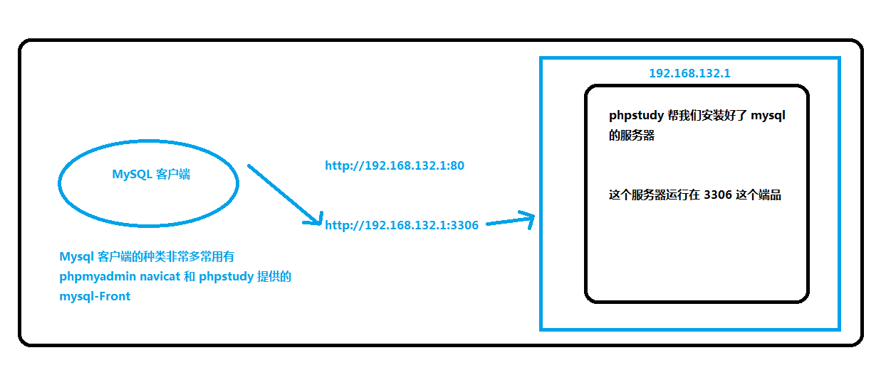
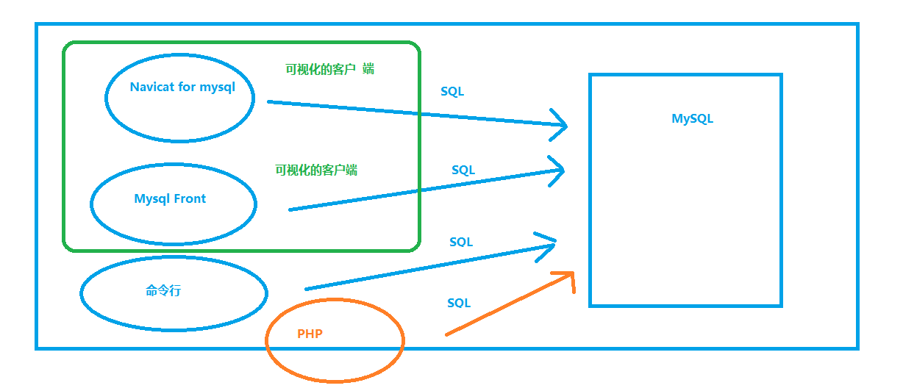

###简介

数据库就是数据的仓库，用来按照特定的结构去组织和管理我们的数据，有了数据库我们就可以更加方便、便捷的操作（C / R / U / D）我们需要保存的数据。

不管是什么数据库，最终都是将数据存到文件（硬盘）中，只是存储的格式不同于文本文件。

### 基础操作

#### 数据库管理工具

本质上就是一个使用数据库服务器软件（Server）提供的服务的数据库客户端（Client）。





##### 命令行工具

一般如果只是简单操作数据库，推荐使用 MySQL 内置的命令行工具完成：

进入 MySQL 客户端的 REPL 环境过后，可以通过标准的 SQL 语句操作数据库。

常见的操作指令：

```sql
mysql> show databases;  -- 显示全部数据库
mysql> create database <db-name>;  -- 创建一个指定名称的数据库
mysql> use <db-name>;  -- 使用一个数据库，相当于进入指定的数据库
mysql> show tables;  -- 显示当前数据库中有哪些表
mysql> create table <table-name> (id int, name varchar(20), age int);  -- 创建一个指定名称的数据表，并添加 3 个列
mysql> desc <table-name>;  -- 查看指定表结构
mysql> source ./path/to/sql-file.sql  -- 执行本地 SQL 文件中的 SQL 语句
mysql> drop table <table-name>;  -- 删除一个指定名称的数据表
mysql> drop database <db-name>;  -- 删除一个指定名称的数据库
mysql> exit|quit;  -- 退出数据库终端
```

##### 可视化工具

如果需要复杂的操作，推荐 Navicat Premium

> 下载地址：http://www.navicat.com.cn/download/navicat-premium
>
> 这是一个付费软件，可以免费试用 14 天
>
> 详细安装移步 [相关软件的安装][./相关软件的安装.md]

#### 基本概念

- 数据库 -- 存储表的仓库
- 表 -- 存储数据的表文件
- 主键 -- 不重复唯一标识符
- 字段 —— 指的就是列
- 字段类型 —— 指的就是列能够存储的数据种类
  - int 整型数字
  - char(<length>)  定长字符串, 不达到指定长度, 也占固定的长度
  - varchar(<length>)  可变长字符串, 在限制长度之内, 字符长度可变 (一般使用此类型)
  - date 字符串日期格式 xxxx-xx-xx
  - decimal 小数
- 数据库查询：指的是操作数据库的过程（曾, 删, 改, 查）
- 数据库查询语言：SQL

#### 基本查询语句

+ 建议关键字全部使用大写格式
+ 数据库查询语言存在隐式转换, 可以将数字类型写为字符串类型

##### 查询

```sql
-- 查询数据
-- select 字段名[, 字段名2]... from 表名
select id, name, birthday from users;

-- 通配 * 找到表中所有列数据
select * from users;
```

##### 增加

```sql
-- 新增数据
-- 字段顺序, 和插入之顺序必须相同
-- 插入全部字段, id值字段设置为自动设置时, 插入数据时将其设置为null
insert into users values (null, '王五', 0, '2020-12-12', '12312');
-- 指定字段
insert into users (name, gender, avatar) values ('王五', 0, '12312');
-- 一次性插入多行数据
insert into users (name, gender, avatar) values ('王五', 0, '12312'), ('王五无', 1, '1231212');
```

##### 修改

```sql
-- 更新数据, 一次性更新多个数据使用逗号隔开即可
update users set name = '麻子', gender = 0;
```

##### 删除(此操作一定要谨慎)

```sql
-- 删除
-- 删除语句必须指定条件
delete from users WHERE id = 1;
```

##### 筛选条件

```sql
-- 单一条件
delete from users where id = 6;
-- 并列条件
delete from users where id = 6 and gender = 0;
-- 或集条件
delete from users where id = 6 or gender = 0;
-- 判断条件
delete from users where id > 6;
-- 单字段选择多个值
delete from users where id in (4, 5); -- 删除 id 为4或5的数据
-- 模糊查询   
delete from users where name like '关%'; -- name 字段匹配以关开头的所有值
-- 限制数据的条数
select * from users limit n, m;  -- 返回从第 n(第一行为 0) 行开始的 m 条数据 (包括第 n 行)常用于分页
select * from users limit n; -- 返回前 n 条数据
```

#### 常见语句

```php
-- 常用单条查询获取数据
$reader = mysqli_query($conn,"SELECT name,age FROM student limit 1")
-- 解构赋值: 将获取到的索引数组数据中前两个值分别存贮到 $name 和 $age 变量中
-- 注意只能使用 mysqli_fetch_row 方法, 因为它获取到的是索引数组
list($name, $age) = mysqli_fetch_row($reader);
```

#### 常见查询函数

- count(* / 字段名)    
  - 获取总条数
  - 常用于分页功能，查询总页数:     SELECT count(*) FROM users
- max(字段名) / min(字段名)
  - 获取当前字段的最大值、最小值
- avg(字段名)
  - 获取当前字段的平均值

####多表查询

```mysql
# posts users categories 三张表
# 给三张起其别名, 然后通过共同的主键连接3张表, 相当于将3张表并集连接
SELECT p.*,u.nickname,c.name FROM posts AS p JOIN users AS u ON p.user_id=u.id JOIN categories AS c ON p.category_id=c.id';
```

#php 操作 MySQL (mysqli)

###关于错误显示与提示

```php
-- 一般使用在连接数据库语句后
mysqli_connect_errno()                                -- 返回上一次连接错误的错误代码。
mysqli_connect_error()                                -- 返回上一次连接错误的错误描述。

-- 一般使用在每一句操作数据的语句后面
mysqli_errno( 连接资源 )                            -- 返回最近调用函数的最后一个错误代码。无错则 0
mysqli_error( 连接资源 )                            -- 返回最近调用函数的最后一个错误描述。
  
-- 不常用
mysqli_error_list( 连接资源 )                       -- 返回最近调用函数的错误列表。
```

###连接与关闭数据库

**主机地址用IP地址比较快, 用域名得经过 CDN查询 比较慢**

+ mysqli_connect( 数据库主机地址, 数据库账号, 数据库密码 [,数据库名])
  + 打开一个到 MySQL 服务器的新的连接并选择一个数据库。返回一个连接资源
+ mysqli_close( 连接资源 ) 
  + 关闭之前打开的数据库连接。 
+ mysqli_select_db( 连接资源, 数据库名)          
  + 更改或选择连接的默认数据库。, 返回成功与否
  + 数据库连接时如果选择过数据库则不需要在添加此句
+ mysqli_set_charset( 连接资源, charset )       不常用
  + 设置或更改默认客户端字符集。

###执行 sql 语句

+ mysqli_query( 连接变量, sql语句 )  
  + 执行sql语句。针对成功的 SELECT、SHOW、DESCRIBE 或 EXPLAIN 查询，将返回一个结果集(资源类型)。针对 DELETE UPDATE INSERT 成功的查询，将返回 TRUE。如果失败，则返回 FALSE。

### 获得查询结果

+ mysqli_fetch_assoc( 结果集 ) 
  + 从结果集中取得一行, 并作为枚举数组返回。返回关联数组
  + 需要循环调用, 每次调用返回下一条数据
+ mysqli_fetch_row( 结果集 ) 
  + 从结果集中取得一行，并作为枚举数组返回。返回线性数组
  + 需要循环调用, 每次调用返回下一条数据
+ mysqli_affected_rows( 连接变量 )
  + 返回前一次 MySQL 操作所影响的记录行数(数字类型)。 .>0, =0, 或 -1( err )
+ mysqli_fetch_array( 结果集 , resulttype )      不常用
  + 从结果集中取得一行作为关联数组，或数字数组，或二者兼有
  + resulttype: MYSQLI_ASSOC,  MYSQLI_NUM,  MYSQLI_BOTH

###释放结果集

+ mysqli_free_result( 结果集 )
  + 释放结果集内存。

##一段查询的完整的例子


```php
扩展  JS中json格式解码 JSON.parse()
      JS中json格式编码 JSON.stringify()
      PHP中json格式编码 json_encode()
      PHP中json格式解码 json_decode()


-- 定义4个常量 因为常量一旦创建就不可改变的特性 所以使用常量定义
-- 主机IP地址
define("HOST","127.0.0.1");
-- 数据库账户用户名
define("USER","root");
-- 数据库账户密码
define("PAW","root");
-- 连接的数据库名
define("DBNAME","itcast");
-- 建立数据库连接
-- 使用 @ 的原因为: 防止不良居心的人看到详细的连接数据库的报错信息, 趁机攻击数据库
$conn = @ mysqli_connect(HOST,USER,PAW,DBNAME);
-- 如果连接数据库失败
if(!$conn){
   -- 结束程序运行 并 抛出错误
   die( "<p class=\"warning\">error: " .  mysqli_connect_errno() . ": " . mysqli_connect_error() . "</p>" );
}
$name = "关";
-- sprintf()函数为将一个格式字符串返回
-- 此行注意事项!! 
    -- 1 -> %%两个百分号为显示一个转以后的%(占位符:为0个至多个其他字符)
    -- 2 -> sql语句后加 ; 号
$str = sprintf("SELECT * FROM user WHERE name='%%%s%%';",$name);
-- 执行sql语句 返回一个读取器(reader对象:象指针一样 开始指向第一个数据,调用一次后,指向第二个数据,在调用一次后,指向第三个数据...)
$reader = mysqli_query($conn,$str);
$arr = [];
-- 判断是否查询到结果
if($reader){
    -- mysqli_fetch_assoc()函数将数据以关联数据的形式返回
    while($item = mysqli_fetch_assoc($reader)){
        $arr[]=$item;
    }
-- 查询失败
}else{
    -- 关闭数据库连接
    mysqli_close( $conn );
    -- 结束程序运行
    die("<p class=\"warning\">error: " .  mysqli_errno( $conn ) . ": " . mysqli_error( $conn ) . "</p>" );
}
-- 释放结果集内存
mysqli_free_result($reader);
-- 关闭数据库连接
mysqli_close($conn);
-- 将二维数组进行json格式编码
$arr = json_encode($arr);
-- 如果是ajax获取输出数据 一定得使用echo输出数据
echo $arr;
```