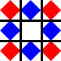

# css3

## 3D变换

  perspective: 模拟人眼距离被观察物体的距离; 默认无,也就是说在一个2d平面中; 建议值800px;

  perspective-origin: 观察原点(从哪个位置看), 默认为物体的正中心

  transform-origin: 变形原点(元素绕哪个点转), 默认为左上角

  transform-style: preserve-3d 给元素添加3d观察效果

  backface-visibility: 元素背面可见性, 默认可见, 设为 hidden 隐藏

  z轴正方向为屏幕到人眼的方向, 元素进行3d变换时坐标轴也会跟随进行变换, 也就是说坐标轴相对于元素本身是不变的

## border-image

兼容性: ie11+ 其余的浏览器有些需要加前缀

border-image: url() 裁剪位置 显示方式

```css
border-image: url(./media/eg.png) 10 10 round repeat
```

+ url(): 图片相对/绝对路径

+ 裁剪位置: 使用TRBL原则（top-right-bottom-left), 将图片切割成9宫格的样子, 中心的部分不会被显示, 其中四个角(红色部分)就分别固定在border的四个角, 蓝色部分将进行显示变形

  

  + 1个值: 上右下左都为同一个值
  + 2个值: 上下 左右
  + 3个值: 上 左右 下
  + 4个值: 上 右 下 左

+ 显示方式: stretch拉伸(默认值), round平铺, repeat重复, between平衡

  + 1个值: 上下左右 
  + 2个值: 上下  左右

+ round平铺: 计算能放下的个数, 四舍五入, 增加/减少宽度, 来显示

  

+ repeat重复: 按原始尺寸进行平铺多余的部分会被裁剪

  

+ between平衡: 计算能放下的个数, 向下取整, 保持原始的宽度, 来显示, 多余的宽度会被平均到各个重复的块之间