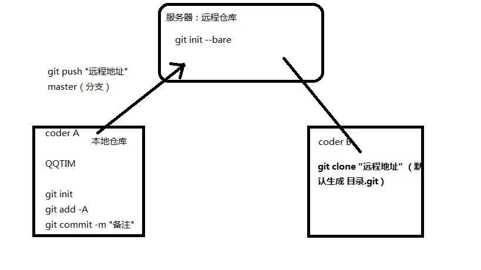
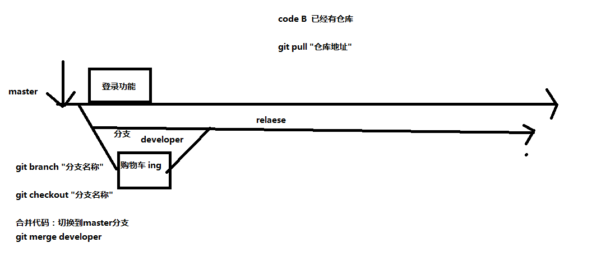
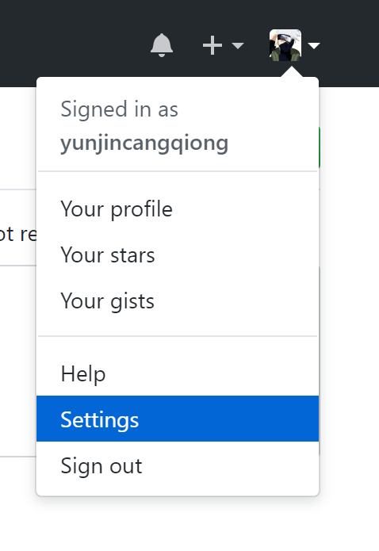
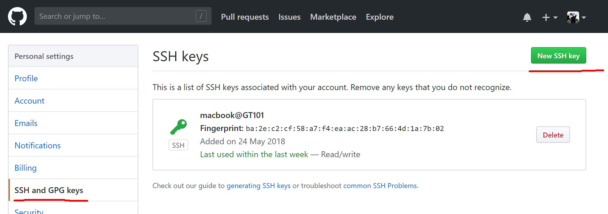
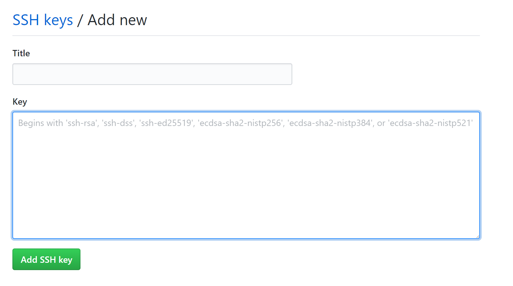

## 命令行窗口

操作电脑的两种方式：图形界面、命令行窗口。

- 我们平时都是通过图形界面来操作计算机，比如鼠标右键->新建->新建文件夹。
- 其实命令行窗口也是一种操作向计算机的方式。
- 开启命令行 win + R -> cmd -> enter
- 常用命令行工具
    + cmd
    + powershell
    + git bash

## 常用命令
- pwd (print working directory) 查看当前所在的目录
  - pwd
- cd (change directory) 切换目录
  - cd 路径
    - ../ 上一级目录
- ls (list) 查看当前目录下的所有内容(文件, 图片, 视频...)
  - ls
  - ls -l 查看当前目录下的所有内容和基本信息
- mkdir (make directory) 创建目录
  - mkdir 目录名
- touch 创建文件
  - touch 文件名

- clear 将当前的光标位置置顶, 到达清屏的效果, 原来的操作并没有被清除, 知识被移到了上面
- exit 退出当前命令行窗口

- cat 查看文件内容, 一次性全部输出
  - cat 文件名
- less 查看文件内容, 输出当前窗口大小范围的内容
  - less 文件名
    - 使用回车来每次输出一行
    - 使用空格来每次输出一页
    - 使用 b(back) 来回退一页
    - 使用 q(quit) 来退出查看
- rm (remove) 删除文件
  - rm 文件名
- rmdir (remove directory) 删除文件夹, 只能删除空文件夹, 不常用
  - rmdir 目录名
- rm -rf  强制删除目录
  - rm -rf 目录名
- mv (move) 移动文件或重命名
  - 移动到当前目录相当于重命名
  - mv 文件名 要移动到的路径
    - mv test.html index.html      将test.html重命名为index.html
    - mv test.html ../      将test.html移动到上一级目录
- cp (copy) 复制文件
  - cp 要复制的文件名 复制到的文件名
  - cp index.html test.html   将index.html文件的内容复制到 test.html中, 会覆盖test.html原有的内容
- echo 写入内容到文件, 每次输出都是覆盖原有文件内容
  - echo '内容' > 文件名
- ehco 写入内容到文件, 每次输出都是追新内容
  - ehco '内容' >> 文件
- tar -cf 压缩包名字 要压缩的文件列表
  - -c表示创建新压缩包，-f指定包的文件名。 
    - tar -cf test.tar index.html test.html      将index.html test.html 添加到test.tar压缩文件包
- tar -xf 压缩包名字
  - -x表示解压，-f指定包的文件名。

## GIT是什么
源代码管理工具，是linux系统之父Linus Torvalds为管理linux系统内核而开发的开源的版本控制工具。

SVN 集中式管理控制

Git 分布式管理控制

在写代码的过程中提供的反悔的机会。

开发过程中出现bug，越改越乱，可以选择撤销，当修改的步骤较多或者文件较多可能撤销不回去，如果编辑器在中途关闭过，就肯定撤销不回去了。想回到没改之前代码能运行的状态。

分布式管理控制



分支: 在当前主功能的基础上, 复制一份或多分代码到新的分支进行额外开发, 开发完毕后进行分支合并; 主要用于多人协同开发, 每个人有自己的分支;



## GIT三大区域

- 工作目录
    + 存放项目代码的目录
- 暂存区
    + 临时存放更改的了文件
    + 防止工作目录中的代码丢失
- 代码仓库
    + 当开发的功能足以形成一个版本的时候 可以将代码形成版本提交到仓库
    + 相当于复制了一份当前的代码存储到了仓库中

## GIT常用命令
- 用户第一次操作的是  需要设置 git用户名和邮箱, 没有不让提交到仓库
    + git config --global user.name zhangsan
    + git config --global user.email zhangsan@163.com
- 查看当前的git配置
    + git config --list	
- 初始化git仓库
    + git init
- 查看当前仓库的状态 (已修改，已暂存，已提交)
    + git status
- 将工作目录中的文件添加到暂存区
    + git add 文件名列表
      + . 点代表全部文件
- 将暂存区中的代码提交到本地仓库 形成一个版本
    + git commit -m 备注(备注中不包含空格可以不加引号)
- 查看本地仓库中的历史提交版本
    + git log 
    + 该信息中有commitID, 使用时取前6位, 用于版本回滚
- 将文件从暂存区中删除, 不让 git 管理此文件
    + git rm --cached 文件列表 
    + 说明:
        * 必须保证工作目录中的文件代码和暂存区文件代码一致; 如果不一致, git会阻止这次删除行为(保护文件); 解决办法:  将当前文件提交到暂存区在删除即可
        * 此时工作目录中有此文件, 暂存区中没有此文件, 这些文件不被git管理
- 用暂存区中的文件覆盖工作目录中的文件
    + git checkout  文件列表 
    + 说明：暂存区和工作目录都有此文件 这些文件依然被git管理

**commitID** 前6位id

- 回滚到本地仓库中的特定版本并覆盖暂存区和工作目录, 如果指定的回滚版本后面还有其他版本, 则后面的版本会被删除
    + git reset --hard commitID 
      + 例如, 一共提交到仓库4次, 回滚第2次提交的代码, 则第3次, 和第4次的提交记录会被删除
- 回滚到本地仓库中的特定版本不覆盖暂存区和工作目录
    + git reset --soft commitID
- 回滚到本地仓库中的特定版本并覆盖暂存区
    + git reset --mixed commitID
- 回滚中HEAD的使用
    + git reset --hard HEAD 使用最新的版本覆盖工作目录和暂存区
    + git reset --hard HEAD^ 使用上一次提交的版本覆盖工作目录和暂存区
    + git reset --hard HEAD^^ 使用大上一次提交的版本覆盖工作目录和暂存区
- 查看所有分支
    + git branch
- 查看本地和远程的所有分支  
    - git branch -a
- 创建分支, 相当于把主分支复制一份到新分支
    + git branch 分支名称
- 切换分支
    + git checkout 分支名称
      + **`切换分支之前一定要将代码提交到仓库, 因为所有分支公用一个缓存区,避免产生多余的问题 `**
- 创建并切换分支
    + git checkout -b 分支名称 
- 删除分支(如果分支没有被合并, 不允许删除)(原因: 保护文件)
    + git branch -d 分支名称
- 删除分支(强制删除分支)
    + git branch -D 分支名称
- 合并分支, **需要在主分支下操作** 
    + git merge 来源分支
- 在空目录下操作, 初始化一个裸露仓库(公共代码仓库), 可在本地创建, 类似于github 的仓库, 用于多人协作开发, 一般有专人(运维或后台)负责创建维护.
    + git init --bare 
- 向远程仓库推送代码
    + git push 远程仓库地址 本地分支名称:远程分支名称
      + 一般远程仓库地址为ssh地址, 可以避免输入账号和密码(需要配置ssh秘钥); 本地分支名称:远程分支名称, 因为必须相对应,所以可以合并写一个
      + eg: git push git@github.com:yunjincangqiong/test.git master
- 从远程仓库中拉取代码, 用于本地已经有部分代码, 只需要更新部分代码
    + git pull 远程仓库地址(https地址) 远程分支名称:本地分支名称
- 为远程仓库地址创建别名(一般为origin), 减少代码负担, 设置之后上传代码时使用别名即可
    + git remote add 别名 远程仓库地址
- 查看远程地址的详情信息
    + git remote -v
- 查看当前别名所对应的远程仓库地址
    + git remote show 别名 
- 删除当前别名及所对应的远程仓库地址
    + git remote remove 别名 
- 从远程仓库获取代码(拉取所有版本到本地)
    + git clone 远程仓库地址(https地址) 项目名称 
    + 使用场景：加入到已有项目的开发中 需要先拉取所有版本到本地 再进行开发
- 冲突的产生和修复
    - 创建公共仓库
    - 创建张三并向公共仓库中提交一次代码
    - 创建李四并拉取公共仓库中的代码
    - 张三修改文件再一次向公共仓库中提交代码
    - 李四修改同一个文件并向公共仓库中提交
        - 由于刚刚张三提交了一版代码到公共仓库中 李四本地仓库不是最新的, 所以不能向公共仓库中提交代码, 需要先拉取再提交
    - 李四再次拉取公共仓库中的代码
        - 由于公共仓库中张三修改了index.html文件 李四在本地也修改了inex.html文件
             所以冲突了
    - 解决冲突需要人为的解决, 两个人需要商量谁的代码留存问题, 商量过后, 李四更改冲突文件并向仓库中提交
    - 张三从公共仓库中再拉取解决冲突后的代码
- gitignore忽略清单

```
要用编辑器才能创建 .gitignore 文件(因为以点开头),把让git忽略的文件名(带后缀)写到该文件中即可, git就会自动忽略某些文件
```

**协同开发操作**
1.创建一个远程仓库（分享仓库，裸仓库）
2.远程仓库一般是运维或后台创建好（linux）
3.创建远程仓库（git init --bare）
4.可以提交代码，拉取代码，克隆仓库
5.提交代码（git push "远程地址" master）
6.拉取代码（git pull "远程地址" 分支（默认是master））
7.克隆远程仓库（git clone "远程地址" master）

- 多人协作开发免登录操作 ssh-keygen
  - 由于公司并不会让你知道仓库的密码(为了公司保密), 所以需要在 git bash 中输入 ssh-keygen 命令, 之后会在 C:\Users\macbook\\.ssh C盘->用户->当前用户->.ssh下产生两个文件, 一个公钥(.pub)一个私钥, 将公钥添加到github即可实现免密
  - **注意上传代码时要使用 ssh 协议的url, 才可使用免密操作** 
- 公钥和私钥
  - 类似于古代的玉佩, 两人一人一半玉佩, 只要能完好合在一起, 就证明是对的人.
- 以下为 ssh 公钥添加到github的详细操作





将 ssh 公钥文件用编辑器打开, 将里面的内容粘贴到 key 里面点击 Add SSH key 即可, title 可为空

