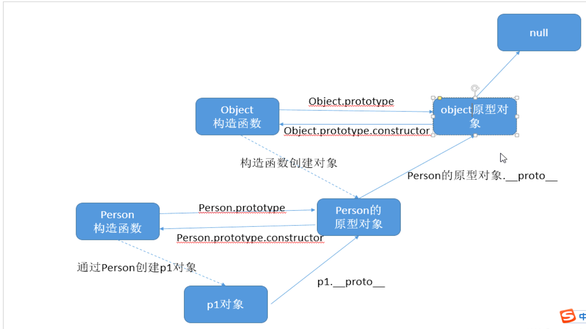

# 对象

```
对象.不存在的属性或者方法 === undefined  对象.不存在的方法() === 报错
```

## 对象的几个方法

以下都基于这个案例

```js
function Person(name) {this.name = name}
let per1 = new Person('gt')
```

Object.prototype.isPrototypeOf()

判断调用者是否在被调用者的原型链上, 返回布尔值

```js
Person.prototype.isPrototypeOf(per1) // true
```

Object.prototype.hasOwnProperty()

判断属性/方法是否是调用者的自己本身的; 原型上继承下来的返回false; 返回布尔值

```js
per1.hasOwnProperty('name') // true
per1.hasOwnProperty('toString') // false
```

Object.prototype.propertyIsEnumerable()

判断属性/方法是否是可枚举的; 返回布尔值

如果判断一个调用者未定义的属性/方法也会返回false

```js
Person.prototype.propertyIsEnumerable('constructor') // false
Person.prototype.propertyIsEnumerable('name') // false
```

静态方法

Object.getPrototypeOf()

获取被调用者的原型对象

```js
Object.getPrototypeOf(per1) === Person.prototype // true
```

Object.keys()

获得被调用者的所有**自身的属性**，并仅是可枚举的. 返回值为数组. 与for-in功能一致

```js
Object.keys(per1) // ["name"]
```

Object.getOwnPropertyNames()

获得被调用者的所有**自身的属性**，无论是否可枚举. 返回值为数组.

```js
Object.getOwnPropertyNames(Person.prototype) // ["constructor"]
```

不可枚举的属性有(Object.prototype上所有的属性都是不可枚举的):  toLocaleString()、toString()、valueOf()、hasOwnProperty()、isPrototypeOf()、propertyIsEnumerable()、constructor

### Object.defineProperty

语法: Object.defineProperty(obj, prop, descriptor)

参数说明:

obj：必需。目标对象 
prop：必需。需定义或修改的属性的名字
descriptor：必需。目标属性所拥有的特性

当设置或获取对象的某个属性的值的时候，第三个参数可以提供getter/setter方法。在特性中使用get/set属性来定义对应的方法。也就说将对象的某个属性托管给getter/setter方法, 别的方式(直接赋值)无法直接改变其值.

get方法: 获取属性的时候触发的函数

set方法: 设置属性的时候触发的函数, 唯一一个参数为设置的最新的值

```js
let obj = {
  asd: 'zxczxc'
}
// 需要一个拷贝的存储值变量
let value = 'zxczxc'
Object.defineProperty(obj, 'asd', {
  // 获取属性的时候触发的函数
  get() {
    return value
  },
  // 设置属性的时候触发的函数
  set(newVal) {
    value = newVal
  }
})
// 获取属性值
console.log(obj.asd)
// 设置属性值
obj.asd = '123'
// 获取最新的属性值
console.log(obj.asd)
```

**注意：get或set不是必须成对出现，任写其一就可以。如果不设置方法，则get和set的默认值为undefined**

### 环境

```
javascript的应用环境: 由宿主环境和运行期环境组成
宿主环境: 外壳程序(shell) 和 浏览器 等
运行期环境: 由javascript引擎内建的环境
```

### 本地对象

```
官方定义: 独立于宿主环境的ECMAscript实现的对象
ECMAscript标准中内置的对象
```

### 内置对象

```
官方定义: 独立于宿主环境的ECMAscript实现的对象, 在javascript程序开始执行时出现
ECMAscript标准中内置的对象, 并且是已经实例化好的, 所以所有的内置对象也是本地对象
包括两个对象  Global, Math
Global: 一个特殊的全局对象, 生命周期跟程序的生命周期一致, 不能通过名字来访问, 浏览器中将Global作为window的一部分实现, 所有不属于任何对象的属性和方法都属于Global; javascript中的window对象扮演了ECMAscript中定义的Global全局对象; 也就是说在浏览器端 window === Global
```

### 宿主对象

```
官方定义: 由javascript实现的宿主环境提供的对象
不是ECMAscript标准中定义的对象, 宿主环境就是用户代理, 包括 浏览器 和 node.js 等;
主要为 BOM, DOM 和 自定义对象
```

# 面向对象

## 原型对象

```
每一个构造函数都有一个原型对象,可使用 构造函数名.prototype 访问
每一个实例对象都有一个 __proto__ 属性 指向构造函数的原型对象; 即 实例对象.__proto__ = 构造函数名.prototype; 所以 (实例对象.__proto__ === 构造函数名.prototype)返回true
构造函数的实例对象可以调用原型对象的属性和方法;此行为叫为对象的继承
实例对象中使用的 constructor 属性就是原型对象中继承过来的; 构造函数名.prototype.constructor == 构造函数
```


## 原型链



```
由 __proto__ 属性连接起来的链式结构叫原型链
作用: 属性方法向上搜索, 继承
链式结构的终点 null
javascript:
	function Person (name) {
      this.name = name;
	}
	var p1 = new Person('gt');
```

## 继承

```
目的: 代码重用
好处: 可以减少代码量, 使代码更整洁简单易懂
```


### 原型继承	

```
方法一:
javascript:
	function Person (name) {
      this.name = name;
	}
	Person.prototype.sName = 'people';
	Person.prototype.eat = function () {
      console.log('eat');
	}
	var p1 = new Person('gt');
	console.log(p1.name);// gt
	console.log(p1.sName);// people
	p1.eat();// eat
	var p2 = new Person('gg');
	console.log(p2.name);// gg
	console.log(p2.sName);// people
	p2.eat();// eat
    
使用原型对象和实例对象的关系进行继承;实例对象可以使用定义在原型对象中的属性和方法
缺点: 每次添加都得加上 Person.prototype 前缀

方法二:
javascript:
	Person.prototype = {
	 constructor: Person,
      sName: 'people',
      eat: function () {
        console.log('eat');
      }
	}
	
可以一次性添加大量方法和属性
缺点: 丢失了 constructor 属性,导致实例对象继承的 constructor 属性指向错误,所以使用时注意重新给 constructor 属性赋值
```

### 构造函数继承

```
javascript:
	function Person(name) {
    	this.name = name;
    }
    Person.prototype.sName = 'people';
    Person.prototype.eat = function () {
   		console.log('eat');
    }
    function Student(name, age) {
    	Person.call(this, name);// 关键句
    	this.age = age;
    }   
    var p1 = new Student('gt', 18);
    console.log(p1.name);// gt
    console.log(p1.age);// 18
    console.log(p1.sName);// undefined
    p1.eat();// 报错
    var p2 = new Student('gg', 20);
    console.log(p2.name);// gg
    console.log(p1.age);// 20
    console.log(p2.sName);// undefined
    p2.eat();// 报错

利用 call函数 或者 apply函数改变构造函数内部的this指向实现继承
缺点: 不能继承构造函数原型对象中的属性和方法
```

### 组合继承(原型继承+构造函数继承)

```
javascript:
	function Person(name) {
    	this.name = name;
    }
    Person.prototype.sName = 'people';
    Person.prototype.eat = function () {
    	console.log('eat');
    }
    function Student(name, age) {
   		Person.call(this, name);
    	this.age = age;
    }
    // Student.prototype = Person.prototype;
    Student.prototype = new Person();
    function Teacher(name, gender) {
    	Person.call(this, name);
    	this.gender = gender;
    } 
    // Teacher.prototype = Person.prototype;
    Teacher.prototype = new Person();
    var p1 = new Student('gt', 18);
    console.log(p1.name);// gt
    console.log(p1.age);// 18
    console.log(p1.sName);// people
    p1.eat();// eat
    var p2 = new Teacher('gg', 20);
    console.log(p2.name);// gg
    console.log(p1.age);// 20
    console.log(p2.sName);// people
    p2.eat();// eat
    
方案1: 
注释掉代码的问题:
	根源: Student.prototype 和 Teacher.prototype 都指向 Person.prototype; 
	1. Student 和 Teacher 的 constructor 属性指向不正确;并且不能更改;会间接改变Person.prototype.constructor 的指向;造成新的问题;
	2. Student.prototype 和 Teacher.prototype 不能有私有的方法或属性;
方案2:
	使原型对象从新指向一个新的Person实例对象
	缺点: 原型对象的 constructor 属性改变为Person的 constructor 属性, 指向 Person;得手动改变原型对象的 constructor 属性, 否则会产生指向错误问题;
```

### 拷贝继承

```
javascript:
	   function Person(name) {
          this.name = name;
        }
        Person.prototype.sName = 'people';
        Person.prototype.eat = function () {
          console.log('eat');
        }
        function Student(name, age) {
            Person.call(this, name);
            this.age = age;
        }
        myExtends(Student.prototype, Person.prototype);
        function Teacher(name, gender) {
            Person.call(this, name);
            this.gender = gender;
        } 
        myExtends(Teacher.prototype, Person.prototype);
        var p1 = new Student('gt', 18);
        console.log(p1.name);// gt
        console.log(p1.age);// 18
        console.log(p1.sName);// people
        p1.eat();// eat
        var p2 = new Teacher('gg', 20);
        console.log(p2.name);// gg
        console.log(p1.age);// 20
        console.log(p2.sName);// people
        p2.eat();// eat

        function myExtends (obj, copyObj) {
            for (var key in copyObj) {
                //防止原有的属性和方法被重新赋值
                if(obj[key]){
                    continue;
                }
                obj[key] = copyObj[key];
            } 
        }

把 Person原型对象 中的属性和方法拷贝到 Student 和 teacher 的原型对象中;利用原型继承原理实现继承
```

## 深拷贝

```
就是将一个对象的全部结构都复制到另一个对象中,但是两者并无关系
javascript:
	function deepCopy(parent, child) {
        for (var key in parent) {
          if (child[key]) {
            continue;
          }
          //细节先判断数组在判断对象,数组也是对象的一种,反向容易把数组创建成对象
          if (parent[key] instanceof Array) {
            child[key] = [];
            deepCopy(parent[key], child[key]);
          } else if (parent[key] instanceof Function) {
            //对于函数可以直接共享,并不影响功能;
            child[key] = parent[key];
          } else if (parent[key] instanceof Object) {
            child[key] = {};
            deepCopy(parent[key], child[key]);
          } else {
            child[key] = parent[key];
          }
        }
      } 
样例:
	  var obj = {
        name: 'aaa',
        cars: ['保时泰', '玛莎拉泰'],
        dog: {
          name: 'mimi',
          age: 10,
        },
        eat: function () {
          console.log('eat');
        }
      }
      var newObj = {
        name: 'bbb'
      }
      deepCopy(obj, newObj);
      console.dir(newObj);
```

## 递归函数

```
递归函数就是函数自己调用自己
注意: 一定要有结束条件,显示或者隐式结束条件
回调案例:
javascript:
案例一:     点击li标签控制台打印其内部文字(需要html的ul列表结构)
	 //带回调函数的dom元素遍历
      function dom(node, callback) {
        var child = node.children;
        for (var i = 0; i < child.length; i++){
          callback(child[i]);
          dom(child[i]);
        }
      } 
      //获取ul元素并且给其子元素添加点击事件
      var ul = document.querySelector('ul');
      dom(ul, function (child) {
        child.onclick = function () {
          console.log(this.innerHTML);
        }
      })
      
案例二:     打印斐波那契数列(兔子生殖问题)
注意: 存在性能问题, 当 n 值过大时, 内存会泄露, 导致浏览器死掉
	//打印第几个数  1 1 2 3 5 8 13 ...
    function getFiro(n) {
      if (n === 1 || n === 2) {
        return 1;
      }
      return getFiro(n - 1) + getFiro(n - 2);
    }
    console.log(getFiro(6));
    
案例三:     计算数字 n 的和
	function sum (n) {
      if (n === 1) {
        return 1;
      }
      return sum(n - 1) + n;
    }
    console.log(sum(3));
```


