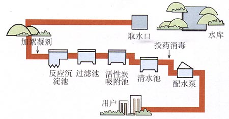

## Express(支持链式编程)

原生的 http 在某些方面表现不足以应对我们的开发需求，所以我们就需要使用框架来加快我们的开发效率，框架的目的就是提高效率，让我们的代码更高度统一。

官网 :  http://expressjs.com/

#### 单项目安装

```shell
# 新版简介语法
npm i express
# 标准语法
npm install --save express
```

#### 官方样例语法(es6)

```javascript
// 导入 express 模块
const express = require('express')
// 初始化 express 模块, 并接收导出的api
const app = express()
// 路由部分
app.get('/', (req, res) => res.send('Hello World!'))
// 监听端口, 一般为3000, 如果冲突可以手动改变端口号
app.listen(3000, () => console.log('Example app listening on port 3000!'))
```

#### 普通版本

```javascript
var express = require('express')
var app = express()
app.get('/', function(req, res) {res.send('success')})
app.listen('3000', function(){console.log('link success')})
```

### 常用API

~~~js
// 接收 get 请求发送的数据
req.query
// 发送一段信息, 并结束当前代码的执行
res.send('msg')
// 重定向到指定地址
res.redirect(url)
~~~

#### jQuery表单序列化

```js
form表单.serialize() // name=zhangsan&sex=1&age=20
form表单.serializeArray() // 数组对象  json格式
```

####基本路由

get:

```javascript
// 当你以 GET 方法请求 / 的时候，执行对应的处理函数
app.get('/', (req, res) => {
  res.send('Hello World!')
})
```

post:

```javascript
// 当你以 POST 方法请求 / 的时候，指定对应的处理函数
app.post('/', (req, res) => {
  res.send('Got a POST request')
})
```

all:

```js
// 不管以什么方式请求 / , 都会触发函数
app.all('/', (req, res) => {
  res.send('针对/路由相应所有请求')
})
```

####路由中间件

use:

```js
// 在代码执行过程中, 执行一段不阻塞当前程序执行的代码, 并可能会给 req 或者 res 添加附加的功能
app.use('')
// 如 body-parser 模块会给 res 添加一个 body 属性用于获取处理好的 post 传输的数据
```

all:

```js
// 不管以什么方式请求的当前 url, 都会触发函数
app.all('/', (req, res, next) => {
  res.send('针对/路由相应所有请求')
  // 使其不阻塞当前的请求, 让代码继续向下执行
  next()
})
```

#### 静态服务(加载可访问静态资源)

```javascript
app.use(['虚拟路径'], express.static('文件夹路径'))
样例 : 当请求以 /public 开头的url时, 加载public文件夹中的文件
app.use('/public', express.static('./public'))
```

### 配置 `art-template` 模板引擎

- [art-template GitHub仓库](https://github.com/aui/art-template)
- [art-template 官方文档](https://aui.github.io/art-template/)

安装：

```shell
# 注意: 两个都要安装
npm i art-template
# 基于 express 的模板引擎
npm i express-art-template
```

配置：

```javascript
// 第一个参数用来配置视图文件的后缀名，默认是 .art ，则你存储在 views 目录中的模板文件必须是 xxx.art
// app.engine('art', require('express-art-template'))

// 为了使用html文件 这里把 art 改为 html
app.engine('html', require('express-art-template'))
```

使用：

```javascript
// 导入模板引擎模块后, 会给 res 添加一个 render 方法
app.get('/', (req, res) => {
  // express 默认会去项目中的 views 目录找 index.html
  res.render('index.html', [模板对象数据])
})
```

修改默认的 `views` 视图渲染存储目录 ：

```javascript
// 注意：第一个参数 views 千万不要写错
app.set('views', 目录路径)
```

设置参数:

```js
// 可以将模块和自定义的数据传入模板中使用
app.set('view options', {
  imports: {moment, getUserInfo () {
    return global.userInfo
  }}
})

// 在模板中, 使用 $imports 就可以调用模块和自定义的数据
eg: {{$imports.moment.format(Date.now(), 'YYYY-MM-DD HH:mm:ss')}}
```

**特殊性: template语法在视图 html 文件中书写时, `直接使用即可`不需要 script 标签包裹**

### 模板继承

```
配置模引擎时注意 使用 html 格式文件

以下文件一般放在views文件夹中  
文件夹前加 _ 主要是为了区分导入模板文件和html模板文件 
简洁语法(标准语法)
导入主模板 (主模板一般放在 _layout 文件夹中)
注意文件路径问题
{{extend 'layout.html'}}
主模板中可以使用以下语句进行挖坑
名字用于识别当前坑
{{block '名字'}}{{/block}}
在引用主模板的文件中可以使用以上语句进行填坑
导入子模板 一般为公用的头部 尾部 侧边栏等 (子模板一般放在 _parts 文件夹中)
{{include '子模板名' }}
第二种语法 跟使用普通模板时一样 在模板文件中 挖坑 data为模板对象数据
{{include '子模板名' data}}

原生语法(不建议使用)
<%extend('./layout.art')%>
<%block('head', function(){ %> ... <% })%>
<%include('./header.art')%>
<%include('./header.art', data)%>

样例
==============================================================================
主模板
layout.html : 
<!DOCTYPE html>
<html lang="en">
<head>
  <meta charset="UTF-8">
  <title>Document</title>
  <link rel="stylesheet" href="/public/css/...">
  {{ block 'link' }}
  {{ /block }}
</head>
<body>
  {{ block 'header' }}
  {{ /block }}
  <div class='container'>
  	...
  </div>	
  {{ block 'footer' }}
  {{ /block }}
  {{ block 'script' }}
  {{ /block }}
</body>
</html>
========================================================================================
子模板
header.html : 
<h1>header</h1>
footer.html : 
<h1>footer</h1>
========================================================================================
引用模板
index.html
{{extend './layout.html'}}
{{ block 'link' }}
  <link rel="stylesheet" href="/public/css/...">
{{ /block }}
{{ block 'header' }}
{{include './header.html'}}
{{ /block }}
{{ block 'footer' }}
{{include './footer.html'}}
{{ /block }}
{{ block 'script' }}
  <script src='/public/...'></script>	
  <script>
    console.log('success')
  </script>  
{{ /block }}
```

### 在 Express 中获取 GET 请求参数

Express 内置了一个 API，可以直接通过 `req.query` 来获取

```javascript
req.query 直接以对象的形式返回获取到的数据 {'name':'wang','age':18}
```

### 在 Express 获取表单 POST 请求体数据

在 Express 中没有内置获取表单 POST 请求体的 API，这里我们需要使用一个第三方包：`body-parser`。

安装：

```shell
npm i body-parser
```

配置：

```javascript
var express = require('express')
// 引包
var bodyParser = require('body-parser')

var app = express()

// 配置 body-parser
// 只要加入这个配置，则在 req 请求对象上会多出来一个属性：body
// 也就是说你就可以直接通过 req.body 来获取表单 POST 请求体数据了
// 使用中间件针对普通 post 和 json 进行相应的处理
// parse application/x-www-form-urlencoded
app.use(bodyParser.urlencoded({ extended: false }))
// parse application/json
app.use(bodyParser.json())
```

使用：

```javascript
app.use(function (req, res) {
  // 设置响应头信息 普通数据传输时不需要设置响应头信息
  res.setHeader('Content-Type', 'text/plain')
  // 可以通过 req.body 来获取表单 POST 请求体数据
  // 获取的数据为对象的形式  {'name':'wang','age':18}
  res.send(req.body)
})
```

### 在 Express 配置使用 `express-session` 插件

> 参考文档：https://github.com/expressjs/session

安装：

```shell
npm i express-session
```

配置：

```javascript
// 该插件会为 req 请求对象添加一个成员：req.session 默认是一个对象
// 这是最简单的配置方式，暂且先不用关心里面参数的含义
app.use(session({
  // 配置加密字符串，它会在原有加密基础之上和这个字符串拼起来去加密(内部自动完成不需要手动处理)
  // 目的是为了增加安全性，防止客户端恶意伪造
  secret: 'itcast',
  // 重置 session 的生存周期(只适用于 session 设置生命周期的情况下)
  // 例如: 生命周期为10分钟, 5分之后再次访问, 就会重置回10分钟
  resave: false,
  // 无论你是否使用 Session ，我都默认直接给你分配一把钥匙
  saveUninitialized: true 
}))
```

使用：

```javascript
// 添加 Session 数据
req.session.foo = 'bar'

// 获取 Session 数据
req.session.foo

//删除指定 Session 数据
req.session.foo = null

//删除全部 Session 数据
req.session = null
```

提示：默认 Session 数据是内存存储的，服务器一旦重启就会丢失，真正的生产环境会把 Session 进行持久化存储。

###express中间件



中间件的本质就是一个请求处理方法，我们把用户从请求到响应的整个过程分发到多个中间件中去处理，就如上图中污水处理的每一个过程, 这样做的目的是提高代码的灵活性，动态可扩展的。

- 同一个请求所经过的中间件都是同一个请求对象和响应对象

####中间件原理 

```
中间件：处理请求的，本质就是个函数

在 Express 中，对中间件有几种分类

当请求进来，会从第一个中间件开始进行匹配(从上至下顺序匹配)
   如果匹配，则进来
      如果请求进入中间件之后，没有调用 next 则代码会停在当前中间件
      如果调用了 next 则继续向后找到第一个匹配的中间件
   如果不匹配，则继续判断匹配下一个中间件
   如果都不匹配就会报错
   
不关心请求路径和请求方法的中间件
也就是说任何请求都会进入这个中间件
中间件本身是一个方法，该方法接收三个参数：
   Request   请求对象
   Response  响应对象
   next      函数 : 可继续请求下一个中间件
当一个请求进入一个中间件之后，如果不调用 next 则会停留在当前中间件
所以 next 是一个方法，用来调用下一个中间件的
调用 next 方法也是要匹配的,向后寻找匹配的中间件（不是调用紧挨着的那个）

当调用 next 的时候，如果 next 传递了参数(一般为error对象)，则直接往后寻找带有 四个参数 的应用程序级别中间件
当发生错误的时候，我们可以调用 next 传递错误对象
然后就会被全局错误处理中间件匹配到并处理之
```

####应用程序级别中间件

万能匹配（不关心任何请求路径和请求方法）：

主要用于统一处理错误项

```javascript
app.use(function (req, res, next) {
  console.log('Time:', Date.now())
  next()
})
```

路径匹配 : 只要是以 '/xxx/' 开头的：

主要用于开放公用资源

```javascript
app.use('/a', function (req, res, next) {
  console.log('Time:', Date.now())
  next()
})
```

####路由级别中间件

路由功能实现

get:

```javascript
app.get('/', function (req, res) {
  res.send('Hello World!')
})
```

post: 

```javascript
app.post('/', function (req, res) {
  res.send('Got a POST request')
})
```

put:

```javascript
app.put('/user', function (req, res) {
  res.send('Got a PUT request at /user')
})
```

delete:

```javascript
app.delete('/user', function (req, res) {
  res.send('Got a DELETE request at /user')
})
```

####404处理中间件

```
放在所有业务路由处理之后,用于处理那些没有被处理的url
app.use(function (req, res, next) {
  return res.send('404')
  ...404处理
})
```

####错误处理中间件(注意特征为4个参数缺一不可)

```javascript
app.use(function (err, req, res, next) {
  console.error(err.stack)
  res.status(500).send(err.message)
})
```

####内置中间件

- [express.static](http://expressjs.com/en/4x/api.html#express.static) serves static assets such as HTML files, images, and so on.
- [express.json](http://expressjs.com/en/4x/api.html#express.json) parses incoming requests with JSON payloads. **NOTE: Available with Express 4.16.0+**
- [express.urlencoded](http://expressjs.com/en/4x/api.html#express.urlencoded) parses incoming requests with URL-encoded payloads. **NOTE: Available with Express 4.16.0+**

####第三方中间件

> http://expressjs.com/en/resources/middleware.html

- [body-parser](http://expressjs.com/en/resources/middleware/body-parser.html)
- [compression](http://expressjs.com/en/resources/middleware/compression.html)
- [cookie-parser](http://expressjs.com/en/resources/middleware/cookie-parser.html)
- [morgan](http://expressjs.com/en/resources/middleware/morgan.html)
- [response-time](http://expressjs.com/en/resources/middleware/response-time.html)
- [serve-static](http://expressjs.com/en/resources/middleware/serve-static.html)
- [session](http://expressjs.com/en/resources/middleware/session.html)

## 插件

markdown文件转html文件  marked

## CRUD 案例

```
crud是指在做计算处理时的增加(Create)、读取查询(Retrieve)、更新(Update)和删除(Delete)几个单词的首字母简写

```

#### 模块化思想

模块如何划分：

- 模块职责要单一  一个模块只处理一种业务

#### 起步

- 初始化
- 安装依赖
- 模板处理

#### 路由设计(不同的url请求不同的处理)

| 请求方法 | 请求路径             | get 参数 | post 参数                    | 备注       |
| ---- | ---------------- | ------ | -------------------------- | -------- |
| GET  | /studens         |        |                            | 渲染首页     |
| GET  | /students/new    |        |                            | 渲染添加学生页面 |
| POST | /studens/new     |        | name、age、gender、hobbies    | 处理添加学生请求 |
| GET  | /students/edit   | id     |                            | 渲染编辑页面   |
| POST | /studens/edit    |        | id、name、age、gender、hobbies | 处理编辑请求   |
| GET  | /students/delete | id     |                            | 处理删除请求   |

#### 提取路由模块

router.js:(标准写法)

```javascript
/**
 * router.js 路由模块
 * 职责：
 *   处理路由
 *   根据不同的请求方法+请求路径设置具体的请求处理函数
 * 模块职责要单一，不要乱写
 * 我们划分模块的目的就是为了增强项目代码的可维护性
 * 提升开发效率
 */
var express = require('express')

// 1. 创建一个路由容器
var router = express.Router()

// 2. 把路由都挂载到 router 路由容器中
router.get('/students', function (req, res) {
})

router.get('/students/new', function (req, res) {
})

router.post('/students/new', function (req, res) {
})

router.get('/students/edit', function (req, res) {
})

router.post('/students/edit', function (req, res) {
})

router.get('/students/delete', function (req, res) {
})

// 3. 把 router 导出
module.exports = router
```

app.js:

```javascript
//导入文件
var router = require('./router')

// 挂载路由
app.use(router)
```

#### 设计操作数据的 API 文件模块

```javascript
/**
 * student.js
 * 数据操作文件模块
 * 职责：操作文件中的数据，只处理数据，不关心业务
 */


/**
 * 获取所有学生列表
 * return []
 */
exports.find = function () {
  
}

/**
 * 添加保存学生
 */
exports.save = function () {
  
}

/**
 * 更新学生
 */
exports.update = function () {
  
}

/**
 * 删除学生
 */
exports.delete = function () {
  
}

```

#### 自己编写的步骤

- 处理模板
- 配置开放静态资源
- 配置模板引擎
- 简单路由：/students 渲染静态页出来
- 路由设计
- 提取路由模块
- 由于接下来一些列的业务操作都需要处理文件数据，所以我们需要封装 student.js
- 先写好 student.js 文件结构
  - 查询所有学生列表的 API find
  - findByid
  - save
  - updateById
  - deleteById
- 实现具体功能
  - 通过路由收到请求
  - 接收请求中的数据（get、post）
    - req.query
    - req.body
  - 调用数据操作 API 处理数据
  - 根据操作结果给客户端发送响应
- 业务功能顺序
  - 列表
  - 添加
  - 编辑
  - 删除