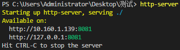
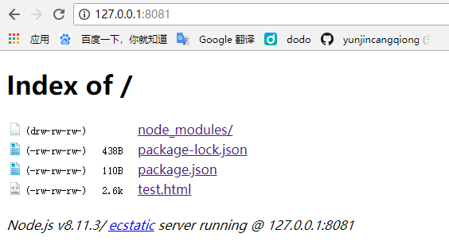

# http-server

## 简介

一款**基于 node 的本地服务器插件**, 可以使你的本地文件在本地服务器上运行

## 安装

安装之前确保安装了 node

npm i http-server -g  全局安装

## 使用

要让那个文件夹在本地服务器运行就在那个文件夹下打开命令行工具, 输入 `http-server` 命令即可

然后就可以使用下方提供的地址访问本地的文件, 多文件会以文件目录的形式展示出来, 点击具体的文件即可访问

