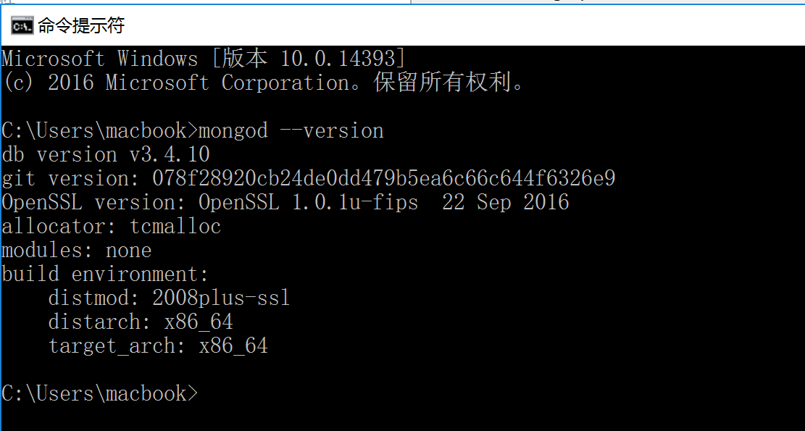

## MongoDB

> 参考 http://www.runoob.com/mongodb/mongodb-tutorial.html

### 关系型数据库和非关系型数据库

表就是关系

或者说表与表之间存在关系。

- 所有的关系型数据库都需要通过 `sql` 语言来操作
- 所有的关系型数据库在操作之前都需要设计表结构
- 而且数据表还支持约束
  - 唯一的
  - 主键
  - 默认值
  - 非空
- 非关系型数据库非常的灵活
- 有的非关系型数据库就是 key-value 对儿
- 但是 MongoDB 是长的最象关系型数据库的非关系型数据库
  - 数据库 -》数据库
  - 数据表-》集合（数组）
  - 表记录-》（文档对象）
- MongoDB 不需要设计表结构 (开发时也需要就是没有那么复杂)
- 也就是说你可以任意的往里面存数据，没有结构性这么一说

### 安装

- 下载
  - 64 位下载地址：https://www.mongodb.org/dl/win32/x86_64-2008plus-ssl?_ga=2.105676933.746703754.1509930046-961479447.1509930046
  - 32 位下载地址：https://www.mongodb.org/dl/win32/i386
- 安装
- 配置环境变量
  - 1.复制软件所在文件绝对路径  
    - 默认为 : C:\Program Files\MongoDB\Server\3.4\bin
  - 2.此电脑右键-->属性-->高级-->环境变量-->用户变量-->把路径添加到path变量即可
- 重开 cmd 输入 `mongod --version` (不可使用简写)出现版本号即为成功



### 启动和关闭数据库

启动：

```shell
# mongodb 默认使用执行 mongod 命令所处盘符根目录下的 /data/db 作为自己的数据存储目录
# 所以在第一次执行该命令之前先自己手动新建一个 /data/db
启动数据库 输入命令 mongod 回车即可(注意开启后不要关闭 cmd 窗口)
```

如果想要修改默认的数据存储目录，可以：

```shell
mongod --dbpath=数据存储目录路径
```

停止：

```
在开启服务的控制台，直接 Ctrl+c 即可停止。
或者直接关闭开启服务的控制台也可以。
```

### 连接和退出数据库

连接：

```shell
# 该命令默认连接本机的 MongoDB 服务
mongo
```

退出：

```shell
# 在连接状态输入 exit 退出连接
exit
```

### 基本命令

- `show dbs`
  - 查看显示所有数据库
- `db`
  - 查看当前操作的数据库
- `use 数据库名称`
  - 切换到指定的数据（如果没有会新建）
- 插入数据

## mongoose

官方的 `mongodb` 包来操作：https://github.com/mongodb/node-mongodb-native

第三方包：`mongoose` 基于 MongoDB 官方的 `mongodb` 包再一次做了封装。

- 官网：http://mongoosejs.com/

- 官方指南：http://mongoosejs.com/docs/guide.html
- 官方 API 文档：http://mongoosejs.com/docs/api.html

####MongoDB 数据库的基本概念

- 可以有多个数据库
- 一个数据库中可以有多个集合（表）
- 一个集合中可以有多个文档（表记录）
- 文档结构很灵活，没有任何限制
- MongoDB 非常灵活，不需要像 MySQL 一样先创建数据库、表、设计表结构
  - 在这里只需要：当你需要插入数据的时候，只需要指定往哪个数据库的哪个集合操作就可以了
  - 一切都由 MongoDB 来帮你自动完成建库建表这件事儿

```javascript
{
  qq: {
    users: [
      {name: '张三', age: 15},
      {name: '李四', age: 15},
      {name: '王五', age: 15},
      {name: '张三123', age: 15},
      {name: '张三321', age: 18},
      ...
    ],
    products: [
      
    ],
    ...
  },
  taobao: {
    
  },
  baidu: {
    
  }
}
```


## 使用

安装：

```shell
npm i mongoose
```

### 设计 Scheme 发布 Model

```javascript
var mongoose = require('mongoose')

var Schema = mongoose.Schema

// 1. 连接数据库
// 指定连接的数据库不需要存在，当你插入第一条数据之后就会自动被创建出来
//!!!!!!!!!!!!!!!!!!!!!使用时注意开启数据库 cmd 命令 mongod !!!!!!!!!!!!!!!!!!!!!!!
mongoose.connect('mongodb://localhost/数据库名', { useMongoClient: true })

// 2. 设计文档结构（表结构）
// 字段名称就是表结构中的属性名称
// 约束的目的是为了保证数据的完整性，不要有脏数据
//!!!!!!mongoose会自动为每个数据添加一个id 在调用时 注意使用 _id 来获取id值 !!!!!!!!
var userSchema = new Schema({
  username: {
    type: String,
    required: true // 必须有
  },
  password: {
    type: String,
    required: true
  },
  email: {
    type: String
  }
})

// 3. 将文档结构发布为模型
//    mongoose.model 方法就是用来将一个架构发布为 model
//    第一个参数：传入一个大写名词单数字符串用来表示你的数据库名称
//                 mongoose 会自动将大写名词的字符串生成 小写复数 的集合名称
//                 例如这里的 User 最终会变为 users 集合名称
//    第二个参数：架构 Schema
//   
//    返回值：模型构造函数
//在本文件内部使用
var User = mongoose.model('User', userSchema)
//导出数据模型构造函数
module.exports = mongoose.model('User', userSchema)

// 4. 当我们有了模型构造函数之后，就可以使用这个构造函数对 users 集合中的数据为所欲为了（增删改查）

```

###数据限制

```
type          数据类型  String Number Boolean
required      该数据为必填项
enum[]		  限制该数据的所有可能值   例如限制性别 enum[0,1,-1] 男,女,保密 和 权限 enum[0,1,2] 可为n多等级 有无查看文章的权限 下载的权限 发表评论的权限等
default       设置该数据的默认值
```

### 增加数据

```javascript
创建新数据
var admin = new User({
  username: 'admin',
  password: '123456',
  email: 'admin@admin.com'
})
保存新数据到数据库
admin.save(function (err, ret) {
  if (err) {
    console.log('保存失败')
  } else {
    console.log('保存成功')
    console.log(ret)
  }
})
```

### 查询

查询所有：

```javascript
User.find(function (err, ret) {
  if (err) {
    console.log('查询失败')
  } else {
    console.log(ret)
  }
})
```

按条件查询所有(就算只有一个数据也会以数组的方式返回数据)：

```javascript
User.find({
  username: 'zs',
}, function (err, ret) {
  if (err) {
    console.log('查询失败')
  } else {
    console.log(ret)
  }
})
```

按条件查询单个：

```javascript
User.findOne({
  username: 'zs'
}, function (err, ret) {
  if (err) {
    console.log('查询失败')
  } else {
    console.log(ret)
  }
})
```

### 删除数据

根据条件删除所有：

```javascript
User.remove({
  username: 'zs'
}, function (err, ret) {
  if (err) {
    console.log('删除失败')
  } else {
    console.log('删除成功')
    console.log(ret)
  }
})
```

根据条件删除一个：

```javascript
Model.findOneAndRemove(conditions, [options], [callback])
```

根据 id 删除一个：

```javascript
Model.findByIdAndRemove(id, [options], [callback])
```

### 更新数据

根据条件更新所有：

```javascript
Model.update(conditions, doc, [options], [callback])
```

根据指定条件更新一个：

```javascript
Model.findOneAndUpdate([conditions], [update], [options], [callback])
```

根据 id 更新一个：

```javascript
User.findByIdAndUpdate('5a001b23d219eb00c8581184', {
  password: '123'
}, function (err, ret) {
  if (err) {
    console.log('更新失败')
  } else {
    console.log('更新成功')
  }
})
```

# 使用 Node 操作 MySQL 数据库

> 参考文档：https://www.npmjs.com/package/mysql

安装：

```shell
npm install --save mysql
版本5之后 使用
npm i mysql
```

hello world：

```javascript
var mysql = require('mysql');

// 1. 创建连接
var connection = mysql.createConnection({
  host: '127.0.0.1',    //连接主机地址  默认为127.0.0.1:80  或者   localhost
  user: 'root',         //数据库账号
  password: '123',	    //数据库密码
  database: 'users'     //数据库名称 
});

// 2. 连接数据库 打开冰箱门
connection.connect();

// 3. 执行数据操作 把大象放到冰箱
// 第三个参数作用不大 可以忽略
connection.query('sql语句', function (error, results, fields) {
  if (error) throw error;
  console.log('The solution is: ', results);
});

// connection.query('INSERT INTO users VALUES(NULL, "admin", "123456")', function (error, results, fields) {
//   if (error) throw error;
//   console.log('The solution is: ', results);
// });

// 4. 关闭连接 关闭冰箱门
connection.end();

```

