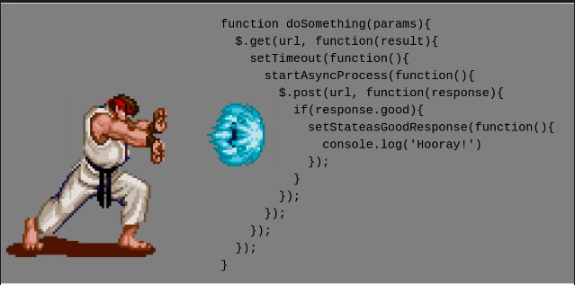

## 异步编程

### 回调函数

~~不成立的情况：~~

```javascript
function add(x, y) {
  console.log(1)
  setTimeout(function () {
    console.log(2)
    var ret = x + y
    return ret
  }, 1000)
  console.log(3)
  // 到这里执行就结束了，不会等到前面的定时器,函数无返回值,所以直接就返回了undefined
}

console.log(add(10, 20)) // 1,3,undefined, 1秒后输出2
```

~~不成立的情况：~~

```javascript
function add(x, y) {
  var ret
  console.log(1)
  setTimeout(function () {
    console.log(2)
    ret = x + y
  }, 1000)
  console.log(3)
  return ret
}

console.log(add(10, 20)) // 1,3,undefined, 1秒后输出2
```

用回调函数接收异步获取的值：

```javascript
function add(x, y, callback) {
  // callback 就是回调函数
  // var x = 10
  // var y = 20
  // var callback = function (a) { }
  console.log(1)
  setTimeout(function () {
    var ret = x + y
    callback(ret)
  }, 1000)
}

add(10, 20, function (a) {
  // a 才是我们得到的结果
})
```

基于原生 XMLHTTPRequest 封装 get 方法：

```javascript
function get(url, callback) {
  var oReq = new XMLHttpRequest()
  // 当请求加载成功之后要调用指定的函数
  oReq.onload = function () {
    // 我现在需要得到这里的 oReq.responseText
    callback(oReq.responseText)
  }
  oReq.open("get", url, true)
  oReq.send()
}

get('data.json', function (data) {
  console.log(data)
})
```

### Promise

> 参考文档：http://es6.ruanyifeng.com/#docs/promise

callback hell : 回调地狱  n多个异步函数嵌套的情况

无法保证顺序的代码：

异步执行代码时 无法保证顺序输出

异步核心  :  不会等待返回结果 会继续向下执行代码

```javascript
var fs = require('fs')

fs.readFile('./data/a.txt', 'utf8', function (err, data) {
  if (err) {
    // return console.log('读取失败')
    // 抛出异常
    //    1. 阻止程序的执行
    //    2. 把错误消息打印到控制台
    throw err
  }
  console.log(data)
})

fs.readFile('./data/b.txt', 'utf8', function (err, data) {
  if (err) {
    // return console.log('读取失败')
    // 抛出异常
    //    1. 阻止程序的执行
    //    2. 把错误消息打印到控制台
    throw err
  }
  console.log(data)
})

fs.readFile('./data/c.txt', 'utf8', function (err, data) {
  if (err) {
    // return console.log('读取失败')
    // 抛出异常
    //    1. 阻止程序的执行
    //    2. 把错误消息打印到控制台
    throw err
  }
  console.log(data)
})

```

通过回调嵌套的方式来保证顺序：

```javascript
var fs = require('fs')

fs.readFile('./data/a.txt', 'utf8', function (err, data) {
  if (err) {
    // return console.log('读取失败')
    // 抛出异常
    //    1. 阻止程序的执行
    //    2. 把错误消息打印到控制台
    throw err
  }
  console.log(data)
  fs.readFile('./data/b.txt', 'utf8', function (err, data) {
    if (err) {
      // return console.log('读取失败')
      // 抛出异常
      //    1. 阻止程序的执行
      //    2. 把错误消息打印到控制台
      throw err
    }
    console.log(data)
    fs.readFile('./data/c.txt', 'utf8', function (err, data) {
      if (err) {
        // return console.log('读取失败')
        // 抛出异常
        //    1. 阻止程序的执行
        //    2. 把错误消息打印到控制台
        throw err
      }
      console.log(data)
    })
  })
})

```



为了解决以上编码方式带来的问题（回调地狱嵌套），所以在 EcmaScript 6 中新增了一个 API：`Promise`。

- Promise 的英文就是承诺、保证的意思（I promise you）

promise 的三种状态 

等待状态 Pending  默认为此状态 异步代码 执行完毕后会转换为以下两种状态

成功状态 Resolve

失败状态 Reject

promise基本语法

```javascript
var pro = new Promise(function (resolve, reject) {
  异步操作 : 
  	失败时 将错误对象返回 reject(err)
  	成功时 将数据返回     resolve(data)
})
then函数有两个参数均为回调函数 第一个参数为成功的resolve回调函数 第二个参数为失败的reject回调函数
pro.then(function(data){},function(err){})

多层嵌套时
pro.then(function(data){
  ...
  return promise对象2
},function(err){})
   .then(function(data){
  	...
  	return promise对象3
   },function(err){})
   ...
```

Promise 样例：

```javascript
var fs = require('fs')

// 在 EcmaScript 6 中新增了一个 API Promise
// Promise 是一个构造函数

// 创建 Promise 容器
// 1. 给别人一个承诺 I promise you.
//    Promise 容器一旦创建，就开始执行里面的代码
var p1 = new Promise(function (resolve, reject) {
  // console.log(2)
  fs.readFile('./data/aa.txt', 'utf8', function (err, data) {
    if (err) {
      // 失败了，承诺容器中的任务失败了
      // console.log(err)
      // 把容器的 Pending 状态变为 Rejected

      // 调用 reject 就相当于调用了 then 方法的第二个参数函数
      reject(err)
    } else {
      // console.log(3)
      // 承诺容器中的任务成功了
      // console.log(data)
      // 把容器的 Pending 状态改为成功 Resolved
      // 也就是说这里调用的 resolve 方法实际上就是 then 方法传递的那个 function
      resolve(data)
    }
  })
})

// console.log(4)

// p1 就是那个承若
// 当 p1 成功了 然后(then) 做指定的操作
// then 方法接收的 function 就是容器中的 resolve 函数
p1
  .then(function (data) {
    console.log(data)
  }, function (err) {
    console.log('读取文件失败了', err)
  })

```

封装 Promise 版本的 `readFile`:

```javascript
var fs = require('fs')

function pReadFile(filePath) {
  return new Promise(function (resolve, reject) {
    fs.readFile(filePath, 'utf8', function (err, data) {
      if (err) {
        reject(err)
      } else {
        resolve(data)
      }
    })
  })
}

pReadFile('./data/a.txt')
  .then(function (data) {
    console.log(data)
    return pReadFile('./data/b.txt')
  })
  .then(function (data) {
    console.log(data)
    return pReadFile('./data/c.txt')
  })
  .then(function (data) {
    console.log(data)
  })

```

