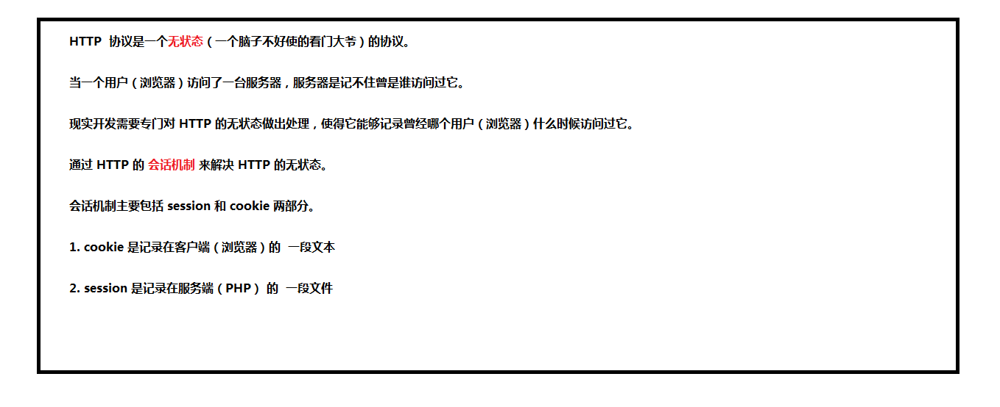

# cookie

HTTP 很重要的一个特点就是**无状态**（每一次见面都是“初次见面” 不会记录访问者的信息），如果单纯的希望通过我们的服务端程序去记住每一个访问者是不可能的，所以必须借助一些手段或者说技巧让服务端记住客户端，这种手段就是 **Cookie**。


Cookie 就像是在超级市场买东西拿到的小票，由超市（Server）发给消费者（Browser），超市方面不用记住每一个消费者的脸，但是他们认识消费者手里的小票（Cookie），可以通过小票知道消费者之前的一些消费信息（在服务端产生的数据）。



##JavaScript-API

+ 注意: **只能在服务器中打开时才可以使用 api 操作 cookie**

1. 通过 document.cookie 可对 cookie 进行设置和读取    
   + 限制为每次只能设置一对 设置cookie时为追加键值对
2. cookie 是键值对格式的字符
   + key=vlaue 格式

​    a) 设置

​    document.cookie = 'age=16';

​    document.cookie = 'gender=男';

​    b) 获取

​     直接使用 document.cookie 就可以获取全部 cookie 的值

3. cookie 默认可以跨页面被访问(同一协议 域名 端口)


4. 一旦 cookie 被设置, 以后所有请求都会将设置好的 cookie 以请求头的方式被发送到服务端
5. cookie 是有时间限制（生命周期），默认为关闭浏览器时删除cookie, 可以对时间限制（生命周期）做出调整。
   + document.cookie = 'name=xiaoming; expires=' + new Date('2020-01-01');
     + 注意时间格式为 xxxx - xx - xx
   + document.cookie = 'name=xiaoming; max-age='+ 60 *60 *24 *365;
     + 1年之后 cookie 失效
6. 删除 cookie 
   + 设置一个当前之前的时间即可
     + document.cookie = 'name=xiaoming; max-age=-1000';
7. cookie 有目录的限制，只能在设置好的目录以及其子目录被访问, path 的默认值为当前设置 cookie 的路径
   +  document.cookie = 'name=xiaoming; path=/php/05day/4-code/abc';
      +  设置 目录限制为 /php/05day/4-code/abc 路径及其子路径下生效
8. domain 可以设置 cookie 生效的域, domain 有默认值，其值为当前的域名
   + 例如 设置 cookie 生效为 jd.com 则在 taobao.com 下无法进行访问
   + document.cookie = 'name=xiaoming; domain=https://jd.com';

## PHP-API

+ setcookie(键名, 值 [ ; 附加信息 ] )
  + 通过 响应头 Set-Cookie 要求（指示）浏览器设置相应的 cookie

  ```
  // 设置 cookie
  setcookie("TestCookie", "hello", time() + 1 * 60 * 60);  /* 1 小时过期  */
  // 获取 cookie
  echo $_COOKIE["TestCookie"];
  ```

## jQuery cookie 插件

+ 引入

```javascript
<script src="./libs/jquery-1.12.4.min.js"></script>
<script src="./libs/jquery.cookie.js"></script>
```

```javascript
// 1. 设置
// 相当于 document.cookie = 'name=xiaoming';
$.cookie('name', 'xiaoming');
$.cookie('age', 16, {
  expires: 7,
  path: '/php/06day/4-code/libs'
});

// 2. 读取
console.log($.cookie('name'));
console.log($.cookie('age'));

// 3. 删除
// $.removeCookie('name');
// $.removeCookie('age');

// 4. 清空(不能一次性清空)
$.removeCookie();
```


##使用细节

+ $注意只有客户端才能直接设置和存贮cookie$

1. cookie 的大小有限制约 4K (因为url地址有长度限制)


2. 非必要情况不要使用 cookie
   + 原因为每次都会发送请求都会携带发送 cookie 造成带宽的浪费
3. cookie默认为存贮在内存中, 但cookie存贮时间过长时就存贮在本地硬盘上
4. document.cookie 可以获取/设置cookie的值 限制为每次只能设置一对 设置cookie时为追加对

###说明 : 密码请使用MD5加密(需要下载插件 md5.js)

escape()/unescape()不会对数字和字母以及一些常见的特殊字符加密

###封装设置cookie函数

```javascript
function setCookie(name, value) {
  //设置过期时间
  let day = 30
  let date = new Date()
  date.setTime(date.getTime() + day * 24 * 3600 * 1000)
  //escape: 对密码进行编码  expires: 设置过期时间
  document.cookie = name + '=' + escape(value) + '; expires=' + date.toGMTString()
}
```

### 封装获取cookie函数

```javascript
function getCookie(name) {
  let arr = document.cookie.match(new RegExp('(^|)' + name + '=([^;]*)(;|$)'))
  if (arr != null) {
    //解码加密的 value 值
    return unescape(arr[2])
  }
  return null
} 
```

### 封装删除cookie

```javascript
function deleteCookie(name) {
  let date = new Date()
  //设置过期的时间cookie对就被删除了
  date.setTime(date.getTime() - 5000)
  //此处借用封装的获取cookie函数
  let dele = getCookie(name)
  if (dele != null) {
    document.cookie = name + '=' + dele + '; expires=' + date.toGMTString()
  }
}
```

#session

由于 Cookie 是服务端下发给客户端**由客户端本地保存**的。换而言之客户端可以在本地对其随意操作，包括删除和修改。如果客户端随意伪造一个 Cookie 的话，对于服务端是无法辨别的，就会造成服务端被蒙蔽，构成安全隐患。

于是乎就有了另外一种基于 Cookie 基础之上的手段：**Session**：


Session 区别于 Cookie 一个很大的地方就是：Session 数据存在了服务端，而 Cookie 存在了客户端本地，存在服务端最大的优势就是，不是用户想怎么改就怎么改了。

Session 这种机制会更加适合于存放一些属于用户而又不能让用户修改的数据，因为客户端不再保存具体的数据，只是保存一把“钥匙”，伪造一把可以用的钥匙，可能性是极低的，所以不需要在意。


##操作 session

    1> 如果要使用 session, 就先开启 session
    	session_start();
    2> 一旦开启了 session, 服务器就会自动的生成 sessionID 并以 set-cookie 响应头的形式发回浏览器, 命令浏览器设置相应的 cookie ;  
    服务端获取 session_id 值: $_COOKIE["PHPSESSID"];
    3> 我们操作 SESSION 的读写只需要操作 $_SESSION 超级全局变量关联数组即可
    设置 $_SESSION[ "键" ] = "值";
    读取 $v = $_SESSION[ "键" ]; 
    
    -> 如果不在使用 session 可以删除 session 中的数据 或 销毁 session
        unset( $_SESSION[ "键" ] ); // 清除对应的数据
        session_destroy(); // 彻底摧毁所有 session 数据
+ 注意 session 只要开启,  剩下的生成, 发送, 接收, 判断 session_id 数据都是自动完成的