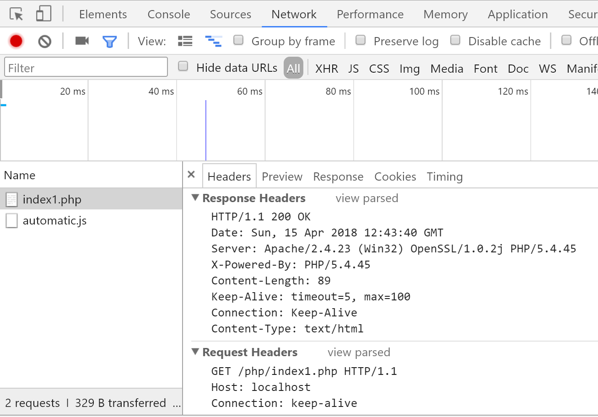

## 概要

### 定义

HTTP（HyperText Transfer Protocol，超文本传输协议）最早就是计算机与计算机之间沟通的一种标准协议，这种协议限制了通讯**内容的格式**以及各项**内容的含义**。


随着时代的发展，技术的变迁，这种协议现在广泛的应用在各种领域，也不仅仅局限于计算机与计算机之间，手机、电视等各种智能设备很多时候都在使用这种协议通讯，所以一般现在称 **HTTP 为端与端之间的通讯协议**。

Web 属于 B/S 架构的应用软件，在 B/S 架构中，浏览器与服务器沟通的协议就是 HTTP 协议

### 约定内容

- 请求 / 响应报文格式
- 请求方法 —— GET / POST / 等.
- 响应状态码 —— 200 / 301 / 302 / 304 / 404 / 500 / 等.
- 预设的请求 / 响应头

### 约定形式

1. 客户端通过随机端口与服务端某个固定端口（一般为80）**建立连接** 三次握手
2. 客户端通过这个连接**发送请求**到服务端（这里的请求是名词）
3. 服务端监听端口得到客户端发送过来的请求
4. 服务端通过连接响应给客户端状态和内容（响应报文）

## 核心概念

### 报文

#### 请求报文


##### 请求行

`GET /demo.php HTTP/1.1`

请求方式 + 空格 + 请求路径 + 空格 + HTTP 协议版本

##### 请求头

客户端想要告诉服务端的一些额外信息，以下为常见的请求头：

| 键               | 值                           |
| --------------- | --------------------------- |
| Host            | 请求的主机                       |
| Cache-Control   | 控制缓存（例如：max-age=60 缓存 60 秒） |
| Accept          | 客户端想要接收的文档类型，逗号分隔           |
| User-Agent      | 标识什么用户代理帮你发送的这次请求           |
| Referer         | 这次请求的来源                     |
| Accept-Encoding | 可以接受的压缩编码                   |
| Cookie          | 客户端本地的小票信息                  |

##### 请求体

这次请求客户端想要发送给服务端的数据正文，**GET 为空请求体, POST 为向服务器发送的数据**

#### 响应报文


##### 状态行

`HTTP/1.1 200 OK`

HTTP 协议版本 + 空格 + 状态码 + 空格 + 状态描述

##### 响应头

服务端想要告诉客户端的一些额外信息，常见的有以下：

| 键              | 值          |
| -------------- | ---------- |
| Date           | 响应时间       |
| Server         | 服务器信息      |
| Content-Type   | 响应体的内容类型   |
| Content-Length | 响应的内容大小    |
| Set-Cookie     | 让客户端设置一个小票 |

如果需要在程序中设置自定义的响应头（不是预设的），建议使用 `X-<Property-Name>` 规则

##### 响应体

这次请求服务端想要返回给客户端的数据正文，一般返回的都是 HTML，也可以返回 JavaScript 或者 CSS（需要修改响应头中的响应类型）。

## 简单分析一个请求头

```
POST (传送数据的方式) 01-demo.php(请求地址) HTTP/1.1(协议版本)
Host(主机名称): t.com
Connection(连接类型): keep-alive (长连接) // 不用每次请求数据都重新建立连接
Content-Length(传输数据的大小): 19
Cache-Control(缓存控制): max-age=0
Origin(信息源): http://t.com
Upgrade-Insecure-Requests(升级不安全的请求): 1(chrome独有的 意思就是说支持https协议下次访问的时候直接自动将http协议替换成https协议)(原因: chrome将http协议标记为不安全连接, 全面促进http2.0版本落地)
User-Agent(用户代理信息): Mozilla/5.0 (Windows NT 6.1; WOW64) AppleWebKit/537.36 (KHTML, like Gecko) Chrome/60.0.3112.113 Safari/537.36
Content-Type(资源MIME类型): application/x-www-form-urlencoded
Accept(可以接受什么MIME类型的数据): text/html,application/xhtml+xml,application/xml;q=0.9,image/webp,image/apng,*/*;q=0.8
Referer(从那跳转到这个页面): http://t.com/20170913-php-basic-03/codes/10-referenceAndCopy/
Accept-Encoding(可接受的压缩格式): gzip, deflate
Accept-Language(接受的语言): zh-CN,zh;q=0.8

每一个请求可以带有多个请求头, 请求头的目的是告诉服务器一些注意事项和详细信息. 每一个头都是采用 名字: 值 的方式提供

User-Agent:     一般用于判断浏览器的版本与类型( 现在一般是判断是否为移动端 因为各个浏览器的信息都是假冒的)
Accept-:        告知服务器, 我们的浏览器可以接受信息格式
Referer:        告诉服务器, 我的当前请求是否哪一个页面过来的. 一般用于防盗链, 或请求追溯, 或统计.
Content-Length          告诉服务器我们传递了多少个字节的数据
Content-Type            告诉服务器我们传递的数据类型
```

##简单分析一个响应头

```
HTTP/1.1 200 OK
Date(当前处理日期): Sun, 15 Apr 2018 12:43:40 GMT
Server(服务器软件或代理): Apache/2.4.23 (Win32) OpenSSL/1.0.2j PHP/5.4.45
X-Powered-By(后台语言): PHP/5.4.45
Content-Length(内容大小): 89
Keep-Alive: timeout=5, max=100
Connection(连接类型): Keep-Alive(长连接)
Content-Type(内容类型): text/html

array(4){[0]=>int(1)[1]=>int(2)[2]=>int(3)[3]=>int(4)}int(20)  // 响应体
```

## Chrome开发者模式分析http



+ chrome浏览器对http信息做出了优化处理, 与原来的信息格式不相同

##状态码

状态代码由三位数字组成，第一个数字定义了响应的类别，且有五种可能取值。

- 1xx：指示信息 —— 表示请求已接收，继续处理。
- 2xx：成功 —— 表示请求已被成功接收、理解、接受。
- 3xx：重定向 —— 要完成请求必须进行更进一步的操作。
- 4xx：客户端错误 —— 请求有语法错误或请求无法实现。
- 5xx：服务器端错误 —— 服务器未能实现合法的请求。

常见状态代码、状态描述的说明如下。

- 200 OK：客户端请求成功。
- 301 Moved Permanently: 永久重定向
- 302 Moved Temporaily: 临时重定向
- 400 Bad Request：客户端请求有语法错误，不能被服务器所理解。
- 401 Unauthorized：请求未经授权，这个状态代码必须和 `WWW-Authenticate` 报头域一起使用。
- 403 Forbidden：服务器收到请求，但是拒绝提供服务。
- 404 Not Found：请求资源不存在，举个例子：输入了错误的URL。
- 500 Internal Server Error：服务器发生不可预期的错误。
- 503 Server Unavailable：服务器当前不能处理客户端的请求，一段时间后可能恢复正常。