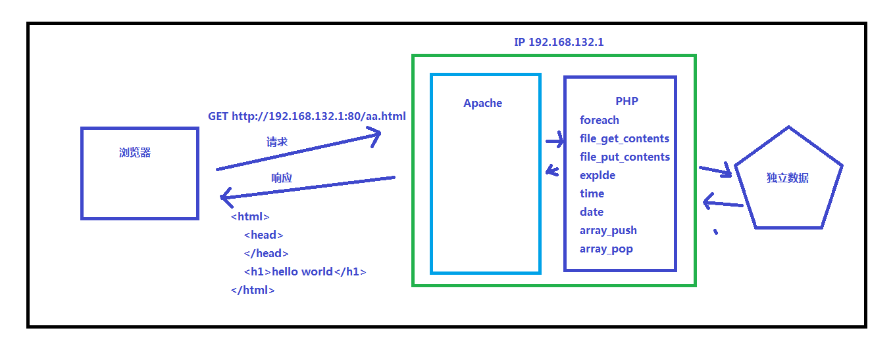

# 无特殊情况其余与javascript一致

## PHP文件

+ php代码由 开始标记 *<?php* (中间无空格)  结束标记  *?>* 包裹
+ php代码是此文档中最后的部分时建议去掉结束标记  *?>*  减少空行
+ php文件是由 .php 结尾的文件, 其中可以编写 html css js 代码
+ **注意php文件需要在服务器中打开, 本地打开不能正确解析**

##与 HTML 混编

老式的传统编码方式, 前端写完静态页面之后, 交给后台, 由后台处理业务逻辑(在前台代码中混合编写后台代码)

- 普通嵌入

  ```php
  <p><?php echo 'hello'; ?></p>
  ```

- 语句混编

  ```php
  <?php if ($age >= 18) { ?>
    <p>成年人</p>
  <?php } else { ?>
    <p>小朋友</p>
  <?php } ?>
  ```

  更常见的用法：指令式结构

  ```php
  <?php if ($age > 18): ?>
    <p>成年人</p>
  <?php else: ?>
    <p>小朋友</p>
  <?php endif ?>
  ```

## 注释

+ 单行注释  //        #(不常用)
+ 多行注释  /*    */

## 报错类型

+ notice 注意错误
  + 第一级报错 不影响代码运行,可能会影响结果
+ warning 警告错误
  + 第二级报错 不影响代码运行可能会影响结果
+ error 致命错误
  + 第三级报错 影响代码执行
+ 所有报错信息都会返回并显示在页面
+ @ 错误抑制符
  + 使用@可以屏蔽报错信息, 阻止心怀不轨的人利用报错信息
  + 例:  $con = @mysqli_connect('', '', '') or die('数据库连接出错!');

##常用输出

+ echo 

```
可以输出单个或多个变量, 多个变量用逗号隔开, 不能用于输出复杂类型
echo $name, $age;

特殊输出 false null 时, 实际上输出的是空字符串'', 输出 true 时, 输出数字1, 存在隐式转换

!!!!!!!!!!!!!!!!!!!!!!!!!!!!!!!!!!!!!!!!
向前台返回数据时, 一般使用 echo 输出数据; 向前台返回 json 数据时, 要将数据用 json_encode() 方法编码成 json 数据(字符串格式)后发送, 因为 echo 无法返回复杂类型.
!!!!!!!!!!!!!!!!!!!!!!!!!!!!!!!!!!!!!!!!
```

+ var_dump( para ) ,    print_r( para )

```
常用于输出数组, 复合数组类型数据
```

## 变量

用一个美元符号 $ 后面跟变量名(包含_ 字符 数字, 不能以数字开头)来表示, 区分大小写。

PHP 中变量无需声明类型，变量的类型根据值的类型来推断。(动态类型)

```php
<?php
$foo; // 申明一个变量，变量名为 `foo`，未对其进行赋值, 默认值为 NULL
$bar = 'baz'; // 申明一个变量，将一个值为 `baz` 的字符串赋值给它
echo $foo; // 输出一个变量名为 `foo` 的变量
fn($bar); // 将一个变量名为 `foo` 的变量作为 `fn` 的实参传递
```

##常量

+ 常量跟变量一样也是一个数据容器，但是不同的是一旦声明过后就不允许被修改, 否则报错.
+ 定义常量

```php
<?php
// 定义常量使用的是内置的 `define` 函数
// (必选)第一个参数是常量的名称，建议采用全大写字母命名，多个单词下划线分隔
// (必选)第二个参数是常量中存放的数据，可以是任意类型
// (可选参数)第三个参数是常量名称是否区不分大小写，默认 false 区分大小写
define('SYSTEM_NAME', '阿里百秀');
```

+ 使用常量

```php
<?php
// 直接通过常量的名称访问常量, 不需要用 $
echo SYSTEM_NAME;
```

## 基本类型

- string（字符串）
- integer（整型）—— 只能存整数
- float（浮点型）—— 可以存带小数位的数字
- boolean（布尔型）
- array（数组）
- object（对象）
- NULL(不区分大小写)（变量定义不赋值时的默认值）
- source (资源类型) -- 执行 sql 语句获取的就是资源类型

## 单引号 双引号

+ 都可以包裹字符串
+ 双引号有**解析变量**的作用

```
$name = 'gt';   
echo "$name" // 'gt'
```

+ 双引号可以**解析特殊的转义符号**

```
echo "\n" // 解析为换行
```

##数组

PHP 中数组可以分为两类：

- 索引数组

  与 JavaScript 中的数组基本一致

  ```php
  <?php
  // 定义一个索引数组
  $arr = array(1, 2, 3, 4, 5);
  var_dump($arr);

  // PHP 5.4 以后定义的方式可以用 `[]`
  $arr2 = [1, 2, 3, 4, 5];
  var_dump($arr2);
  ```

- 关联数组

  有点类似于 JavaScript 中的对象

  ```php
  <?php
  // 注意：键只能是`integer`或者`string`
  $arr = array('key1' => 'value1', 'key2' => 'value2');
  var_dump($arr);

  // PHP 5.4 以后定义的方式可以用 `[]`
  $arr2 = ['key1' => 'value1', 'key2' => 'value2'];
  var_dump($arr2);
  ```

## API

### 常用API

+ (int / string / bool)变量
  + 强制转换数据类型
+ isset(变量)
  + 用于判断变量是否有值, 有值返回 true , 无值返回 false
  + 特殊:  值为 null 会被判定为无值
+ unset(变量)
  + 删除变量, 静态变量无法删除
+ empty(变量)
  + 判断变量是不是为空值
  + 特殊: 值为 null, 数字 (-)0, false, 空数组 时 也会被判定为空
+ exit()
  + 结束执行当前程序
+ die(msg)
  + 结束执行当前程序, 并输出一段信息
+ sleep(时间)
  + 使程序停止运行一定时间, 单位为秒

### 字符串API

+ strlen(字符串)  
  + 获取字符串的长度
+ 字符串{索引} 访问字符串的第i个字符 php高版本字符串[索引]也可行


+ md_stripos(字符串, 要查找的字符 [, 开始查找的位置], 字符编码])
  + 在字符串中查找指定字符的索引并返回, 字符串如果为英文字母不区分大小写
  + 特殊: 在为汉字时需要设置编码为 utf8 才能正常返回索引, 否则, 因为一个汉字占3字节, 所以索引为正常情况下的3倍
+ explode(分隔符, 字符串)
  + 以分隔符分割字符串, 返回分割后的索引数组
+ trim(字符串)
  + 去除字符串两边的空格并返回新的字符串

### 数组API

+ count(数组)
  + 动态获取数组的长度
+ implode(连接符, 数组)
  - 以连接符连接数组, 返回连接之后的字符串
+ array_pop(数组)
  + 弹出并返回数组的最后一个值, 改变数组的原值
+ array_push(数组, 要加入的值 [,要加入的值])
  + 在数组的最后添加值, 返回改变之后的数组的长度, 改变数组的原值
+ array_unshift(数组, 要加入的值  [,要加入的值])
  + 在数组的最前面添加值, 返回改变之后的数组的长度, 改变数组的原值
+ array_shift(数组)
  + 弹出并返回数组的第一个值, 改变数组的原值
+ array_values(数组)
  + 获取并返回数组的值组成的索引数组
+ array_keys(数组)
  + 获取并返回数组的键或索引组成的索引数组
+ array_splice(数组, 位置, 删除的个数 [,插入的值, 插入的值...])
  + 跟 js 中 splice 方法完全一致
+ array_rand(数组)
  + 返回数组的随机的索引值, 关联数组返回随机的键名
+ in_array(变量/值, 数组)
  + 判断变量或值是否在数组中, 有返回true, 没有返回false

###文件操作API

+ file_get_contents(文件路径)
  + 获取文件的内容(字符串格式)
+ file_put_contents(文件路径, 要写入的值, [FILE_APPEND])
  + 设置文件的内容, 默认为覆盖文件内容, 第三个参数为在原来文件的基础上添加内容
  + 特殊: 当文件路径不存在时, 会创建新的文件
+ move_uploaded_file(文件临时路径, 文件要移动到的路径)
  + 移动上传的文件到指定目录

### 时间API

+ 设置时区

```
时间处理默认采用格林威治时间(与中国所在的时区相差8个小时)
打开phpStudy，点击 其它选项菜单 中 打开配置文件 中 php.ini
搜索关键字 date.timezone ，并在下一行添加 date.timezone=Asia/Shanghai即可。
注：配置文件中每行开头的;表示注释。
```

- 时间戳：`time()`
  - 从 Unix 纪元（格林威治时间 1970-01-01 00:00:00）到当前时间的**秒数**
- 格式化日期：`date()`
  - 获取有格式的当前时间
  - 格式化一个指定的时间戳
  - 可以通过 `strtotime()` 将有格式的时间字符串转换为时间戳

```
基本使用
	date('Y-m-d, h:i:s', time());// 2018-04-12, 02:27:40
```

## JSON

一组有特定格式的字符串, 用于传输, 存储数据;  类似于 js 的数组和对象

json基本的两种格式

+ '["html", "css", "javascript"]'
+ '{"name": "gt", "age": "15"}'
+ 注意:
  + 键必须用 " 双引号包裹
  + 最后一个值, 不能以 , 逗号结尾
  + 不能有单行或多行注释
  + 没有 `undefined` 这个值

###JSONAPI

+ json_decode(json数据[, true])    对应 js 中 JSON_stringify(数据)
  + 将json数据转化成数组和对象的格式, 第二个参数就是将数据转化成纯数组(将对象转化为关联数组)的形式
  + php中解码json数据时, 注意json中如果有对象数据, 一定要使用第二个参数 true
+ json_encode(数据)    对应 js 中 JSON_parse(数据)
  + 将数据(保持一定格式)转化成json数据

### js兼容老ie

```html
使用 json2.js 来兼容老ie   在 head 中引入即可
<!-- 用来解决 JSON 在 IE 低版本下未定义的问题 -->
<!-- 以下为 IE 能识别的注释 -->
<!-- ie hack -->
<!--[if lte IE 7]>
<script src="json2.js"></script>
<![endif]-->
```

##数据类型转换

```php
<?php
$str = '132';
// 将一个内容为数字的字符串强制转换为一个整形的数字
$num = (int)$str;
// 将一个数字强制转换为布尔值
$flag = (bool)$num;
```

##点运算符

字符串拼接采用的是的 `.` 点运算符

```php
<?php
$name = 'zce';
// 拼接 `hey ` 和 `zce`
$message = 'hey ' . $name;
// 相当于 +=
$foo .= $message
```

##foreach

+ 可以遍历两种数组

```php
<?php
关联数组
$arr = array('name' => 'zhangsan', 'age' => '18');
// $key 键 $value 值
foreach ($arr as $key => $value) {
  echo $key . ' ' . $value;
}

索引数组
$arr = array(2,3,4,5);
// $index 索引 $value 值
foreach($arr as $index=>$value) {
  echo $i, $v;
};
```

## 函数

+ 函数名不区分大小写, 但是都建议使用小写
+ 参数默认值
  + function fn( $name='gt' ) { }  在不传值时默认为'gt'

##变量作用域

+ **默认函数内不能访问函数所在作用域的成员。**
+ 仅对于函数作用域可以理解为php没有作用域链, 当前函数作用域中没有, 不会向上查找
+ 子函数要使用父函数的变量的解决方法
  + 以传参的形式传入子函数
  + 暴露给 $GLOBALS 超全局变量, 类似于 js 中暴露给 window 对象

```php
<?php
$top = 'top variable';
function foo () {
  $sub = 'sub variable';
  echo $top; // => 无法拿到
  function bar () {
    echo $top; // => 无法拿到
    echo $sub; // => 无法拿到
  }
  bar();
}
foo();
```

如果需要访问**全局变量**，可以通过 `global` 关键字声明：

```php
<?php
$top = 'top variable';
function foo () {
  // 声明在当前作用域中获取全局作用域中的 `$top`
  global $top;
  $sub = 'sub variable';
  echo $top; // => `top variable`
  function bar () {
    // 声明在当前作用域中获取全局作用域中的 `$top` 和 `$sub`
    global $top, $sub;
    echo $top;
    // => `top variable`
    echo $sub;
    // => 仍然无法拿到，因为 `$sub` 不在全局范围，而是在 `foo` 函数中定义
  }
  bar();
}
foo();
```

### 静态变量

```php
在 php 中函数可以定义静态变量(js中用闭包来模拟静态变量 其行为与之十分相似), 
其语法是:  static $变量名 = 值;
静态变量在函数第一次执行的时候 被赋值, 在函数后面调用的时候会被赋值为变化后的值.
  例如:
function fn() {
  $num = 1;
  echo $num;
  $num++;
}
fn();// 1
fn();// 1
如果是静态的呢?
function fn() {
  static $num = 1;
  echo $num;
  $num++;
}
fn(); // 第一次调用的时候, 给函数分配内存空间, 然后执行函数中的代码, 第一次会执行 $num = 1;输出为1;然后静态变量$num的值变为2;
// 函数执行结束后, 释放函数内存, 但是不释放 静态变量$num 的内存.(只有在关闭软件或者浏览器的时候释放静态变量)
fn(); // 第二次调用函数, 依旧是分配内存, 但是第一句话不再是 $num = 1 了, 这句话被忽略.输出为2;
```

##超全局变量

+ PHP 中的许多预定义变量都是“超全局的”，这意味着它们在一个脚本的全部作用域中都可用。在函数或方法中无需执行 global $variable; 就可以访问它们。

- $GLOBALS — 关联数组, 引用全局作用域(函数作用域中拿不到)中可用的全部变量
- $_SERVER — 获取服务端相关信息
- $_REQUEST — 获取以 post 或者 get 方式提交的参数 (不建议使用)
- $_POST — 获取 POST 提交参数
- $_GET — 获取 GET 提交参数
- $_FILES — 获取上传文件的数据
- $_ENV — 操作环境变量
- $_COOKIE —  获取 Cookie
- $_SESSION — 操作 Session

###$GLOBALS

+ 类型为关联数组, 全局变量的名(无$)就是键, 值就是值

```php
<?php
$x = 75;
$y = 25;
function foo () {
  // 创建一个名为 z 的全局变量
  $GLOBALS['z'] = $GLOBALS['x'] + $GLOBALS['y'];
}
foo();
echo $z; // => 100
```

### $_GET

+ 关联数组 表单的 name 值为键  值为值


+ 用于获取 get 方式传输的数据
  + $_GET["name"]
+ 设置值
  + $_GET['path'] = './test.php'

###$_POST

- 关联数组 表单的 name 值为键  值为值


- 用于获取 post 方式传输的数据, **只能获取非文件数据**
  - $_POST["name"]
- 设置值
  - $_POST['path'] = './test.php'

### $_FILES

专门用于接收文件数据, 为2维关联数组

```php
样例:
Array
(
    [文件上传表单name属性值] => Array
        (
            [name] => See You Again.mp3  // 文件名
            [type] => audio/mp3  // 文件类型
            [tmp_name] => C:\Users\macbook\AppData\Local\Temp\phpE1DF.tmp // 文件临时存贮路径, 不进行处理瞬间就会删除临时文件
            [error] => 0  // 错误码: 0是没有错误
            [size] => 3674803  // 文件大小
        )
)
```

### $_SERVER

+ $_SERVER['REQUEST_METHOD']   获取当前提交数据的方式
+ $_SERVER["HTTP_REFERER"]   获取请求来源的url地址
+ $_SERVER["HTTP_USER_AGENT"]    获取用户代理的信息

###$_COOKIE

+ 获取所有的 cookie 信息
+ 获取指定的 cookie 信息
  + $_COOKIE['键名']
+ 设置指定的 cookie 信息
  + $_COOKIE['键名'] = 值

###$_SESSION

- 获取所有的 session 信息(不包含 session_id )
- 获取指定的 session 信息
  - $_SESSION['键名']
- 设置指定的 session 信息
  - $_SESSION['键名'] = 值

##载入其他文件

通常情况下，当一个文件中的代码过长，自然会想到要拆分到多个文件中。随着开发经验的积累，慢慢的会发现，除了文件过程应该拆分文件，更应该做的事情是根据用途去划分。

+ 使用方式
  + xxx 文件路径

PHP 中引入其他 PHP 文件有四种方式(均为关键字)：

|                    | require | require_once | include | include_once |
| ------------------ | ------- | ------------ | ------- | ------------ |
| 被载入文件如果不存在是否影响继续运行 | Y       | Y            | N       | N            |
| 多次调用是否会重复执行被载入的文件  | Y       | N            | Y       | N            |

总结来说：

- 横向分为两类：require 和 include 两种，区别在于 require 会因为载入文件不存在或者报错而停止当前文件执行，而 include 会报错但是不会影响代码的执行。
- 纵向分为两类：xxx 和 xxx_once，区别在于代码中每使用一次 xxx 就执行一次载入的文件，而 xxx_once 只会执行一次。

使用层面：

- include 一般用于载入公共文件，这个文件的存在与否不能影响程序后面的运行
- require 用于载入不可缺失的文件
- 至于是否采用一次载入（once）这种方式取决于被载入的文件

## 常见表单元素处理

至于表单元素中的文本框文本域一类的元素，都是直接将元素的 `name` 属性值作为键，用户填写的信息或者选择的信息作为值，发送到服务端。

但是表单元素中还有一些比较特殊的表单元素需要单独考虑：

#### 单选按钮

```html
<!-- 最终只会提交选中的那一项的 value -->
<input type="radio" name="gender" value="male">
<input type="radio" name="gender" value="female">
```

#### 复选按钮

```html
<!-- 没有设置 value 的 checkbox 选中提交的 value 是 on -->
<input type="checkbox" name="agree">
<!-- 设置了 value 的 checkbox 选中提交的是 value 值 -->
<input type="checkbox" name="agree" value="true">
```

如果需要同时提交多个选中项，可以在 `name` 属性后面 跟上 `[]`：

```html
<input type="checkbox" name="funs[]" value="football">
<input type="checkbox" name="funs[]" value="basketball">
<input type="checkbox" name="funs[]" value="world peace">
```

最终提交到服务端，通过 `$_POST['func']` 接收到的是一个索引数组。

#### 选择框

```html
<!-- 单选 -->
<select name="subject">
  <!-- 设置 value 提交 value -->
  <option value="1">语文</option>
  <!-- 没有设置 value 提交 innerText ,注意千万不要这么写 -->
  <option>数学</option>
</select>

<!-- 多选 -->
<select name="select[]" multiple>
  <option value="a">1</option>
  <option value="b">2</option>
  <option value="c">3</option>
</select>

最终提交到服务端，通过 $_POST['select'] 接收到的是一个索引数组。
```

#### 文件选择框 -- 多文件上传

```html
<!-- 注意设置 post 和 enctype 属性 -->
<form action="" method="POST" enctype="multipart/form-data">
  <!-- 将name设置成数组的形式 并且设置多选属性 -->  
  <!-- 选择文件值就可以按住 ctrl 键进行多选 -->
  <input type="file" multiple name="file[]">
  <button type="submit">提交</button>
</form>

<!-- var_dump($_FILES) 获取到的信息 -->

array(1) {
  ["file"]=>
  array(5) {
    ["name"]=>
    array(2) {
      [0]=>
      string(11) "icon-08.png"
      [1]=>
      string(18) "icon-标志-08.png"
    }
    ["type"]=>
    array(2) {
      [0]=>
      string(9) "image/png"
      [1]=>
      string(9) "image/png"
    }
    ["tmp_name"]=>
    array(2) {
      [0]=>
      string(47) "C:\Users\macbook\AppData\Local\Temp\php2326.tmp"
      [1]=>
      string(47) "C:\Users\macbook\AppData\Local\Temp\php2327.tmp"
    }
    ["error"]=>
    array(2) {
      [0]=>
      int(0)
      [1]=>
      int(0)
    }
    ["size"]=>
    array(2) {
      [0]=>
      int(8158)
      [1]=>
      int(8158)
    }
  }
}
```


## 请求

+ 请求在网站的访问过程中很常见，并且请求分为多种方式：GET、POST、PUT、DELETE、OPTIONS等。其中GET和POST最常用。

### GET

GET从字面上理解为'获取'，通常用于获取服务端的数据。

常见的发起GET请求的方式有：

- 地址栏访问
- src/href
- 表单

网页中有许多效果使用的就是GET请求：

- 各种搜索框
- 各种详情页面
- 大部分请求都是GET请求。。。

### POST

POST从字面上理解为'发送'，通常用于向服务端发送数据。

#### 对比 GET 与 POST

|          | GET                                      | POST                                     |
| -------- | ---------------------------------------- | ---------------------------------------- |
| 后退按钮/刷新  | 无害                                       | 数据会被重新提交（浏览器应该告知用户数据会被重新提交）。             |
| 书签       | 可收藏为书签                                   | 不可收藏为书签                                  |
| 缓存       | 能被缓存                                     | 不能缓存                                     |
| 编码类型     | application/x-www-form-urlencoded        | application/x-www-form-urlencoded 或 multipart/form-data。为二进制数据使用多重编码。 |
| 历史       | 参数保留在浏览器历史中。                             | 参数不会保存在浏览器历史中。                           |
| 对数据长度的限制 | 是的。当发送数据时，GET 方法向 URL 添加数据；URL 的长度是受限制的（URL 的最大长度是 2048 个字符）。 | 无限制。                                     |
| 对数据类型的限制 | 只允许 ASCII 字符。                            | 没有限制。也允许二进制数据。                           |
| 安全性      | 与 POST 相比，GET 的安全性较差，因为所发送的数据是 URL 的一部分。在发送密码或其他敏感信息时绝不要使用 GET ！ | POST 比 GET 更安全，因为参数不会被保存在浏览器历史或 web 服务器日志中。 |
| 可见性      | 数据在 URL 中对所有人都是可见的。                      | 数据不会显示在 URL 中。以报文的形式的发送数据, 数据在请求头发送      |

##表单基本使用

form 标签有两个必要属性：

+ action：表单提交地址（填完了，交给谁）	
+ method：表单以什么方式提交
+ **每一个表单项都必须有一个 name 属性用于向后台传输数据**

PHP 中有三个超全局变量专门用来获取表单提交内容：

+ $_GET：用于获取以 GET 方式提交的内容，更标准的说法：接收 URL 地址问号后参数中的数据
+ $_POST：用于获取以 POST 方式提交的内容，更标准的说法：接收 请求体 中的数据
+ $_REQUEST：用于获取 GET 或 POST 方式提交的内容 (不建议使用)

借助 $_POST就可以获取到表单提交的内容：

```php
<?php
// 获取表单提交的用户名和密码
echo '用户名：' . $_POST['username'];
echo '密码：' . $_POST['password'];
```

###提交地址

`action` 提交地址指的是这个表单填写完成过后点击提交，发送请求的请求地址是什么。

从便于维护的角度考虑，一般我们最常见的都是提交给当前文件，然后在当前文件中判断是否是表单提交请求：

```php
<?php
if ($_SERVER['REQUEST_METHOD'] === 'POST') {
  // 表单提交请求
}
```

另外，建议使用 `$_SERVER['PHP_SELF']` 动态获取当前页面访问路径，这样就不用因为文件重命名或者网站目录结构调整而修改代码了：

```php
<!-- 这样写死 action 地址，当文件重命名就需要修改代码 -->
<form action="/foo/login.php">
  <!-- ... -->
</form>
<!-- 通过 `$_SERVER['PHP_SELF']` 获取路径，可以轻松避免这个问题 -->
<form action="<?php echo $_SERVER['PHP_SELF']; ?>">
  <!-- ... -->
</form>
```

###提交方式

`method` 可以用于设置表单提交的方式，目前我们所认识的就是最常见两种表单提交方式：`GET` 和 `POST`。

从效果上来看，两者都可以将数据提交到服务端，但是从实现提交的原理上两者有很大的不同：

- GET
  - **表单数据是通过 URL 中的 ? 参数传递到服务端的**
  - 可以在地址栏中看到提交的内容
  - 数据大小有限制(2k左右)，因为 URL 地址长度有限（2048个字符）
- POST
  - **表单数据是通过请求体传递到服务端的**，我们在界面上看不到
  - 可以提交任何类型的数据，包括文件
  - 数据大小理论没有限制
  - 由于界面上看不见，浏览器也不储存，所以更安全
  - 发送数据时进行编码, 获取数据时进行解码, 所以相对于 GET 来说, '性能'差一些

至于什么情况下应该选用哪种方式，这个需要结合业务场景和这两种方式各自的特点来决定，没有绝对的答案，只能给出一些原则：

- 绝不能使用 GET 来发送密码或其他敏感信息！！！
- **应该想清楚这次请求到底主要是去拿东西，还是去送东西**

## 文件上传

**注意：**

- 修改 `php.ini` 中的 `post_max_size` 配置，让服务端可以接受更大的请求体体积
- 修改 `php.ini` 中的 `upload_max_filesize` 配置，让服务端支持更大的单个文件上传

html代码

```javascript
// 文件上传时只能使用 post 传输数据的方式, 并且设置 enctype="multipart/form-data"
<form action="./request.php" method="post" enctype="multipart/form-data">
    <input type="file" name="source">
    <input type="submit" value="提交">
</form>
```

php代码

```php
<?php
  header("Content-Type: text/html; charset=UTF-8");
  $temp = $_FILES['source']['tmp_name'];
  // 如果文件名中有中文, 使用$newName = iconv("UTF-8", "GBK", $_FILES["source"]["name"]); 转换编码
  // 大陆电脑默认编码为gbk, 所以会显示乱码, 将 utf-8 转换为 gbk 即可在上传的本地文件夹中正常显示文件名
  $name = './upload/'. $_FILES['source']['name'];
  // 将文件移动到 upload 文件夹下
  move_uploaded_file($temp, $name);
```

## 响应头设置

php中可以使用 header 函数设置响应头

+ header("Content-Type: text/html; charset=UTF-8")

  + 设置文件类型和编码
  + 常见的 HTTP MIME type：`text/css` `text/html` `text/plain` `applcation/javascript`

+ header("Refresh: 秒数(无单位); url=链接地址")
  + 几秒后刷新页面到新的连接地址

+ header("Location: 链接地址")
  + 重定向到新的链接地址

+ ```
  - header('Content-Type: application/octet-stream');
    - 让文件下载
  - header('Content-Disposition: attachment; filename=下载之后的文件名');
    - 设置下载文件的文件名
  上面两个响应头一起使用可以使文件下载
  ```

+ 图片防盗链

  + 通过判断请求来源 `Referer` 是否为本网站从而区分是否是合法请求

## 前后台交互

假设后台语言为php,  浏览器向服务器请求页面, 如果请求的页面中有php代码, 则服务器将代码转交给php解析器处理, php处理完成之后, 将代码返回给服务器, 服务器再返回给浏览器



### 前后端分离

前端只管向后台要数据接口, 并渲染数据, 完成业务逻辑,  后端只管提供接口, 处理数据.

## 引用赋值

```php
在 php 中可以对变量进行引用赋值, 对于函数的参数进行引用传递, 类似于对象传值, 只传递地址
1> 在 php 中对数据的赋值( 基本类型: 字符串, 数组, ... ) 默认都是传递的值
$num1 = 1;
$num2 = $num1; // 将 $num1 中的 值拷贝一份, 交给 $num2;

$arr1 = array( 1, 2, 3 );
$arr2 = $arr1; // "也会拷贝值"
2> 如果希望使用引用的方式赋值. 在变量前面使用 & 运算符
  语法: 
$变量1 = &$变量2;
此时 $变量1, 就是 $变量2 的别名, 即修改 $变量1, 等同于 修改 $变量2 反之 也成立
  3> 在 php 代码中引用赋值使用相对较少, 但是在函数传参的时候, 对于大量的的数据一般采用引用传递(减少拷贝数值产生的时间和内存消耗)
  语法:
function 函数名( &$参数 ) {
  // ...
}
```


## php响应机制

```
由于 php 运行在 服务器. 那么它的输出实际上是利用一个机制来实现的
在服务器中有一个缓存
服务器在执行 php 代码的时候, 会将 php 的代码从上往下, 从左至右执行.
我们在执行代码中可以输出, 每次的输出服务器都不会立即返回给浏览器.
而是在服务器中使用了一个缓存. 待 php 代码全部执行结束后, 一次性将结果返回给浏览器.
```

## php 的内存(垃圾)回收机制

```php
    -> 内存泄漏 ( 创建的对象占用了内存, 但是对象不见了, 内存还占着 )
    -> 内存溢出
    -> 在 php 的内部给每一个数据都提供了一个计数器, 例如: $num = new Object();
        此时在 php 的底层就会给刚被创建出来的对象标记为 1. 
        如果出现了赋值行为, 则计数自动 +1. 例如: $variable = $num;
        那么给刚刚的那个对象计数增加 1. 即 计数就为 2.
        凡是从新指向, 那么也会修改计数器. 例如: $num = null;
        即少了一个变量指向对象, 那么对象的计数 -1, 又回到 0.
        php 底层会定期监视内存与对象的引用, 凡是 引用计数 为 0 的对象. 就会找个合适的时间删除资源.
        
    -> 在 PHP 中一个函数的静态变量, 在函数执行的时候会存储起来. 
        同时在整个 php 代码执行结束之前这个数据都会在内存中. 
        但是如果这个 php 页面执行结束了. 那么这时的静态变量的内存就会释放了.
```

