## phpstudy

### 安装 phpStudy

这里我们选择一个简单易用的服务器软件集成环境，内部集合了我们需要使用的服务器软件Apache、服务端开发语言php的执行环境、以及数据库软件MySQL。

> - 下载地址与使用说明：http://www.phpstudy.net/download.html

安装方式如下，解压后，双击运行phpStudySetup.exe：

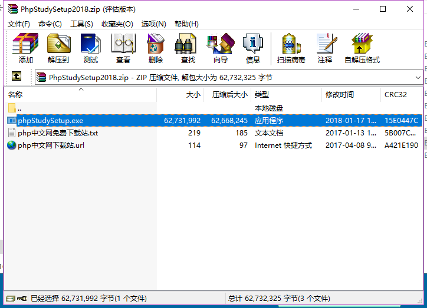

界面会提示安装路径，使用默认路径即可，点击`是`：

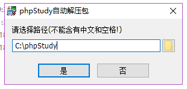

接下来等待安装完毕：

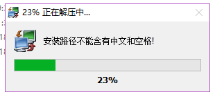

安装完毕后可能会弹出更新提示，跳过即可(如果没有则可忽略)。界面会呈现如下效果：

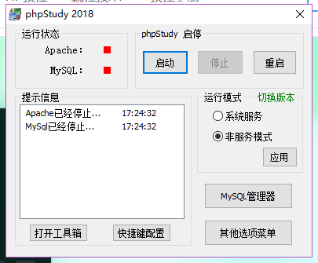

点击启动，等待左侧红点变为绿色即为启动成功，现在可以打开浏览器，在地址栏中输入localhost并点击回车，页面会显示`Hello World`，恭喜你，phpStudy成功的安装完毕啦！~

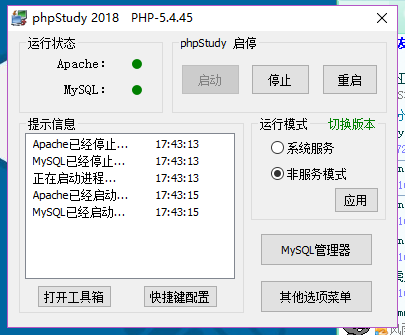

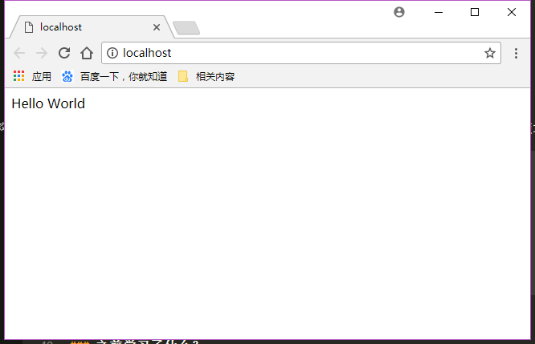

## 配置php.ini

- 修改 `php.ini` 中的 `post_max_size` 配置，让服务端可以接受更大的请求体体积
- 修改 `php.ini` 中的 `upload_max_filesize` 配置，让服务端支持更大的单个文件上传

## 安装mysql可视化工具

+ **注意: 提示更新不要更新 会导致破解失效**
+ navicat
  + 脑残安装即可, 安装路径可自选
+ 破解无限期使用
  + 使用 PatchNavicat 选择 navicat.exe 可执行程序 确定即可 随后弹出一个框 即为成功

## phpStudy的基本使用

### 监听端口（了解）

实时监听各种请求, 监听端口可以随意修改为任意一个未被其他程序监听的端口，可以通过点击phpStudy软件底部右侧 `其他选项菜单` 中 `phpStudy 设置` 中的 `端口常规设置` 进行设置。(采用默认80即可)

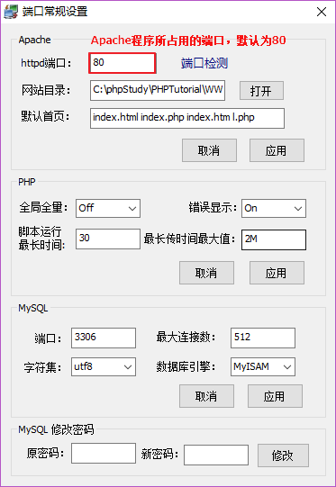

### 网站根目录与默认文档

> **网站根目录** 就是存放我们网站文件的最顶层目录，通常 URL 中域名后面的第一个斜线对应（映射）的就是网站根目录。
>
> **默认文档** 又称为默认首页，指的是客户端访问的是一个目录（没有指定具体的文件），服务端默认返回这个目录下的某个文档（文件），这个文档就称之为**默认文档**

如果需要设置网站根目录与默认文档，可以通过点击phpStudy软件底部右侧 `其他选项菜单` 中 `phpStudy 设置` 中的 `端口常规设置` 进行设置。

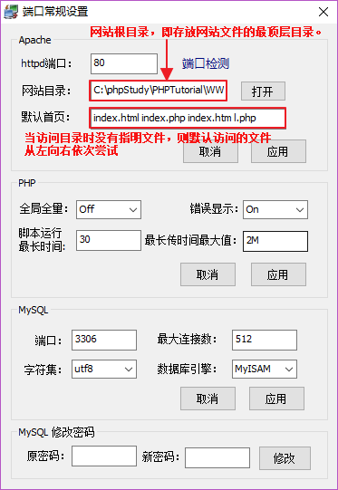

### 开启目录列表

当我们访问一个目录时，如果没有指明要访问的文件，则会访问 `默认文档` (见上一节)，但如果没有默认文档时，访问文件就不那么方便了。

此时可以开启 `目录列表` 功能，方便文件的查看。设置方式如下：

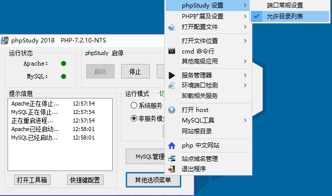

> 注：开启目录列表后，localhost无法访问（其他路径不影响），则删除网站根目录下的 l.php 即可。

### 配置虚拟主机

如果一台机器上只有一个网站的话，没有任何问题，但是如果想要在一台机器上部署多个站点(同一IP多个域名)，就必须通过配置虚拟主机的方式解决。

找到虚拟主机配置位置，点击phpStudy软件底部右侧 `其他选项菜单` 中的 `站点域名管理`。

> 初次打开时，每个选项中有均默认的示例配置，可以直接修改为需要的值

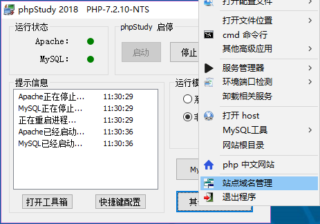

> 配置中标红的位置中第一个为虚拟主机的域名，第二个为当前虚拟主机的网站根目录，第三个为第二域名(相对第一个域名简短一些，方便使用，不是必须的)，端口无需修改。
>
> 例如此处设置域名为 `www.day1.cn` ，目录为`C:\phpStudy\PHPTutorial\WWW\day1`, 第二域名为 `day1.cn`

> 修改完毕后点击 `新增` ，然后点击 `保存设置并生成配置文件`，phpStudy会自动重启。

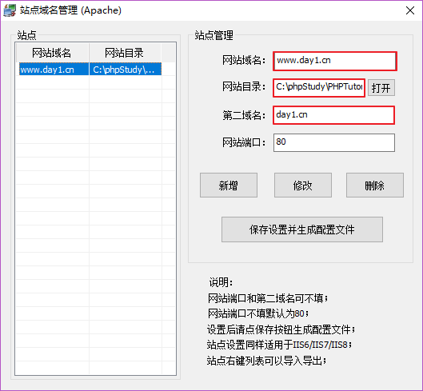

虚拟主机配置完毕后，如果真的要使用 `www.day1.com` 这个域名的话，还需要通过修改 `hosts` 文件达到目的，原因很简单：这个域名不是我们自己的，我们没有办法修改这个域名在公网上的 DNS。但是可以通过修改本地 `hosts`文件使浏览器找到我们设置的对应域名.

找到hosts文件位置( windows下为 C:\Windows\System32\drivers\etc )或直接从phpStudy中进入( 修改之前记得备份 )，点击phpStudy软件底部右侧 `其他选项菜单` 中的 `host`.

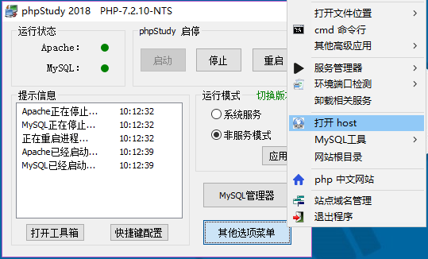

在文件中最后按照图片中高亮格式, 添加 ip地址 和 域名即可

设置新添加的网站可以通过`目录列表方式访问`     依次点击   其他选项菜单 => 打开配置文件 => vhosts-ini 在相应位置添加高亮字符串即可  Options +Indexes +FollowSymLinks +ExecCGI

本地

> 注意：
>
> - 如果使用了虚拟主机，则默认必须全部使用虚拟主机，即之前的默认网站也必须通过虚拟主机方式配置，否则访问不到。

### 403问题

+ 文件权限问题
  + 只有苹果系统下会有这个问题
+ 没有目录列表权限
  + 当根目录下没有可以直接显示的文件时( index.php, index.html, index.htm ); 也会显示 403 
  + 解决办法
    + 1. 开启目录列表
      2. 在根目录下创建index.php或 index.html或 index.htm