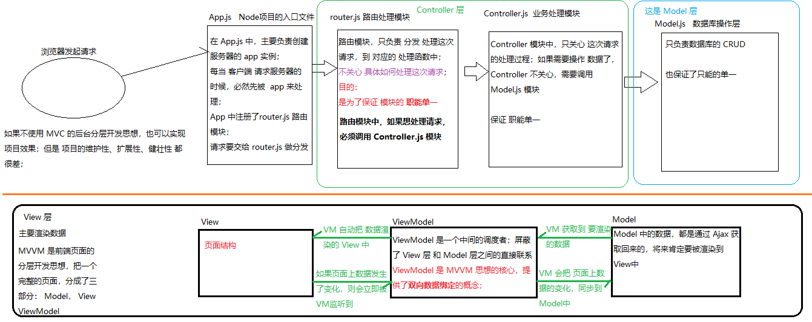
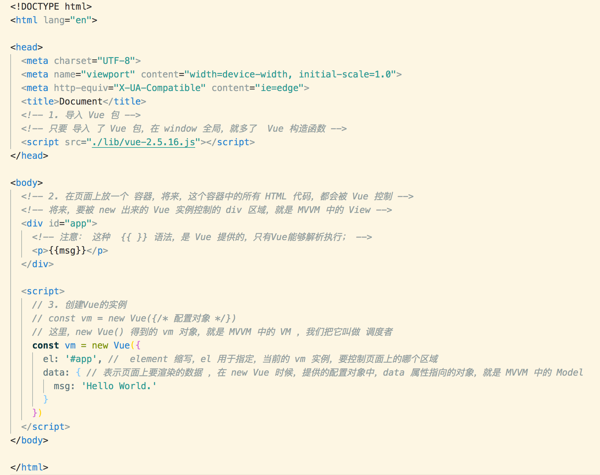

# Vue.js 基础

##框架和库的区别

+ 概念：小而巧的是库； 大而全的是框架
 + 框架：是一套完整的解决方案；对项目的侵入性较大，项目如果需要更换框架，则需要重新架构整个项目。


 + 库（插件）：提供某一个小功能，对项目的侵入性较小，如果某个库无法完成某些需求，可以很容易切换到其它库实现需求。


## 为什么要学习流行框架

+ 企业角度：
  - 企业中需要使用流行框架来提高项目的开发效率；（本质目的：节约开发成本）
+ 个人角度：
  + 为了能有一个比较不错的收入(主要原因)
  + 提高竞争力和对技术的把握程度
  + 学习的不仅仅是框架
    + 接触到最新的开发模式
    + 最新的开发思想(比如MVVM的开发思想)
    + 最前沿的技术 ES6, ES7...


## 什么是Vue.js

+ Vue.js 是前端的**主流框架之一**，和Angular.js、React.js 一起，并成为前端三大主流框架！
  + Angular.js  由Google公司研发, 是出现**最早**的前端框架，曾经很火，但是现在已经 被边缘化了；学习曲线曲折；1.x为之前的一个大版本, 2.0之后为另一个大版本, 前后两个版本差别很大
    + Angular 1.x     学起来比较困难；
    + Angular 2.x ~ 5.x    学习起来相对简单；
  + React.js   由FaceBook公司研发, 是目前**最流行**的一个框架；是使用的人最多的一个框架；但是，学习起来也比较难；因为在 React中，所有的功能，都要用 Javascript 来实现；
  + Vue.js 由国人 `尤雨溪 ` 开发, 是目前**最火**的前端框架；Vue 学习起来非常容易; 文档非常友好；
+ Vue.js 是一套构建用户界面的框架，**只关注视图（页面）层的开发**，易于上手；
+ 前端的主要工作是什么？
  + 实现基本的页面结构
  + 实现炫酷的页面效果
  + 实现数据交互
+ 前端的发展历程
  + 在Web端开发中，刚开始没有前端岗位，那时候只有美工（作图、用 dreamware 拖拽组件组成页面结构）
  + 前端就是一些活儿不好的美工，另辟蹊径，打通了前端的岗位；
  + 前端刚起步时的布局技术: HTML +  Table 布局 + CSS2
  + 现代布局技术: CSS + DIV 布局
  + 使用原生的 JavaScript 写页面, 会有很多的兼容性问题
  + jQuery + 模板引擎 + Ajax（老年程序员技术栈）
  + 前端流行框架诞生（要解决的问题：就是 避免程序员手动操作DOM元素）


## Node（后端）中的 MVC 与 前端中的 MVVM 之间的区别

 + MVC 主要是后端的分层开发思想；把 一个完整的后端项目，分成了三个部分：
    + Model：（数据层）主要负责 数据库的操作；
    + View：（视图层）所有前端页面，统称为 View 层
    + Controller：（业务逻辑层）主要处理对应的业务逻辑；（对于后台来说，这是开发的重点）
 + MVVM是**前端页面的分层开发思想**，主要关注于 **视图层(View)** 分离，也就是说：MVVM把前端的视图层，分为了 三部分 Model, View,  ViewModel
    + Model 是 页面中，需要用到的数据
    + View 是页面中的HTML结构；
    + ViewModel 是 一个 介于前两者之间的调度者；

    


## Vue.js 基本代码 和 MVVM 之间的对应关系




##Vue 实例

- el
  - 指定被 Vue 管理的模板入口, 只有el 中的元素才能被 Vue 管理
  - 不能使用 body、html, 必须是一个普通的 HTML 标签节点，一般是 div
- 虚拟标签 template
  - 一般与 v-if 配合使用, 隐藏多标签区域; 或用于作用域插槽来包裹一些元素
  - 没有具体的实体;不产生新的标签;在网页中不显示; 解析后的文档中也不存在
- data
  - 作用：**数据驱动视图** 中的 **数据**
  - 现在就是不需要直接操作 DOM 元素了，只需要在 data 中初始化一个数据成员，然后在模板中绑定使用这个成员, 我们就可以通过修改数据的方式来改变视图
  - 核心就是把 DOM 操作的思想转变到 **数据驱动视图** 的思想
- methods
  - 作用：一般用来定义事件处理函数
  - 虽然我们可以把方法写到 data 中，但是在 Vue 中更推荐把所有方法都写到 methods 属性中, 这样做更合理，数据和方法分开，分门别类
  - 不允许具有和 data 中重名的成员,否则会报错


## 什么是Vue中的指令

###声明:注意: vue中的指令, 插值表达式等, 都会默认将写入的值识别为特殊的变量, 想要写入字符串需要使用单/双引号包裹.

**特性: `v-开头的指令只能用在元素的属性节点上`**

定义： Vue 中，通过一些特殊的语法，扩展了 HTML 的能力；

+ 将来 创建 Vue 实例的时候，Vue 会把 这些指令 都进行解析，从而，根据不同的指令，执行不同的操作、渲染不同的结果；


## Vue指令之 `插值表达式 {{ }}`

1. 基本使用演示
   ```html
   <!-- 插入动态的文本 -->
   <p>{{msg}}</p>
   <!-- 简单的表达式 -->
   <p>{{msg + '文本'}}</p>
   <!-- 前后可以添加文本 -->
   <p>前{{msg}}后可以添加文本</p>
   ```

2. 在插值表达式中 可以使用简单的表达式, 如字符串拼接, 三元表达式等

3. **注意：插值表达式只能用在双标签元素的内容区域；不能用在元素的属性节点中**


## Vue指令之 `v-cloak`

1. 解决的问题
    + 插值表达式有闪烁的问题: 在网络较慢的时候, vue文件还没加载完毕, 插值表达式会直接展示在页面上, 产生用户体验问题（`v-cloak` 指令来解决闪烁问题）

2. 应用场景
    + 当网络比较慢的时候，我们可以为有差值表达式的最外层的元素，添加 `v-cloak`指令，并添加隐藏的css属性, 防止用户看到 插值表达式

3. 原理

    + 在vue文件加载完毕之后, 会对有该指令的元素进行去除 v-cloak 指令(自定义属性属性)操作

    ```html
    <!-- css -->
    <style>
      [v-cloak] {
        display: none
      }
    </style>
    <!-- html -->
    <div id="app" v-cloak>
      <p>{{msg}}</p>
    </div>
    ```

    ​


## Vue指令之 `v-text`

1. 基本使用
   在 元素的属性节点上，添加`v-text`指令，例如：
   ```html
   <p v-text="msg"></p>
   ```
2. 可在`v-text`中 使用简单的表达式
3. `v-text` 与 `{{}}` 的区别
   + v-text 会覆盖之前元素上的文本内容
   + v-text 没有闪烁问题; 主要原因为其就是一个自定义属性, 在vue文件没加载完成之前,其没有任何特殊功能, 在vue文件加载完毕之后会对其进行渲染


## Vue指令之 `v-html`

1. 基本使用

    能识别并渲染数据中的标签,  例如：

    ```html
    <div v-html="msg"></div>
    ```


## Vue指令之 `v-bind:` 属性绑定

1. 基本使用
   + 为 html 属性节点单向动态绑定数据，例如：
      ```vue
      <button v-bind:title="titleStr">按钮</button>
      ```
2. 简写形式
   + 可以简写成 `:`，例如：
      ```vue
      <button :title="titleStr">按钮</button>
      ```


## Vue指令之 `v-on:` 事件绑定

1. 基本使用：
  为 HTML 元素，绑定 事件处理函数，事件名与原生js一致, 例如：
    ```vue
  <!-- 如果没有参数, 可以直接写函数名 -->
  <input type="button" value="按钮" v-on:click="事件处理函数名" />
    ```
2. 绑定事件处理函数并传参：
    ```vue
    <input type="button" value="按钮" v-on:click="show(123)" />
    ```
3. 简写形式：
  可以简写成 `@`，例如：
   ```vue
  <input type="button" value="按钮" @click="事件处理函数名" />
   ```


## Vue中方法的this指向问题

Vue实例 中所有的内置的属性里面的 this 都指向当前的 Vue实例

```js
const vm = new Vue({
  el: '#app',
  data: {
    name
  },
  methods: {
    eat() {
      // methods 方法中的 this 默认指向该 Vue 实例
      this.name
      // 为避免产生 this 指向其他问题, 可以全部使用箭头函数代替普通函数
    }
  }
})
```

## Vue指令之 `v-model` 双向数据绑定

1. 基本使用：
  + 可以把该指令绑定的表单元素的数据的变化，自动同步更新到相应的 `Vue` 实例的 `data` 中。例如：
    ```html
    <input type="text" v-model="msg"/>
    ```
2. `v-model`和 `v-bind:`的区别：
   + `v-bind:` 只能实现单向的数据同步 `data ---> 页面`；
   + `v-model` 可以实现双向的数据同步 `data <--> 页面`；
3. 注意： 
   + `v-model` 只能 和 **表单元素** 配合使用，例如 `input、select、textarea` 等；
   + `v-model` 是 Vue 中 **唯一支持** 双向数据绑定的指令；


## 在Vue中使用class

1. 类名数组：
   + 通过 `v-bind:` 指令为元素的 `class` 绑定具体的类名数组：
    ```html
    <p :class="['thin', 'red', 'big']">奥迪双钻</p>
    ```
2. 类名数组中使用**三元表达式**，按需为元素添加某些类名
   ```html
   <p :class="['thin', flag ? 'red' : '']">我的伙伴</p>
   <!-- 在只有一个 class 属性切换的时候, 可以不使用类名数组 -->
   <p :class="flag ? 'red' : ''">我的伙伴</p>
   ```


## Vue指令之`v-for`和`:key`属性

> 语法 `<li v-for="(循环的数据项item, 索引i) in 数组"></li>`
>
> 索引参数可选, 没有索引参数时, ()可以省略

1. 迭代数组

   + 普通数组（一般般）
   + 对象数组（用的最多）

2. 迭代对象中的属性（用的不多）

   ```html
   <div id="app">
     <p v-for="(val, key) in obj">属性名为:{{key}} ---- 属性值为:{{val}}</p>
   </div>
   <script>
     var vm = new Vue({
       el: '#app',
       data: {
         obj: {
           name: 'gt',
           age: 23,
           address: '黑龙江'
         }
       },
     })
   </script>

   <!-- 结果为 -->
   <div id="app">
     <p>属性名为:name ---- 属性值为:gt</p>
     <p>属性名为:age ---- 属性值为:23</p>
     <p>属性名为:address ---- 属性值为:黑龙江</p>
   </div>
   ```

3. 迭代数字（几乎没人用）

   将标签循环为数字个

   ```html
   <div id="app">
     <!-- i 从 1 开始计数 -->
     <p v-for="i in 3">{{i}}</p>
   </div>

   <!-- 结果为 -->
   <div id="app">
     <p>1</p>
     <p>2</p>
     <p>3</p>
   </div>
   ```

> 2.2.0+ 的版本里，**当在组件中使用** v-for 时，`:key` 现在是必须的。

+ `问题:` 当用 v-for 更新已渲染过的元素列表时，它默认用 “**就地复用**” 策略。如果数据项的顺序被改变，Vue将**不是移动 DOM 元素来匹配数据项的顺序**， 而是**简单复用此处每个元素**，并且确保它在特定索引下显示已被渲染过的每个元素。

  代码演示: 在勾选了一个复选框时, 再添加数据的时候, 复选框的位置不会随着数据的添加而改变

  ```html
  <!DOCTYPE html>
  <html lang="en">

  <head>
      <meta charset="UTF-8">
      <meta name="viewport" content="width=device-width, initial-scale=1.0">
      <meta http-equiv="X-UA-Compatible" content="ie=edge">
      <title>Document</title>
      <script src="./lib/vue-2.5.16.js"></script>
  </head>

  <body>
      <div id="app">
          <div>
              <input type="text" v-model="name">
              <button @click="add">添加</button>
          </div>

          <ul>
              <li v-for="item in list">
                  <input type="checkbox"> Id：{{item.id}} --- name：{{item.name}}
              </li>
          </ul>
      </div>

      <script>
          var vm = new Vue({
              el: '#app',
              data: {
                  name: '',
                  list: [{
                          id: 0,
                          name: '刚刚'
                      },
                      {
                          id: 1,
                          name: '小刚刚'
                      },
                      {
                          id: 2,
                          name: '大刚刚'
                      }
                  ]
              },
              methods: {
                  add() {
                      // 1. 拼接处一个完整的用户信息对象，包含 Id和name
                      const newUser = {
                          id: this.list.length,
                          name: this.name
                      }
                      // 2. 把拼接出来的 用户信息对象， 调用 this.list.unshift 把对象追加到数组的开头位置
                      this.list.unshift(newUser)
                  }
              }
          });
      </script>
  </body>

  </html>
  ```

+ `解决办法:` 为了给 Vue 一个提示，**以便它能跟踪每个节点的身份，从而重用和重新排序现有元素**，你需要为每项提供一个唯一 :key 属性。

  ```html
  <!-- 注意：:key 的取值，必须是 number 或 string类型 -->
  <!-- 使用 v-for 循环的每一项的 :key 值，都要保证唯一性 -->
  <!-- 今后，只要使用 v-for 循环，就必须为 循环的每一项，添加 :key 属性绑定 -->
  <li v-for="item in list" :key="item.id">
    <input type="checkbox"> Id：{{item.id}} --- name：{{item.name}}
  </li>

  <!-- 标准用法: -->
  <!-- 如果 id 不存在, 使用索引 i 代替 -->
  <p v-for="(item, i) in arr" :key="item.id"></p>
  ```

  ​


## Vue指令之`v-if`和`v-show`

+ v-if 和 v-show 的作用，都是切换界面上元素的显示或隐藏的；
  + 接收一个值, 如果为 true 显示元素, 反之隐藏元素

> 一般来说，v-if 有更高的**切换消耗** 而  v-show 有更高的**初始渲染消耗**。

> 因此，如果需要频繁切换 v-show 较好，如果在运行时不需要频繁切换 v-if 较好。
+ v-if

  + 实现原理： 通过 动态创建 或 移除 元素，实现 元素的 显示 和 隐藏 

+ v-show

  + 实现原理： 通过 控制元素的 display:none 属性，实现 元素的 显示 和 隐藏 

+ v-if v-else 连用

  ```html
  <!-- flag 为 true 显示上面的元素 -->
  <h3 v-if="flag">条件为真</h3>
  <!-- flag 为 false 显示下面的元素 -->
  <h3 v-else>条件为假</h3>
  ```

  ​
## 相关文章

1. [Vue.js双向绑定的实现原理](http://www.cnblogs.com/kidney/p/6052935.html)

