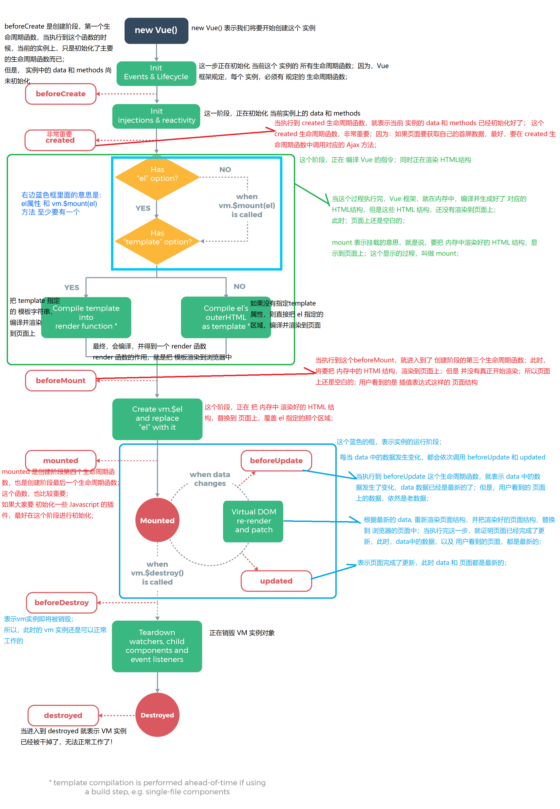

# Vue.js - Day2


## Vue调试工具`vue-devtools`的安装和使用

+ [Vue.js devtools - 翻墙安装方式 - 推荐](https://chrome.google.com/webstore/detail/vuejs-devtools/nhdogjmejiglipccpnnnanhbledajbpd?hl=zh-CN)
+ [手动安装方式](https://github.com/vuejs/vue-devtools)
+ 注意：
  + 安装成功以后，请在chrome地址栏输入 **`chrome://extensions/`** 打开扩展程序管理页面；
  + 找到安装的Vue调试工具，先**启用**，再点击**详细信息**；
  + 进入详细信息面板后，启用**允许访问文件网址** 


## 1. Vue指令之`v-if`和`v-show`

- v-if 和 v-show 的作用，都是切换界面上元素的显示或隐藏的；

  + 一般来说，v-if 有更高的**切换消耗** 而  v-show 有更高的**初始渲染消耗**。
  + 因此，如果需要频繁切换 v-show 较好，如果在运行时条件不大可能改变 v-if 较好。
- **根据应用场景区分：**

  + 举例：袜子要不要洗的问题


## 2. `Vue实例.$set()` 动态添加数据绑定

+ 语法：[Vue实例.$set( target, key, value )](https://cn.vuejs.org/v2/api/#Vue-set)
+ 通俗用法: this.$set(要为哪个对象挂载新属性, '新属性的名称', 新属性具体的值)
+ 例子： `this.$set(this.obj, 'age', 22) `

> 作用：设置对象的属性。如果对象是响应式的，确保属性被创建后也是响应式的，**同时触发视图更新**。这个方法主要用于避开 Vue 不能检测属性被添加的限制。

> 注意：对象不能是 Vue 实例，或者 Vue 实例的根数据对象。

```html
默认情况下, data 中的对象数据动态添加未定义的属性时, 则 vm 实例对象，不会监听到用户的此次操作；就不会触发视图的更新
{{obj}}
new Vue({
  data: {
    obj: {
        name: 'gt'
    }
  }
})
需要使用 this.$set(this.obj, 'age', 22) 语法来添加未定义的属性时, 实例对象才会监听到添加操作, 并触发视图的更新
```


## 3. `Vue实例.$mount()` 动态挂载实例

> 语法：Vue实例.$mount("选择器 - 指定要控制的区域")
>
> 调用 Vue 实例的 $mount() 手动指定要控制哪个区域 vm.$count()

注意：如果同一个实例同时指定了 el 属性和 $mount , 则 el 优先级比较高, $mount就会被忽略, 以 el 指定的区域为准！


## 4. `template`属性指定 Vue页面结构模板

作用: 指定页面上要渲染的模板, template 属性接收的值，是字符串；

注意：如果 在 `new Vue` 实例的时候，既指定了 `el 属性(或$mount属性)`又指定了 `template`属性，则  `template` 指定的模板结构，会替换掉 `el (或$mount属性)`的整个模板结构；

注意: 在没有指定 el 或 $mount属性的时候, 单独使用 template 属性不会起作用


## 3. 过滤器

+ 概念：定义一个用于处理数据的特殊函数，**可用于一些常见的数据格式化**。
+ 过滤器`只可以`用在两个地方：**mustache 插值表达式 和 v-bind 指令中**。
+ 过滤器会把管道符左边的数据进行处理, 返回处理之后的数据

### 3.1 全局过滤器
+ 语法

```js
// 从第二参数开始为可选参数, 用于接收传入的额外参数
Vue.filter('过滤器的名称', (管道符左边的数据, 额外传入的参数) { 
   // 数据处理代码
   // 最后必须 return 一个处理的结果
})
```

### 3.2 私有过滤器

只能被 当前这个 所属的  Vue实例，所控制的区域，进行调用

+ 语法：
```js
var vm = new Vue({
  el: '#app',
  data: {},
  // 实例中 filters 属性专门用于定义过滤器
  filters: {
  	// 这是 古老的 ES3写法
    过滤器的名称: function(originVal, 额外传入的参数) {
      处理代码
      return 处理的结果
    },
    // 这是最新的ES6写法【推荐】
    过滤器的名称(originVal, 额外传入的参数) {
      处理代码
      return 处理的结果
    }
  }
})
```

> 注意过滤器查找顺序问题：如果全局的过滤器名称与私有的过滤器名称相同(不建议这样做), 采用就近原则

1. **使用过滤器的语法**

   + `| `术语为管道符

   - `<span>{{要处理的数据 | 过滤器的名称(额外的参数)}}</span>`
   - `<span :title="要处理的数据 | 过滤器的名称(额外的参数)"></span>`

2. **使用过滤器的注意事项：**

   - 在 定义过滤器处理函数的形参列表中，第一个形参的作用，已经被 Vue 框架 规定好了：永远都是 管道符 | 左侧 传递过来的，待处理的数据

   - 过滤器中，一定要返回(return)一个结果，否则就是一个无效的过滤器

   - 在调用过滤器的时候，把要传的参数放在 () 中就能传参； 从定义过滤器处理函数的第二个形参开始接收传递过来的参数 

   - 可以 多次 使用 | 管道符 一次调用多个过滤器

     ```html
     <h2>{{num | add0 | add1}}</h2>
     ```


## 4. [vue实例的生命周期](https://cn.vuejs.org/v2/guide/instance.html#实例生命周期)

### 4.1 什么是生命周期（每个实例的一辈子）
概念：每一个Vue实例创建、运行、销毁的一个完整的过程，就是生命周期；在实例的生命周期中，总是伴随着各种事件的发生，这些事件就是生命周期函数；

生命周期：实例的生命周期，就是一个阶段，从创建到运行，再到销毁的阶段；

生命周期函数：在实例的生命周期中，在特定阶段执行的一些特定的事件，这些事件，叫做 生命周期函数；

> [生命周期钩子](https://cn.vuejs.org/v2/api/#%E5%AE%9E%E4%BE%8B%E6%96%B9%E6%B3%95-%E7%94%9F%E5%91%BD%E5%91%A8%E6%9C%9F)：就是生命周期事件的别名而已；

> 生命周期钩子 = 生命周期函数 = 生命周期事件

### 4.2 主要的生命周期函数分类
 - **创建期间**的生命周期函数：(特点：每个实例一辈子只执行一次)
   + beforeCreate：创建之前，此时 data 和 methods 尚未初始化
   + **`created` 第一个重要的函数，此时，data 和 methods 已经创建好了，可以被访问了, 一般用于首页数据的获取和渲染**
   + beforeMount：挂载模板结构之前，此时，页面还没有被渲染到浏览器中；
   + **`mounted` 第二个重要的函数，此时，页面刚刚被渲染出来；如果要操作DOM元素，最好在这个阶段, 一般用于初始化引入的第三方插件**
 - **运行期间**会被触发的生命周期函数：（特点：按需被调用 至少0次，最多N次）
   + beforeUpdate：数据是最新的，视图(页面)是旧的
   + updated：视图(页面)和数据都是最新的
 - **销毁期间**的生命周期函数：(特点：每个实例一辈子只执行一次)
   + beforeDestroy：销毁之前，实例还正常可用
   + destroyed：销毁之后，实例已经不工作了


###4.3 Vue生命周期详解




## 5. [axios 实现数据接口请求](https://www.npmjs.com/package/axios)

1. `axios`发起请求；只支持`get`和`post`请求，无法发起`JSONP`请求; 如果涉及到 JSONP请求或者跨域请求，可以让后端启用 `cors` 跨域资源共享即可；
2. 在Vue中，可以使用`vue-resource`或`axios`发起数据请求


+ `vue-resource` 支持 get, post, jsonp请求【官方不推荐使用这个包了！】
+ 历史原因: 维护几个库的压力太大, 又发现了axios 这个好用的替代库, 所以就放弃维护了

使用方法

axios.get('请求的URL地址')

axios.post('请求的URL地址', { 提交给服务器的对象数据 })

具体使用:

```js
// 一般将 axios 方法挂在 Vue 构造函数的原型对象上, 便于 Vue 实例对象直接获取该方法, 在Vue实例方法中就可以直接使用 this.$http 使用该方法
Vue.prototype.$http = axios

// axios 获取的是 promise实例对象, promise实例对象 调用 then 方法就可以执行成功的回调函数, 获取后台返回的数据
this.$http.get(url).then((res) => {
  // axios 提供的固定的结构, 以下代码就可以获取后台返回的数据
  res.data.message
})
```


## 相关文章
1. [vue.js 1.x 文档](https://v1-cn.vuejs.org/)
2. [vue.js 2.x 文档](https://cn.vuejs.org/)
3. [String.prototype.padStart(maxLength, fillString)](http://www.css88.com/archives/7715)
4. [js 里面的键盘事件对应的键码](http://www.cnblogs.com/wuhua1/p/6686237.html)
5. [pagekit/vue-resource](https://github.com/pagekit/vue-resource)
6. [navicat如何导入sql文件和导出sql文件](https://jingyan.baidu.com/article/a65957f4976aad24e67f9b9b.html)
7. [贝塞尔在线生成器](http://cubic-bezier.com/#.4,-0.3,1,.33)