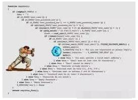

# Vue.js - Day3


## Promise

### 简介(源于阮一峰)

Promise 是异步编程的一种解决方案，比传统的解决方案——回调函数和事件——更合理和更强大。它由社区最早提出和实现，ES6 将其写进了语言标准，统一了用法，原生提供了`Promise`对象。

所谓`Promise`，简单说就是一个容器，里面保存着某个未来才会结束的事件（通常是一个异步操作）的结果。从语法上说，Promise 是一个对象(构造函数)，从它可以获取异步操作的消息。Promise 提供统一的 API，各种异步操作都可以用同样的方法进行处理。

`Promise`对象有以下两个特点。

（1）对象的状态不受外界影响。`Promise`对象代表一个异步操作，有三种状态：`pending`（进行中）、`fulfilled`（已成功）和`rejected`（已失败）。只有异步操作的结果，可以决定当前是哪一种状态，任何其他操作都无法改变这个状态。这也是`Promise`这个名字的由来，它的英语意思就是“承诺”，表示其他手段无法改变。

（2）一旦状态改变，就不会再变，任何时候都可以得到这个结果。`Promise`对象的状态改变，只有两种可能：从`pending`变为`fulfilled`和从`pending`变为`rejected`。只要这两种情况发生，状态就凝固了，不会再变了，会一直保持这个结果，这时就称为 resolved（已定型）。如果改变已经发生了，你再对`Promise`对象添加回调函数，也会立即得到这个结果。这与事件（Event）完全不同，事件的特点是，如果你错过了它，再去监听，是得不到结果的。

有了`Promise`对象，就可以将异步操作以同步操作的流程表达出来，避免了层层嵌套的回调函数。此外，`Promise`对象提供统一的API，使得控制异步操作更加容易。

`Promise`也有一些缺点。首先，无法取消`Promise`，一旦新建它就会立即执行，无法中途取消。其次，如果不设置回调函数，`Promise`内部抛出的错误，不会反应到外部。第三，当处于`pending`状态时，无法得知目前进展到哪一个阶段（刚刚开始还是即将完成）。

Promise 是 ES6 中的新特性；主要用于 解决 回调地狱 问题；每一个 Promise 实例，都表示一个异步操作；



Promise 本身就是一个构造函数, 使用时实例化并传入一个异步函数即可, 

**注意: Promise 实例化时就会立即调用, 为了按需使用, 通常将其放在一个自定义函数中**

```js
// 基本使用
function fn() {
  // return的目的，是为了外界能够通过 Promise 实例的 .then 方法，为我们指定成功的回调函数；
  return new Promise((resolve, reject) => {
    异步函数
  })
}
```


###Promise.prototype.then()方法

该方法会等待`Promise`对象状态发生变化。如果变为`resolved`，就调用成功的回调函数，如果状态变为`rejected`，就调用失败的回调函数。

**注意: 如果 通过 .then 指定的成功的回调函数 和 失败的回调函数中，都没有return 一个 新的 promise 实例，则 .then() 方法，默认也会返回空的 Promise 实例对象(pending状态)**

```js
// 第一个参数为成功的回调函数, 第二个参数为可选参数失败的回调函数
Promise实例.then((data) => {成功的操作}, (err) => {失败的操作})
```


###Promise.prototype.catch()方法

`Promise.prototype.catch`方法是`.then(null, 失败的回调函数)`的别名，用于指定发生错误时的回调函数。

可以接收所有 then 方法的报错信息, 并统一进行报错处理

```js
Promise实例1
  // 需要成功时, 返回下一个 Promise 实例, 继而进行链式操作
  .then((data) => {成功的操作, return Promise实例2})
  .then((data) => {成功的操作})
  // 统一报错处理, 上面的任何一个 then 方法报错都会停止继续执行并直接跑到这步报错处理
  .catch((err) => {失败的操作})
```


###以下为封装一个读取文件的操作的对比

####没有 Promise 之前的最好的异步解决方案

```js
// 加载 node 的 核心文件读取模块
const fs = require('fs')
// 程序员潜规则: cb 接收两个形参，第一个永远是 失败的结果；第二个形参是 成功的结果；
// 利用回调函数来判断当前文件的读取状态, 如果第一个参数 err 为 null, 就代表读取成功, 反之失败
function fn(fileName, cb) {
  fs.readFile(fileName, 'utf-8', (err, data) => {
    // 不传 data 默认就为 undefined
    if (err) return cd(err)
    cd(null, data)
  })
}
// 以下产生的问题, 回调地狱, 报错不能统一处理, 代码格式紊乱
fn('./test1.html', (err, data) => {
  if (err) return console.log('报错信息为:' + err.message)
  console.log('test1文件数据为:' + data)
  fn('./test2.html', (err, data) => {
    if (err) return console.log('报错信息为:' + err.message)
    console.log('test2文件数据为:' + data)
    fn('./test3.html', (err, data) => {
      if (err) return console.log('报错信息为:' + err.message)
      console.log('test3文件数据为:' + data)
    })
  })
})
```

####Promise 的解决方案

```js
// 加载 node 的 核心文件读取模块
const fs = require('fs')

// 由于 Promise 实例化就会立即执行, 所以封装一个函数包裹它, 使其按需执行
function fn(fileName) {
  return new Promise((resolve, reject) => {
    fs.readFile(fileName, 'utf-8', (err, data) => {
      if (err) return reject(err)
      resolve(data)
    })
  })
}

fn('./test1.html')
  .then(data => {
    console.log('test1文件的数据为:' + data)
  	return fn('./test2.html')
  })
  .then(data => {
    console.log('test2文件的数据为:' + data)
    return fn('./test3.html')
  })
  .then(data => {
    console.log('test3文件的数据为:' + data)
  })
  // 统一报错处理, 上面的任何一个 then 方法报错都会停止继续执行并直接跑到这步报错处理
  .catch(err => {
    console.log('报错信息为:' + err.message)
  })
```


## async 和 await

作用：ES7 中的 async 和 await 可以简化 Promise 调用，提高 Promise 代码的 阅读性 和 理解性；

async 关键字: 只能用来修饰 方法; 被 async 修饰的方法，叫做异步方法；

await 关键字: 必须配合 async 进行使用; 也就是说，await 只能用到 被 async 修饰的方法中并且只能用在 Promise 实例之前；

```js
// async 和 await 基本使用
async () => {
  // 用 catch 捕获报错信息对象, 并返回
  const res = await Promise实例.catch(err) {err => err}
  return res
}
```

###执行顺序问题

```js
async function test() {
  console.log('n2')
  // 在执行被 async 修饰的异步方法的时候，在遇到第一个 await 之前，异步方法中的代码，是同步执行的；
  const result = await getFile('./test1.txt')
  // 第一个 await 后面的代码会按照顺序依次执行 
  console.log(result)

  const result2 = await getFile('./test2.txt')
  console.log(result2)

  setTimeOut(() => {
    console.log(666)
  }, 0)
  
  console.log('n3')
}

console.log('n1')
test()
console.log('n4')

// 输出顺序为
n1 n2 n4 1 2 n3 666
```


## axios 高级用法

1. axios 配合 async 和 await 进行使用；

   ```js
   // 例子: 
   // 配置基准的根 url
   axios.defaults.baseURL = 'http://www.liulongbin.top:3005'
   // 将 axios 挂载到 Vue原型上, 方便在 Vue实例里面使用
   Vue.prototype._ajax = axios
   new Vue({
     methods: {
       async getInfo() {
         // 解构赋值取出需要的数据并起别名, axios 的 get, post 方法默认返回一个 Promise 实例
         const { data: res } = await this._ajax.get('/api/getlunbo')
         console.log(res)
       }
     }
   })
   ```

2. 使用 `baseURL` 配置整个项目的API接口根地址；

   好处: 减少代码量, 容易更改根地址

   + 语法:  axios.defaults.baseURL = '根url'

   ```js
   // eg
   axios.defaults.baseURL = 'http://www.liulongbin.top:3005'
   ```

3. `Interceptors`拦截器

   拦截器分为两部分：请求开始之前的拦截器 和 请求完毕以后的拦截器；

   基本语法

   ```js
   // 只要有请求发起，必然会先触发 request 拦截器
   axios.interceptors.request.use((config) => {
     // 在发送请求之前, 执行一些代码
     函数体
     return config;
   });
   // 只要服务器返回响应，必然会触发 response 拦截器
   axios.interceptors.response.use((response) => {
     // 执行一些代码, response 里面包含响应的数据
     函数体
     return response;
   });
   ```

4. 使用 `Interceptors` 拦截器实现 loading 效果；

   在 实例的 created 生命周期函数中，注册 `request` 和 `response` 拦截器

   ```html
   <!DOCTYPE html>
   <html lang="en">

   <head>
     <meta charset="UTF-8">
     <meta name="viewport" content="width=device-width, initial-scale=1.0">
     <meta http-equiv="X-UA-Compatible" content="ie=edge">
     <title>Document</title>
     <script src="./lib/vue-2.5.16.js"></script>
     <script src="./lib/axios-v0.18.0.js"></script>
     <style>
       /* 加载提示框样式 */
       .loading {
         width: 400px;
         height: 150px;
         background-color: cyan;
         color: #000;
         line-height: 150px;
         text-align: center;
         font-size: 13px;
         border: 5px solid #ccc;
         position: absolute;
         top: 30%;
         left: 50%;
         transform: translateX(-50%);
       }
     </style>
   </head>

   <body>
     <div id="app">
       <button @click="getInfo">get请求</button>
       <button @click="postInfo">post请求</button>

       <!-- 加载框 -->
       <div class="loading" v-show="flag">数据加载中，请稍后...</div>
     </div>

     <script>
       // 全局配置 axios 请求 API接口时候的 根路径
       axios.defaults.baseURL = 'http://www.liulongbin.top:3005'
       Vue.prototype.$http = axios

       var vm = new Vue({
         el: '#app',
         data: {
           // 默认隐藏loading效果
           flag: false
         },
         // 生命周期函数之一   表示 data 和 methods 已经初始化完毕了
         created() {
           // 只有有请求发起，必然会先触发 request 拦截器
           axios.interceptors.request.use((config) => {
             // Do something before request is sent
             this.flag = true
             return config;
           });

           // 注册 response 拦截器
           axios.interceptors.response.use((response) => {
             // Do something with response data
             this.flag = false
             return response;
           });
         },
         methods: {
           // 今后在项目中，使用 axios 发起 Ajax 请求，都是按照这种套路进行；
           async getInfo() {
             const { data: res } = await this.$http.get('/api/getlunbo')
             console.log(res)
           },
           async postInfo() {
             const { data: res } = await this.$http.post('/api/post', { name: '张三', age: 22 })
             console.log(res)
           }
         }
       });
     </script>
   </body>

   </html>
   ```


## computed - 计算属性

主要用于筛选, 计算一些数据

看起来, 计算属性是指向一个方法, 但实际上是指向的是后面方法的调用结果

虽然里面定义的是一个方法, 但是它却只是一个属性(变量), 不能像函数那样使用, 也不能传参(会报错)

使用方法与 Vue实例中的data 中的数据一致

**注意：计算属性的 function 中，所依赖的 Vue实例中的data 中的数据，只要发生了变化，都会重新执行其 function 并返回新的值**

```js
data: {
  brandlist: []
}
// computed 计算属性是一个对象
computed: {
  // 定义了一个 newlist 计算属性；返回满足条件的数据组成的数组
  newlist() {
    return this.brandlist.filter(item => item.name.includes(this.keywords))
  }
}
```

虽然可以使用普通方法代替, 但是在 Vue 中还是建议使用 computed计算属性(术业有专攻)

以下为使用普通方法实现计算属性

**原理: 双向绑定的数据更新时, Vue会重新执行一遍所有的指令**

```js
methods: {
  getList() {
    return this.brandlist.filter(item => item.name.includes(this.keywords))
  }
}
// 唯一的区别为, 普通函数使用时需要加()
<li v-for="item in getList()">item.id</li>
```


## [Vue中的动画](https://cn.vuejs.org/v2/guide/transitions.html)

- **为什么要有动画：**动画能够增加页面趣味性，目的是**为了让用户更好的理解页面的功能**；
- **注意：**Vue中的动画，都是简单的过渡动画，并不会有 CSS3 那么炫酷；

### Vue中动画的基本介绍

1. 每个动画都分为两部分：
   - **入场动画**：从不可见（flag = false） -> 可见（flag = true）
   - **出场动画**：可见（flag = true） -> 不可见（flag = false）
2. 入场时候，Vue把这个动画，分成了**两个时间点**和**一个时间段**：
   + `v-enter`：入场前的样式
   + `v-enter-to`：入场完成以后的样式
   + `v-enter-active`：入场的持续的时间
3. 离场时候，Vue把动画，分成了**两个时间点**和**一个时间段**：
   + `v-leave`：离场之前的样式
   + `v-leave-to`：离场完成以后的样式
   + `v-leave-active`：离场的持续的时间


### 使用过渡类名

1. 把需要添加动画的元素，使用 v-if 或 v-show 进行控制

   1. 初次渲染时没有过度动画, 为 false 时就为隐藏状态, 为 true 时就为显示状态
   2. 为 false 时就为出场状态, 为 true 时就为入场状态

2. 把需要添加动画的元素，使用Vue提供的元素 `<transition></transition>` 包裹起来

   1. 只有被 transition 元素包裹的元素，才可以实现Vue的过渡动画
   2. **注意: transition 元素只能过度单个元素, 过度多个元素请使用 transition-group 元素**

3. 添加两组类：

   一般只会定义 .v-enter 和 .v-leave-to, .v-enter-active 和 .v-leave-active 两组类名css属性

   因为 v-enter-to 和 v-leave默认的位置就是元素定义时的位置, 如果v-enter-to 或 v-leave 的位置与元素定义时的位置不一样, 在元素开始移动时会产生瞬间的位移

   解决方案: 改变元素定义时的位置即可

   ```css
   /* 进场之前的位置, 和离场之后的位置 */
   .v-enter,
   .v-leave-to {
       opacity: 0;
       transform: translateX(100px);
   }

   /* 进场和离场的持续时间 */
   .v-enter-active,
   .v-leave-active {
     	transition: all 0.5s ease;
   }
   ```


   transition 标签的 name 属性

   能使用跟 name属性值 相同的前缀的过度属性, 用于实现多个不同的Vue过度动画

   ```html
     <style>
       .v-enter,
       .v-leave-to {
         opacity: 0;
         transform: translateX(150px);
       }

       .v-enter-active,
       .v-leave-active {
         transition: all 0.8s ease;
       }

       .v2-enter,
       .v2-leave-to {
         opacity: 0;
         transform: translateY(150px);
       }

       .v2-enter-active,
       .v2-leave-active {
         transition: all 0.8s ease;
       }
     </style>
   </head>

   <body>
     <div id="app">
       <button @click="flag=!flag">Toggle1</button>
       <transition>
         <h3 v-show="flag">1111</h3>
       </transition>

       <hr>

       <button @click="flag2=!flag2">Toggle2</button>
       <transition name="v2">
         <h6 v-show="flag2">666666</h6>
       </transition>
     </div>
   </body>
   ```


### 使用 animate.css 增强动画效果

[使用第三方 CSS 动画库](https://cn.vuejs.org/v2/guide/transitions.html#%E8%87%AA%E5%AE%9A%E4%B9%89%E8%BF%87%E6%B8%A1%E7%9A%84%E7%B1%BB%E5%90%8D)

[animate.css](https://daneden.github.io/animate.css/)

1. 把需要添加动画的元素，使用v-if或v-show进行控制
2. 把需要添加动画的元素，使用Vue提供的元素 `<transition></transition>` 包裹起来
3. 为  `<transition></transition>`  添加两个 Vue 内置属性类
   + 用 `enter-active-class` 指定 元素入场时候，使用哪个动画类名 来控制入场的动画效果
   + 用 `leave-active-class` 指定 元素 出场 时候的，使用 哪个类名 控制出场动画效果
4. 把需要添加动画的元素，添加一个类 `class="animated"`


样例:  点击按钮实现过度动画

```html
<div id="app">
  <button @click="flag=!flag">Toggle</button>
  <!-- 添加 animate.css 类名 -->
  <transition enter-active-class="bounceInDown" leave-active-class="fadeOutDown">
    <h3 v-show="flag" class="animated">hello Vue</h3>
  </transition>
</div>

<script>
  var vm = new Vue({
    el: '#app',
    data: {
      flag: false
    },
  });
</script>
```


### v-for 的列表过渡

[v-for 的列表过渡](https://cn.vuejs.org/v2/guide/transitions.html#%E5%88%97%E8%A1%A8%E8%BF%87%E6%B8%A1)

可以使用 动画库增强, 也可以使用 Vue提供的类, 来实现过渡动画

使用 transition-group 来包裹多个元素标签

并给需要过渡的元素添加 class="animated" 属性

样例部分代码: 

```html
<style>
  .v-enter,
  .v-leave-to {
    opacity: 0;
    transform: translateY(150px);
  }

  .v-enter-active,
  .v-leave-active {
    transition: all 0.8s ease;
  }
</style>

<body>
  <div id="app">
    <ul>
      <transition-group>
        <!-- remove 方法为删除该元素 -->
        <li class="animated" v-for="item in list" :key="item.id" @click="remove(item.id)">
          Id:{{item.id}} --- 名称：{{item.name}}
        </li>
      </transition-group>
    </ul>
  </div>
</body>
```

以上存在一个问题, 在无序列表项被删除且出场动画结束时, 下面的项会瞬间向上移动, 很突兀. 

下面可以解决这个问题, 但是不支持动画库


### 列表的排序过渡

**不支持第三方动画库**

`<transition-group>` 组件还有一个特殊之处。不仅可以进入和离开动画，**还可以改变定位**。要使用这个新功能只需了解新增的 `v-move` 特性，**它会在元素的改变定位的过程中应用**。

- `v-move` 和 `v-leave-active` 结合使用，能够让列表的过渡更加平缓柔和: 

```css
/* 控制要被删除的元素，使其脱离标准流 */
.v-leave-active {
  position: absolute;
}

/* 控制后续的元素，通过过渡位移到目标位置 */
.v-move {
  transition: all 0.8s ease;
}
```


###过渡列表完整实例代码

```html
<!DOCTYPE html>
<html lang="en">

<head>
  <meta charset="UTF-8">
  <meta name="viewport" content="width=device-width, initial-scale=1.0">
  <meta http-equiv="X-UA-Compatible" content="ie=edge">
  <title>Document</title>
  <link rel="stylesheet" href="./lib/animate.css">
  <script src="./lib/vue-2.5.16.js"></script>
  <style>
    body,
    html {
      margin: 0;
      padding: 0;
    }

    ul {
      list-style: none;
      margin: 0;
      padding: 0;
    }

    li {
      font-size: 12px;
      line-height: 30px;
      border: 1px dashed #ccc;
      margin: 5px 0;
      background-color: #eee;
      padding-left: 5px;
    }

    .v-enter,
    .v-leave-to {
      opacity: 0;
      transform: translateY(150px);
    }

    .v-enter-active,
    .v-leave-active {
      transition: all 0.8s ease;
    }

    /*控制要被删除的元素，脱离标准流*/

    .v-leave-active {
      position: absolute;
      width: 100%;
    }

    /*控制后续的元素，通过过渡位移到目标位置*/

    .v-move {
      transition: all 1s ease;
    }
  </style>
</head>

<body>
  <div id="app">
    <div>
      <input type="text" v-model="name">
      <button @click="add">添加</button>
    </div>

    <ul>
      <!-- 注意：如果要为 v-for 渲染的 列表添加 过渡效果，需要使用 transition-group 把元素包裹起来  -->
      <transition-group>
        <li class="animated" v-for="item in list" :key="item.id" @click="remove(item.id)">
          Id:{{item.id}} --- 名称：{{item.name}}
        </li>
      </transition-group>
    </ul>
  </div>

  <script>
    // 创建 Vue 实例，得到 ViewModel
    var vm = new Vue({
      el: '#app',
      data: {
        name: '',
        list: [{
            id: 0,
            name: 'zs'
          },
          {
            id: 1,
            name: 'ls'
          },
          {
            id: 2,
            name: 'zl'
          }
        ]
      },
      methods: {
        add() {
          this.list.push({
            id: this.list.length,
            name: this.name
          })
          this.name = ''
        },
        remove(id) {
          const i = this.list.findIndex(item => item.id == id)
          this.list.splice(i, 1)
        }
      }
    });
  </script>
</body>

</html>
```

