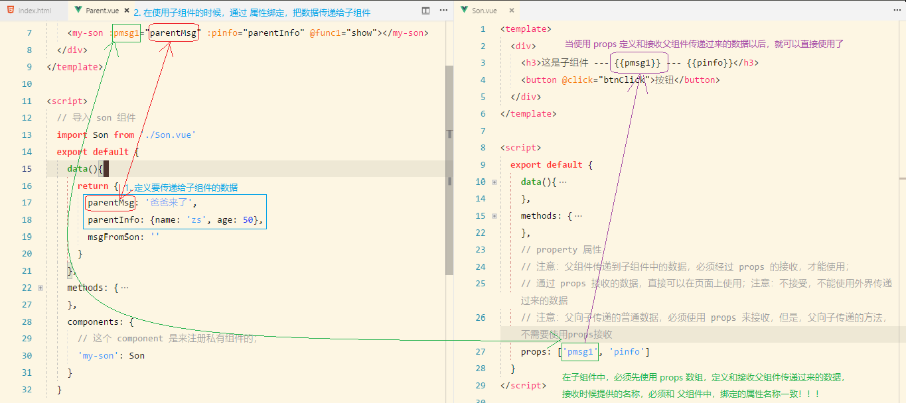
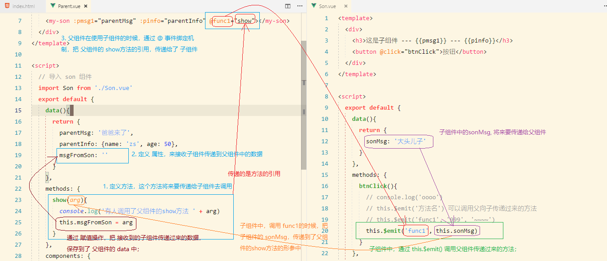
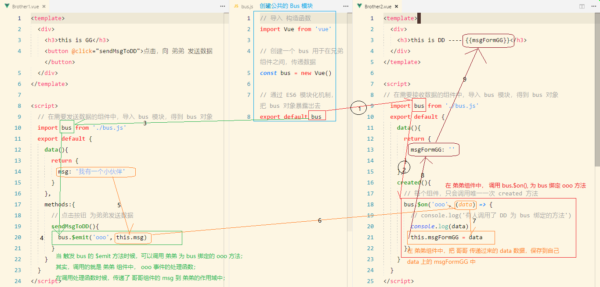

# Vue5

## yarn 常用命令

yarn: FaceBook公司出品的包管理工具

**注意: 包管理工具不要混合使用, 要专一**

```bash
cnpm i yarn -g         # 安装 yarn

yarn add jquery -S     # 安装指定名称的包
npm i jquery -S        # 安装指定名称的包

npm i                  # 安装所有的包
yarn                   # 安装所有的包
```


## 在 webpack 中安装和配置 vue

1. 运行 `cnpm i vue -S` 把 vue 安装到项目依赖

2. 在 `index.js` 中使用 import 导入 vue 模块：

   ```js
   import Vue from 'vue'
   ```

3. 在 `index.html` 中创建将来要被 vm 实例控制的 div：

   ```html
   <!-- 将来，这个 div 就是 Vue实例 要控制的区域 -->
   <div id="#app"></div>
   ```

4. 在 `index.js` 中创建 vm 实例，并使用 el 指定要控制的区域，使用 data 指定要渲染的数据：

   ```js
   const vm = new Vue({
     el: '#app', // 要控制的区域
     data: {
       msg: 'ok' // 要渲染的数据
     }
   })
   ```


## 为什么在基于 webpack 的 vue项目中, 按照如上操作会报错呢

1. 因为使用 `import` 导入的 `vue` 模块，导入的并不是功能最全的 vue 包；而是删减版的；
2. 删减版的 vue 包中功能很少，目的是为了减小vue 包的体积，因为文件越小，网络请求越快！
3. **如何让 `import` 导入最全的 `vue` 包呢？**
   + 打开 `node_modules` 目录，找到 vue 包所在的文件夹
   + 打开文件夹中的 `package.json`，找到 `module` 属性
   + 把 `module` 属性所对应的 `dist/vue.runtime.esm.js` 路径，修改为 `dist/vue.js` 即可
4. **注意：**在学习阶段，可以暂时使用最全的 `vue` 包；**等开发项目的时候，一定要使用 删减版的 包**；


## 定义Vue组件

###命名规范

组件的 名称 开头字母 最好大写  eg: Parent.vue

使用es6模块化语法导入时, 导入名称使用去掉后缀的名字即可 eg: import Parent from './Parent.vue'

定义组件(全局/私有)名称全使用小写, 多单词用连词符`-`链接 eg  my-parent: Parent

### `模块化`和`组件化`概念的解读

1. **什么是模块化：**`是从代码的角度`分析问题；把可复用的代码，抽离为单独的模块；
   + 模块化的好处：
     + 提供模块作用域的概念，防止全局变量污染；
     + 提高了代码的复用率，方便了程序员之间 代码互相调用；
2. **什么是组件化：**组件化是从`页面UI的角度`进行分析问题的；把页面中可复用的UI结构，抽离为单独的组件；
   + 组件化的好处：
     + 方便了UI结构的重用；
     + 随着项目开发的深入，手中可用的组件会越来越多；
     + 可以直接使用第三方封装好的组件库(element-ui)；
     + 让程序员更专注于自己的业务逻辑；


### 定义全局组件

1. 定义组件的语法
   - `Vue.component('组件的名称', { 组件的配置对象 })`
   - 在组件的配置对象中：可以使用 `template` 属性指定当前组件要渲染的模板结构；
2. 使用组件的语法
   - 把 `组件的名称`, 以自定义标签的形式，引入到页面上就行；
3. **注意：**
   + 从更抽象的角度来说，每个组件，就相当于是一个**自定义的元素**；
   + 组件中的DOM结构，有且只能有唯一的根元素（Root Element）来进行包裹！


### 组件中定义`data数据`、`methods方法`以及`生命周期函数`

组件和实例的相同和区别：

1. 组件中的 data 必须是一个 function 并 return 一个 对象；在 Vue 实例中，实例的 data 既可以是 对象，可以是 方法；
2. 组件中，直接通过 template 属性来指定组件的UI结构；在 Vue 实例中，通过 el 属性来指定实例控制的区域；但是实例也可以使用 `template`;
3. 组件和实例，都有自己的`生命周期函数`，`私有的过滤器`，`methods` 处理函数；


### 为什么组件中的 data 属性必须定义为一个方法并返回一个对象

**因为这样，能够保证每次创建的组件实例，都有自己的一块唯一的数据内存，防止组件之间数据的干扰；**


### 使用 `components` 属性定义私有子组件

1. 在每个实例中，和 `el, data, methods, filters` 平级，可以使用 `components` 属性，注册当前实例的私有子组件；
2. 和 `Vue.component()` 注册的全局组件不同，私有组件，只能在当前实例控制的区域内使用！


## `.vue` 文件的结构说明

+ 为什么要把组件，单独的定义到 `.vue` 文件中？
  + 之前创建组件太麻烦，没有智能提示和代码高亮；
  + 之前定义组件，和其它JS代码逻辑掺杂在一块儿，代码不易维护，没有把组件化的优势发挥到极致！

- 每个 .vue 文件，都是一个 vue 组件，它由三部分组成：
  1. `template` 结构
  2. `script` 行为
  3. `style` 样式


## 在`webpack`中配置`.vue`组件页面的解析

1. 运行`cnpm i vue-loader vue-template-compiler -D`

   + vue-template-compiler 为 vue-loader 的内部依赖, 不用处理

2. 添加rules匹配规则：

   ```js
   { test: /\.vue$/, use: 'vue-loader' }
   ```

3. 在`webpack.config.js`中导入并配置插件：

   ```js
   // 导入插件
   const VueLoaderPlugin = require('vue-loader/lib/plugin')
   // new 一个插件的实例对象
   const vuePlugin = new VueLoaderPlugin()

   // 把 new 出来的插件实例对象，挂载到 `plugins` 属性中：
   plugins: [...其它插件, vuePlugin]
   ```


## 导入并使用 .vue 组件

1. 在 `index.js` 中导入 `.vue` 组件
   1. 使用 `Vue.component()` 把导入的 `.vue` 组件，注册为全局组件（所有Vue版本都支持）

      ```js
      improt App from './App.vue'
      Vue.component('my-app', App)
      ```

   2. 在 vm 实例的 `components` 属性中，把 `.vue` 组件，注册为私有子组件（在删减版中不支持）

      + ```js
        var vm = new Vue({
          el: '#app',
          components: {
            // 删减版中不支持这种写法
          }
        })
        ```

2. 在 `Parent.vue` 组件中，导入 `Child.vue` 文件，并使用 `Parent.vue` 组件的 `components` 属性，把 `Child.vue` 注册为自己的私有子组件（所有Vue版本都支持）

   ```vue
   <!-- Parent.vue -->
   <template>
     <my-child></my-child>
   </template>
   <script>
     import Child from './Child.vue'
     export default {
       components: {
         my-child: Child
       }
     }
   </script>
   ```

   ​

### 

## 父组件向子组件传值

### 父组件向子组件传递普通数据

**传过去的数据不是实时更新的**

1. 在`父组件`中，以标签形式使用子组件的时候，可以通过属性绑定，为子组件传递数据：

   ```vue
   <!-- 将要传递的数据绑定在一个自定义的绑定属性上面即可, 多个就绑定多个 -->
   <my-son :pmsg1="parentMsg" :pinfo="parentInfo"></my-son>
   ```

2. 在`子组件`中，如果向用父组件传递过来的数据，必须先定义 `props` 数组来接收：

   ```vue
   <script>
     export default {
       data(){
         return {}
       },
       methods: {},
       // property 属性的简写
       // 注意：父组件传递到子组件中的数据，必须经过 props 的接收，才能使用；
       // 通过 props 接收的数据，直接可以在页面上使用(与data中的数据使用方法相同)；注意：不接受，不能使用外界传递过来的数据
       // props 属性上的值, 不能重新赋值会报错
       props: ['pmsg1', 'pinfo']
     }
   </script>
   ```

3. 接收完的props数据，与 data 中的数据使用方法相同(也可以使用 this 调用)

   ```vue
   <!-- 可以直接在子组件的 template 区域中使用 -->
   <template>
     <div>
       <h3>这是子组件 --- {{pmsg1}} --- {{pinfo}}</h3>
     </div>
   </template>
   ```





### 父组件向子组件传递方法

1. 如果父向子传递方法，需要使用 事件绑定机制：

   ```vue
   <!-- 将父组件要传递的方法绑定在一个自定义的事件绑定属性上 -->
   <my-son @func1="show"></my-son>
   ```

   其中，为 子组件传递的 方法名称为 `func1`, 具体的方法引用为 父组件中的 show 方法

2. 子组件中，可以直接通过 `this.$emit('func1')` 来调用父组件传递过来的方法；


## 子组件向父组件传值

**可以把这个过程想象成 jsonp 来辅助理解(表象类似)**

**基于父组件向子组件传方法, 但该方法至少有一个形参**

1. 子向父传值，要使用 `事件绑定机制 @`；一般来说子组件需要一个触发时机(eg: 点击), 来调用父组件传递过来的方法
2. 父向子传递一个方法的引用
3. 子组件中，可以使用 `this.$emit()` 来调用父组件传递过来的方法
4. 在使用`this.$emit()`调用 父组件中方法的时候，可以从第二个位置开始传递参数；把子组件中的数据，通过实参，传递到父组件的方法作用域中；
5. 父组件就可以通过形参，接收子组件传递过来的数据；




###第二种方法

可以使用 ref 为子组件添加引用；在父组件中可以使用 `this.$refs.ref属性的值`, 拿到子组件的引用，从而获取子组件上的方法 和  data 上的 数据；

eg: 子组件向父组件传值

```vue
<template>
    <div>
        <button type="button" @click="gett">点击获取组件</button>
        <p>{{testData}}</p>
        <my-son ref="ss"></my-son>
    </div>
</template>

<script>
    import Son from './Son.vue'
    export default {
        data() {
            return {
                testData: 'jjjjj'
            }
        },
        methods: {
            gett() {
                // 此处进行子组件向父组件进行传值
                this.testData = this.$refs.ss.test
                // 此处调用子组件的方法
                this.$refs.ss.eat()
            }
        },
        components: {
            'my-son': Son
        }
    }
</script>
```


## 兄弟组件之间传值

> 注意：兄弟组件之间，实现传值，用到的技术，是 `EventBus`

1. 在 conponents 文件夹中定义模块 `bus.js` 

   ```js
   import Vue from 'vue'
   // 创建并导出一个空的 Vue 实例
   export default new Vue()
   ```

2. 在需要`接收数据的兄弟组件`中，导入 `bus.js` 模块

   ```js
   import bus from './bus.js'
   ```

3. 在需要`接收数据的兄弟组`件中的 `created` 生命周期函数里，使用 `bus.$on('事件名称', (接收的数据) => {})` 自定义事件：

   ```js
   created(){
     // 定义并监听事件
     bus.$on('ooo', (data)=>{
       console.log(data)
     })
   }
   ```

4. 在需要`发送数据的兄弟组件`中，导入 `bus.js` 模块

   ```js
   import bus from './bus.js'
   ```

5. 在需要`发送数据的兄弟组件`中，使用 `bus.$emit('事件名称', 要发送的数据)` 来向外发送数据：

   ```js
   import bus from './bus.js'
   export default {
       data(){
         return {
           msg: 'abcd'
         }
       },
       methods: {
         sendMsg(){
           // 触发 绑定的 事件，并向外传递参数
           bus.$emit('ooo', this.msg)
         }
       }
   }
   ```





## 使用 `Vue.prototype.$refs` 来获取元素和组件

缩写解释:   ref  ->  reference 引用

1. 把要获取的DOM元素，添加 ref 属性，创建一个DOM对象的引用，指定的值，就是引用的名称：

   ```html
   <p ref="myElement">这是父组件</p>
   ```

2. 如果要获取 某个引用所对应的 DOM对象，则直接使用 `this.$refs.引用名称`

   ```js
   console.log(this.$refs.myElement)
   ```

3. 也可以使用 ref 为组件添加引用；可以使用 `this.$refs.ref属性的值`, 拿到组件的引用，从而调用组件上的方法 和 获取组件 data 上的 数据；

   eg: 子组件向父组件传值

   ```vue
   <template>
       <div>
           <button type="button" @click="gett">点击获取组件</button>
           <p>{{testData}}</p>
           <my-son ref="ss"></my-son>
       </div>
   </template>

   <script>
       import Son from './Son.vue'
       export default {
           data() {
               return {
                   testData: 'jjjjj'
               }
           },
           methods: {
               gett() {
                   // 此处进行子组件向父组件进行传值
                   this.testData = this.$refs.ss.test
                   // 此处调用子组件的方法
                   this.$refs.ss.eat()
               }
           },
           components: {
               'my-son': Son
           }
       }
   </script>
   ```

   ​


## 使用霸道的 render 函数渲染组件

**一般来说这个函数只会在index.js文件中使用一次, 用于渲染 App.vue 入口组件**

1. 如果在 vm 实例中既指定了 `el` 又指定了 `render` 函数，则会把 el 所指的的区域，替换为 render 函数中所提供的组件；

2. 既然 render 函数会替换到 el 区域内的所有代码，也会让 template 属性失效；因此，在删减版的 vue 包中，new 出来的 Vue 实例对象，不允许 挂载 data 属性和 template 属性(会报错)！

3. 在render函数形参列表中，有一个 createElement 形参，这个 createElement，也是一个 方法，作用是：根据给定的组件，把给定的组件覆盖并渲染到 el 区域

   ```js
   // 导入 Vue 模块
   import Vue from 'Vue'
   // 导入入口组件
   import App from './components/App.vue'
   const vm = new Vue({
     el: '#app',
     // 渲染入口组件
     render: createElement => createElement(App)
   })
   ```

   ​


## nrm的使用

管理包下载的镜像源, 常用的只有 npm镜像源 和 taobao镜像源

1. 运行 `npm i nrm -g` 全局安装
2. 运行 `nrm ls` 可以查看所有可用的下包的镜像地址；前面有 `*` 号的，表示，当前正在使用的镜像地址；
3. 运行 `nrm use taobao` 可以切换到淘宝镜像, 提高包下载速度


## 练习: 评论列表案例

目标：主要练习父子组件之间传值

- Get 获取所有评论： `http://www.liulongbin.top:3005/api/getcmtlist`
- Post 提交新的评论： `http://www.liulongbin.top:3005/api/postcmt`
- 提交评论需要传递的参数`{ name, content }`