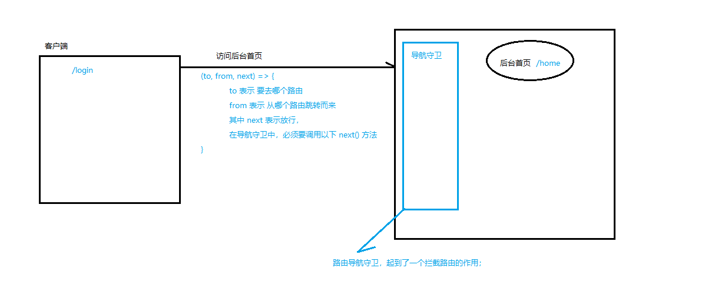
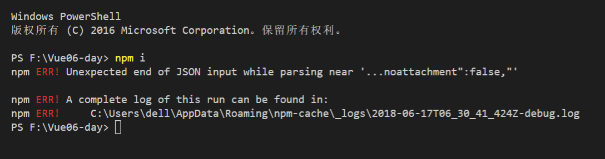

# Vue.js - day6


## 1. 使用 `<component>`标签实现组件切换

1. `<component>` 是Vue提供的；作用是 把 is 属性指定的 `组件名称`(组件名称记得加引号)，渲染到 ``<component>`` 内部
2. 使用 is 属性为属性绑定写法 `:is`
   + <component :is="'my-parent'"></component>


## 2. SPA单页应用


### 2.1 锚点及常规url的区别

1. 普通的URL地址：会刷新整个页面；会追加到浏览历史记录中；
   + `https://www.test.com`
2. 锚链接：不会触发页面的刷新；会追加到浏览历史记录中；
   + `https://www.test.com/#test`


### 2.2 什么是SPA,为什么有SPA

- 概念定义：SPA - Single Page Web Application - 单页面Web应用
- 通俗的理解是：一个网站的所有功能都在一个页面上进行切换，网页不会整体刷新；所有数据通过 Ajax 异步请求并渲染到页面上；
- 特点：
  - 只有一个页面 
  - 页面不会刷新 
  - 数据都是用Ajax请求回来的
  - 页面的切换，都是通过锚点(hash)来实现的
- 好处：
  - 整个网站的主要资源，在页面打开的一瞬间，基本都加载完毕了；
  - 今后页面的切换，不会再请求新的页面资源了，只是在请求 页面对应的 Ajax 数据；
  - 由于项目中所有的数据，都是通过Ajax获取回来的，所以，减轻了服务器端渲染的压力；
- 缺点：
  - SEO问题: 没有html抓不到什么
  - 初始加载时间长

### 2.3 原生实现SPA

使用 window.onhashchange 来监听锚点的改变, 使用 component 标签的`:is`属性来切换组件, 并根据不同的锚点渲染不同的组件

样例: 

```vue
<!-- App.vue -->
<template>
  <div>
    <p>App根组件</p>

    <a href="#home">首页</a>
    <a href="#movie">电影</a>
    <a href="#about">关于</a>

    <component :is="comName"></component>
  </div>
</template>

<script>
  // 导入 组件
  import Home from './Home.vue'
  import Movie from './Movie.vue'
  import About from './About.vue'

  export default {
    data(){
      return {
        // 默认显示 home 组件
        comName: 'my-home'
      }
    },
    created(){
      window.onhashchange =  () => {
        switch(window.location.hash) {
          case '#home':
            this.comName = 'my-home'
          break
          case '#movie':
            this.comName = 'my-movie'
          break
          case '#about':
            this.comName = 'my-about'
          break
        }
      }
    },
    components: {
      'my-home': Home,
      'my-movie': Movie,
      'my-about': About
    }
  }
</script>
```


## 3. 路由

### 3.1 什么是路由

路由 就是 对应关系；

1. 后端路由的定义：URL地址 到 后端 处理函数之间的关系；
2. 前端路由的定义：hash 到 组件 之间的对应关系；
3. 前端路由的目的：为了实现单页面应用程序的开发；


### 3.2 在 vue 中使用 vue-router

1. 安装导入并注册路由模块：

   + 运行 `npm i vue-router -S` 安装路由模块

   + 在 `index.js` 中导入并注册路由模块

     ```js
     // 导入路由模块
     import VueRouter from 'vue-router'
     // 注册路由模块
     Vue.use(VueRouter)
     ```

2. 创建路由链接：

   router 提供的 router-link 元素默认会渲染成 a 元素, to 就相当于 href 属性(不用写 #, 会自动添加)

   router-link 有一个 tag 属性, 可以改变其渲染为别的元素

   + `<router-link to="/home" tag="li">首页</router-link>`

   ```html
   <!-- router-link 就是 第一步，创建 路由的 hash 链接的 -->
   <!-- to 属性，表示 点击此链接，要跳转到哪个 hash 地址-->
   <router-link to="/home">首页</router-link>
   <router-link to="/movie">电影</router-link>
   <router-link to="/about">关于</router-link>
   ```

3. 在 `index.js` 中导入路由相关的组件：

   ```js
   import Home from './components/Home.vue'
   import Movie from './components/Movie.vue'
   import About from './components/About.vue'
   ```

4. 在`index.js`中创建路由规则并挂载在 Vue 实例 vm 上

   ```js
   // 创建路由规则（对应关系）
   const router = new VueRouter({ // 配置对象中，要提供 hash 地址 到 组件之间的 对应关系
     routes: [ // 这个 routes 就是 路由 规则 的数组，里面要放很多的对应关系
       // { path: 'hash地址', component: 配置组件 }
       { path: '/home', component: Home },
       { path: '/movie', component: Movie },
       { path: '/about', component: About }
     ]
   })

   const vm = new Vue({
     el: '#app',
     render: c => c(App),
     router // 把创建的路由对象，一定要挂载到 VM 实例上，否则路由不会生效
   })
   ```

5. 在页面上放路由容器

   **只有同一个组件中的 router-link 会渲染到同一个组件的 router-view 中**

   ```html
   <!-- 这是路由的容器，将来，通过路由规则，匹配到的组件，都会被展示到这个 容器中 -->
   <router-view></router-view>
   ```


### 3.3 路由规则的匹配过程

1. 点击页面的路由链接`router-link`，点击的一瞬间，就会修改浏览器地址栏 中的 Hash 地址；
2. 当 hash 地址被修改以后，会立即被  `vue-router` 插件监听到，然后进行 路由规则的 匹配；最终，找到 要显示的组件；
3. 当 路由规则匹配成功以后，就找到了 要显示的 组件，然后 把 这个组件，替换到 页面 指定的 路由容器`router-view` 中


### 3.4 设置路由高亮的两种方式

1. 当前点击的 router-link 元素会被添加`router-link-active`类, 为这个类添加自定义高亮样式即可；

2. 通过路由构造函数提供的 `linkActiveClass` 属性，来替换默认的高亮类样式；

   + 适用于第三方插件提供的高亮类


   ```js
   const router  = new VueRouter({
     routes: [],
     linkActiveClass: 'active'
   })
   ```

   ​

### 3.5 嵌套路由

**特殊: 可以使用 redirect 属性将根路径重定向到主页面路径 { path: '/', redirect: '/home' }**

1. 在`index.js`文件中导入所有组件, 并添加对应的路由匹配规则;

2. 在对应的父组件中创建 `router-link` 对应要显示的子组件；

3. 在对应的路由规则中，通过 `children` 属性, 定义子路由规则, 通过 `redirect` 属性显示默认的子组件：

   ```js
   const router = new VueRouter({
     routes: [
       {
         path: '/movie',
         component: Movie,
         // redirect 重定向属性: 当匹配到兄弟 path 属性指定的 hash路径 之后, 将重定向到其指向的 hash路径
         redirect: '/movie/in_theaters',
         // 使用 children 属性指定子路由匹配规则
         children: [
           { path: '/movie/in_theaters', component: In_theaters },
           { path: '/movie/coming_soon', component: Coming_soon }
         ]
       }
     ]
   })
   ```

4. 在有 `router-link` 的组件中，添加 `router-view` 容器


### 3.6 路由传参

**与普通地址传参不同, 路由传参使用`/`分隔每个参数**

第一种方法:

1. 路由传参，首先，要把`路由规则`中，对应的参数位置，通过` : `将其定义为一个参数；

   ```js
   eg: { path: '/movie/:type/:id', component: movie }
   ```

2. 可以在对应的组件中，直接使用`this.$route.params` 来获取参数对象；(写起来太麻烦，不推荐)

   ```js
   eg: { type: 'top250', id: '1' }
   ```

第二种方法:

开启路由的 props 传参，来接收路由中的参数; (推荐方式)

1. 在需要传参的路由规则中，添加 `props: true`, 开启路由传参

   ```js
   eg: { path: '/movie/:type/:id', component: movie, props: true }
   ```

2. 在 对应的组件中，定义 props 属性(跟属性传值接收时相同的属性)并接收路由参数, 使用时与 data 中的数据类似

   ```js
   export default {
     props: ['type', 'id']
   }
   ```


### 3.7 命名路由

命名路由使用场景: 路径太长的情况下

什么是命名路由： 就是为路由规则，添加了一个 name 属性;

1. 为路由规则添加 name 属性

   ```js
   eg: { path: '/movie', component: Movie, name: 'moviePage' }
   ```

2. `router-link`中通过路由名称实现跳转

   **to 属性要使用属性绑定**

   ```vue
   <router-link :to="{ name: 'moviePage' }">
   ```

3. 命名路由使用 `params`属性传参, 需要开启 props 传参

   ```vue
   <router-link :to="{ name: 'moviePage', params: {type: 'top250', id: 1} }">
   ```


### 3.8 编程式（JS）导航

除了使用`router-link`标签跳转之外，还可以使用`JavaScript`来实现路由的跳转；

1. 什么是编程式导航
   - 使用`vue-router`提供的 JSAPI 实现路由跳转的方式，叫做编程式导航；
2. 编程式导航的用法(类似于 history 的用法)

- `Vue.property.$router.push('路径的地址')`
  - 跳转到指定的 hash 地址
- `Vue.property.$router.go(n)` n为正负整数
  - 基于当前 正数前进或负数后退n个历史记录
- `Vue.property.$router.forward()`
  - 基于当前 前进一个历史记录
- `Vue.property.$router.back()`
  - 基于当前 后退一个历史记录

> 路由相关区分
>
> - Vue.property.$route  是 路由参数对象
> - Vue.property.$router 是 路由导航对象
> - vm 实例上的 router 属性，是来挂载路由对象的
> - 在 new VueRouter({ /* 配置对象 */ }) 的时候，配置对象中，有一个 routes 属性(数组)， 是来创建路由匹配规则的


### 3.9 路由导航守卫

在客户端通过路由请求任何页面之前都会触发该事件, 相当于在客户端和服务器之间加了一个安全门, 其有放行和禁止通过的权利

基本语法

```js
// 注意： 这里的 router 就是 new VueRouter 得到的 路由对象
const router = new VueRouter({})
// 参数1：是要去的那个页面路由的路由对象 $route(当前所在页面)
// 参数2：从哪个页面即将离开的路由对象 $route(从哪来的那个页面)
// 参数3：next 是一个函数，相当于 Node 里面 express 中的 next 函数; 直接使用 next() 相当于放行, 里面传一个 hash路径参数, 就为跳转到指定的 hash路由
router.beforeEach((to, from, next) => { /* 导航守卫 处理逻辑 */ })
```



## 4. `watch` 属性的使用

观察者属性, 与 Vue 实例的 el 等属性平级, 监听绑定的 data 中的值改变, 并做出相应的处理

```js
// watch 属性实时监听绑定的属性值, 当绑定的 data 中的值改变时, 就会触发当前绑定的函数
watch: {
  // 属性为 data 中的值, 值为一个函数, 函数参数列表有两个参数, 第一个参数为当前属性最新的值, 第二个参数为属性改变之前的值
  // 当绑定的 data 中的值改变时, 就会触发当前绑定的函数
  'name': (newValue, oldValue) => {
    
  }
}
```

与 computed 属性的区别

+ computed 属性: 侧重于得到最后的计算结果, 大都需要返回一个值
+ watch 属性: 侧重于监视数据的变化, 并做某个操作, 一般不需要返回值


## 5. 插槽

定义：定义子组件的时候，在子组件内部刨了一个坑，父组件想办法往坑里填内容；


### 6.1 单个插槽

1. 定义插槽：在子组件作用域中，使用 `<slot></slot>` 定义一个插槽；
2. 使用插槽：在父作用域中使用带有插槽的组件时，组件内容区域中的内容，会插入到插槽中显示；


### 6.2 多个（具名）插槽

1. 定义具名插槽：使用 `name` 属性为 `slot` 插槽定义具体名称；`<slot name="header"></slot>`
2. 使用具名插槽：在父作用域中使用带有命名插槽的组件时，需要为内容指定 `slot="插槽name"` 来填充到指定名称的插槽；


### 6.3 作用域插槽【比较重要】

1. 定义作用域插槽：在子组件中，使用 `slot` 定义插槽的时候，可以通过 `属性传值` 的形式，为插槽传递数据，例子：`<slot text="hello world" :msg="sonMsg"></slot>`
2. 使用作用域插槽：在父作用域中，通过定义 `slot-scope="data"` 属性，接收并使用 插槽数据；
3. 注意：同一组件中不同插槽的作用域，是独立的！


## 7. 使用`element-UI`重构品牌列表案例


## 8. `webpack` 中 `省略文件后缀名` 和配置 `@` 路径标识符


## 拓展

1. 全局的包，默认都安装到了 `C:\Users\自己的用户名文件夹\AppData\Roaming\npm`

2. 安装包的时候，默认会把包缓存到 `C:\Users\自己的用户名文件夹\AppData\Roaming\npm-cache` 目录中

3. 如果 大家使用 `npm install` 装包遇到如下错误，可以尝试删除 `npm-cache` 缓存目录：

   

