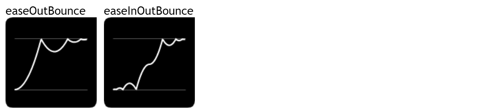

# easing

## 简介

依赖于jQuery, 增加更多的 时间曲线 (三次贝赛尔曲线), 可使用在任何用到时间曲线的地方, 例如 过渡(transition-timing-function) 动画(animate-timing-function) 变换(transform-timing-function)等

## 使用

引入插件

```html
<script type="text/javascript" src="js/jquery.js"></script>
<script type="text/javascript" src="js/jquery.easing.1.3.js"></script>
```

## 详细值

1. linear
2. swing
3. easeInQuad
4. easeOutQuad
5. easeInOutQuad
6. easeInCubic
7. easeOutCubic
8. easeInOutCubic
9. easeInQuart
10. easeOutQuart
11. easeInOutQuart
12. easeInQuint
13. easeOutQuint
14. easeInOutQuint
15. easeInExpo
16. easeOutExpo
17. easeInOutExpo
18. easeInSine
19. easeOutSine
20. easeInOutSine
21. easeInCirc
22. easeOutCirc
23. easeInOutCirc
24. easeInElastic
25. easeOutElastic
26. easeInOutElastic
27. easeInBack
28. easeOutBack
29. easeInOutBack
30. easeInBounce
31. easeOutBounce (弹跳动画)
32. easeInOutBounce


