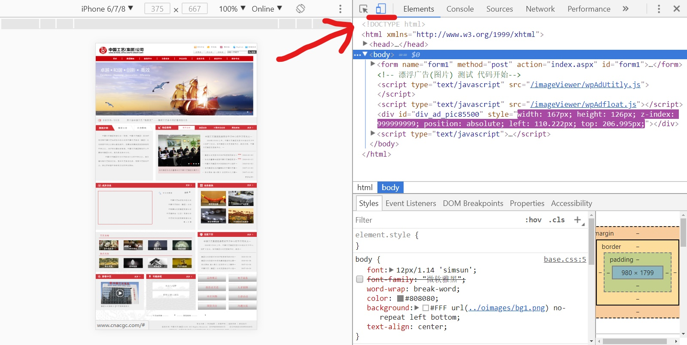
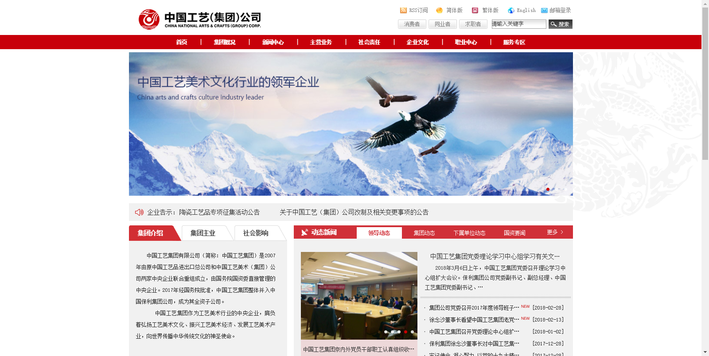
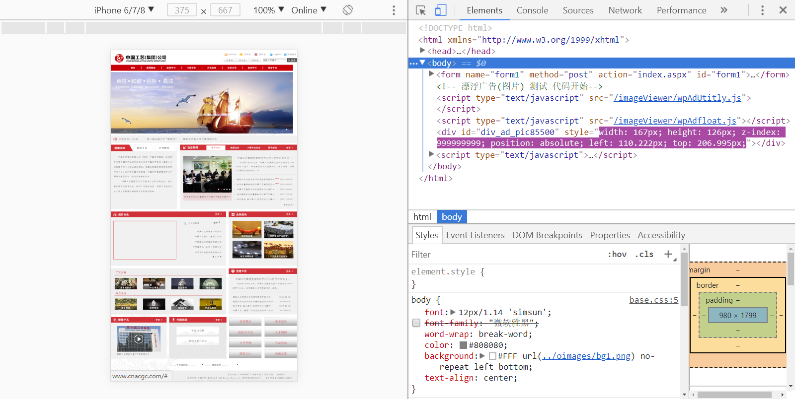
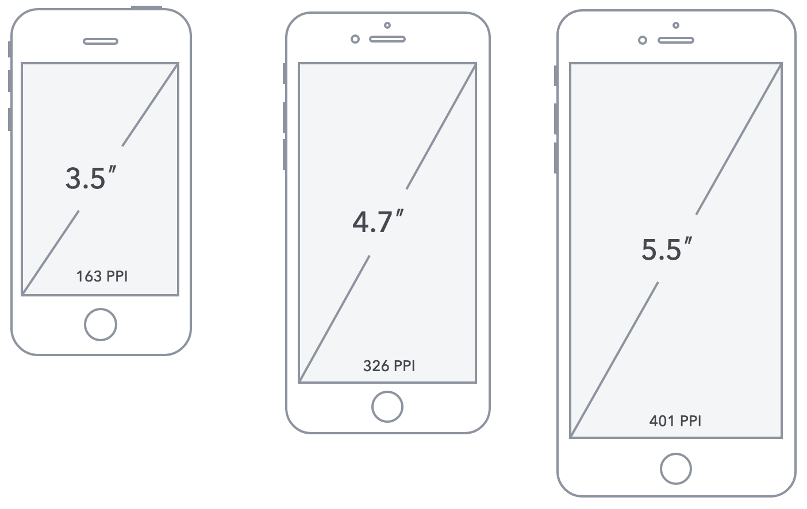
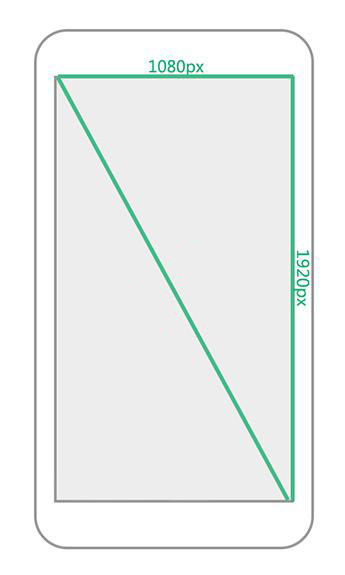
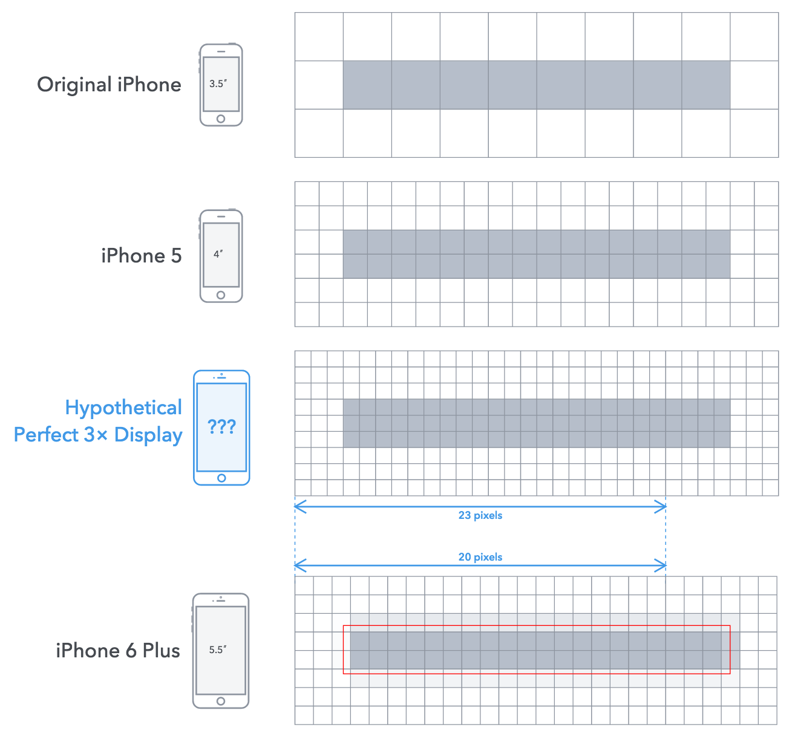

# 移动端

## 移动端开发介绍

### 什么是移动端web开发

在移动端进行web页面的开发，开发出来的页面是运行在手机浏览器上的

### 移动端开发与PC端开发的区别

移动端浏览器大多基于 webkit 内核，属于高级浏览器，支持h5c3特性，不需要考虑兼容性问题

## 移动端开发初探

### 手机模拟器

在日常开发中都是使用电脑开发项目的，在开发过程中需要不断切换到移动设备中查看效果比较繁琐，所以大部分浏览器都提供了手机模拟功能(f12), 以下为谷歌浏览器为开发人员提供了移动设备模拟器。

在模拟的手机模拟器下访问页面也是移动端的, 例如 在模拟器下访问京东, 就会访问移动端的京东页面



### PC端页面在移动设备中的表现

- 网页放在移动设备中被缩小显示
- 不符合我们的视觉习惯 需要想办法让网站不缩放





##基础知识

**移动设备与PC设备最大的差异在于屏幕，这主要体现在屏幕尺寸和屏幕分辨率两个方面.**

屏幕尺寸: 指屏幕对角线的长度, 单位为英寸(in); 1in = 2.54cm



物理像素点: 能够独立显示内容的最小单位

物理像素: 1物理像素为一个像素点的大小, 分辨率使用就是物理像素描述

分辨率: 屏幕水平和垂直方向所拥有的物理像素点个数, 单位为物理像素(px); eg: 1920*1080指的是屏幕垂直方向和水平方向分别有1920和1080个物理像素点构成.



css像素(逻辑像素): 在html, css, js 中使用的就是css像素; 屏幕宽高使用的就是css像素描述的

PPI (Pixels Per Inch) : 表示屏幕每英寸的像素数量, 公式: 屏幕最大分辨率宽高 平方相加 在开平方 在除以屏幕尺寸(in)

retina屏幕: 即视网膜屏幕，意指具有较高PPI（大于320）的屏幕, 能够使图片呈现的更加细腻。

为了提供更好的用户体验, 这要求在做移动端开发时，需要提供更加清晰的图片(2/3倍图)。


window.devicePixelRatio 获取当前设备的屏幕像素密度比(数值型, 可为小数)

屏幕像素密度比 = 物理像素 / css像素

css像素(高亮) 与 物理像素(格子)



eg: 以下两个手机拥有相同尺寸 3.5 (480*320) 和 宽高比例(3:2) 的屏幕, 后一个拥有 Retina 屏幕且屏幕像素密度比为2, 后者的屏幕分辨率为前者的2倍


## 视口

### 什么是视口

这是一个虚拟的区域，承载网页的。承载关系：浏览器窗口 ----> 视口 ----> 网页

- 浏览网页的窗口，视口的大小决定了当前设备是否能够将网页完整呈现。
- PC端在浏览器最大化的情况下，视口的宽度就是电脑屏幕的宽度。
- 移动端，设备厂商为了能够将PC端网页完整的显示在移动设备中，强制将视口的宽度设置为了980px
  - 但是移动端设备屏幕宽度远远小于这个数值
  - 所以最终的表现结果就是网页完整显示，但是被等比缩小为设备屏幕的宽度

在移动端这种展现页面的方式对于用户体验来说是极差的。

### 如何约束视口宽度

```html
在 head 添加元标签即可:
meta:vp + tab  快捷方式
<meta name="viewport" content="width=device-width, user-scalable=no, initial-scale=1.0, maximum-scale=1.0, minimum-scale=1.0">
width=device-width   将视口的宽度设置成设备的宽度
user-scalable=no     禁止用户缩放页面
initial-scale=1.0    网页初始化的缩放比例
maximum-scale=1.0    网页最大的缩放比例
minimum-scale=1.0    网页最小的缩放比例
```

##css初始化

**使用时要相应的提供没有 -webkit- 的属性名和值**

- 取消点击链接或文本框高亮的默认效果 -webkit-tap-highlight-color: transparent;
- 去掉文本框或下拉框的默认样式 -webkit-appearance: none;
- 禁止用户选择页面中的文字 -webkit-user-select: none;
- 使局部滚动更加顺滑 -webkit-overflow-scrolling: touch;(快速滑动时不会立即停止滑动, 而是会慢慢的停下)
- 更改文本框和文本域的 placeholder 文字颜色 input::-webkit-input-placeholder, textarea::-webkit-input-placeholder {color: red}
- 设置所有标签的盒模型为内减 box-sizing: border-box;
  - 由于移动端容器的尺寸都是可变的, 所以让其内部自适应可以防止内容溢出  不出现滚动条  提供用户体验

###样例 base.css

```css
/* 开头缺少清除标签默认的 padding 和 margin 的属性, 根据项目中用到的元素相应清除即可 */

*,
*::after,
*::before {
  box-sizing: border-box;
}

body {
  -webkit-tap-highlight-color: transparent;
  margin: 0;
  font-size: 16px;
  color: #333;
}

input, select {
  appearance: none;
}

input {
  border: 0;
  outline: 0;
}

/* 根据相应的需求设置即可 */
/* input::-webkit-input-placeholder,
*  textarea::-webkit-input-placeholder {}
*/

ul {
  margin: 0;
  padding: 0;
  list-style: none;
}

a {
  text-decoration: none;
  color: #333;
}

/* eg: 精灵图公用类 */
.bg {
  background: url('../images/sprites.png') no-repeat;
  /* 2倍图 宽高为之前的一半 */
  background-size: 200px 200px;
}

.clearfix::after {
  content: '';
  display: block;
  clear: both;
}

.fl {
  float: left;
}

.fr {
  float: right;
}
```

##时间转换公式

new Date(年(4位), 月(从0开始), 日, 时(24制), 分, 秒).getTime() 获取指定时间的时间戳(ms)

eg: new Date(2018, 4, 17, 21, 40, 10).getTime()  2018年5月17日21点40分40秒

- 时：Math.floor(t%86400/3600)
- 分：Math.floor(t%86400%3600/60)
- 秒：Math.floor(t%60)
- 为个位数时, 用于添加前缀 0
- 百以内取十位 Math.floor(num/10)
- 百以内取个位 num%10

##Touch事件

touch是移动端的触摸事件, 而且是一组连续事件,就是说在没发生 touchstart  事件的前提下是不会发生后两个事件的

- touchstart：  当手指触碰屏幕时候触发
- touchmove：当手指在屏幕上滑动时持续触发
- touchend：   当手指离开屏幕时触发
- touchcancel：系统停止跟踪触摸时候会触发, 滑动中突然来电话或者微信视频等, 打断了滑动手势 (这个事件不会经常使用,了解即可)

应用: 利用touch相关事件实现移动端常见滑动效果和移动端常见的手势事件

绑定事件的方法

- 事件监听
  - dom.addEventListener('touchstart',function(e){});
- on句柄 + 事件名称
  - dom.ontouchstart = function () {}  // 不推荐使用

###事件参数对象的关于触摸的三个属性

触摸点: 一个手指触摸屏幕就是一个触摸点

1. changedTouches     改变后的触摸点数组集合
2. targetTouches          当前元素上的触摸点数组集合
3. touches                     页面上所有触摸点数组集合

触摸点集合在每个触摸事件触发的时候会去记录触摸点个数

changedTouches 每个事件都会记录

targetTouches, touches 在离开屏幕( touchend )的时候无法记录触摸点

###触摸点的坐标

使用:  eg: e.touches[0].属性

1. clientX    clientY           基于浏览器窗口左上角的坐标（视口）
2. pageX     pageY            基于页面左上角的坐标（视口）
3. screenX  screenY         基于屏幕左上角的坐标

###移动端手势

```html
<!DOCTYPE html>
<html lang="en">

<head>
  <meta charset="UTF-8">
  <meta name="viewport" content="width=device-width, initial-scale=1.0">
  <meta http-equiv="X-UA-Compatible" content="ie=edge">
  <title>Document</title>
  <style>
    html,
    body {
      padding: 0;
      margin: 0;
      height: 100%;
    }
  </style>
</head>

<body>
  <script>
    swiper(document.body, {
      swiperLeft: function (e) {
        console.log('left');
        console.log(e);
      }
    })

    /**
     * 手势事件工具函数封装
     * @myNode 监听手势事件的 DOM 元素
     * @options 可选参数
     */
    function swiper(myNode, options) {
      // 将所有方法和参数都提供一个默认值
      var myDefault = {
        swiperLeft: function (e) {},
        swiperRight: function (e) {},
        swiperUp: function (e) {},
        swiperDown: function (e) {}
      }
      // 赋值用户传的值
      for (let key in options) {
        myDefault[key] = options[key];
      }

      var startX = 0;
      var startY = 0;
      var moveX = 0;
      var moveY = 0;
      // 判断用户是否只是点击
      var flag = false;
      myNode.addEventListener('touchstart', function (e) {
        startX = e.touches[0].pageX;
        startY = e.touches[0].pageY;
      })
      myNode.addEventListener('touchmove', function (e) {
        flag = true;
        moveX = e.touches[0].pageX;
        moveY = e.touches[0].pageY;
      })
      myNode.addEventListener('touchend', function (e) {
        if (!flag) {
          flag = false;
          return;
        }
        var x = moveX - startX;
        var y = moveY - startY;
        // 手势判断: 横向移动距离 和 纵向移动距离, 起始触摸点 和 最终触摸点的横/纵差正负
        // 将手势 横向移动距离 和 纵向移动距离 长度一样时的特殊情况, 默认判断为左滑和右滑
        if (Math.abs(x) >= Math.abs(y)) {
          if (x > 0) {
            // 左滑
            // 改变传入函数的 this 指向当前触发事件的对象(不改变默认指向window), 并传入事件参数对象
            myDefault.swiperLeft.call(this, e);
          } else if (x < 0) {
            // 右滑
            myDefault.swiperRight.call(this, e);
          }
        } else if (Math.abs(x) < Math.abs(y)) {
          if (y > 0) {
            // 下滑
            myDefault.swiperDown.call(this, e);
          } else if (y < 0) {
            // 上滑
            myDefault.swiperUp.call(this, e);
          }
        }
      })
    }
  
  </script>
</body>

</html>
```

###tap

由于 click 事件在移动端有 300ms 延迟, 为了区分是滑动,双击还是点击, 可以使用 fastclick.js 提供移动端click响应速度的

tap(轻击): 不触发 touchmove 事件且 touchstart 事件发生的时间和 touchend 事件发生的时间间隔要小于150ms

所以移动端使用 tap(轻击)事件来代替, 但是移动端并没有提供原生的 tap 事件, 所以需要封装, 或者使用 zepto ,iscroll 插件提供的 tap 事件

```html
<!DOCTYPE html>
<html lang="en">

<head>
  <meta charset="UTF-8">
  <meta name="viewport" content="width=device-width, initial-scale=1.0">
  <meta http-equiv="X-UA-Compatible" content="ie=edge">
  <title>Document</title>
  <style>
    html,
    body {
      padding: 0;
      margin: 0;
      height: 100%;
    }
  </style>
</head>

<body>
  <script>
    tap(document.body, function (e) {
      console.log(e);
    });
    // tap事件
    function tap(myNode, fn) {
      var flag = false;
      var timestart = 0;
      var timeend = 0;
      myNode.addEventListener('touchstart', function () {
        timestart = Date.now();
      })
      myNode.addEventListener('touchmove', function () {
        flag = true;
      })
      myNode.addEventListener('touchend', function (e) {
        timeend = Date.now();
        var cha = timeend - timestart;
        // 触摸时间不超过 150ms, 且手指没有移动(没有触发touchmove事件)即为 tap 事件
        if (cha <= 150 && !flag) {
          // 改变传入函数的 this 指向当前触发事件的对象(不改变默认指向window), 并传入事件参数对象
          fn.call(this, e);
        }
        flag = false;
      })
    }
  </script>
</body>

</html>
```

##过渡和动画结束事件

###transitionEnd

- 过渡结束后触发
- 过渡属性有多少个, transitionEnd 事件就触发多少次
- 事件参数对象特殊值:   e.propertyName  当前触发过渡的属性名
  - eg:  该属性返回带连词符的属性名 'background-color'
- 有兼容问题, 暂时只支持前缀写法 webkitTransitionEnd

###animationEnd

- 最后一次动画结束时触发, 当循环次数为无穷大( infinity )时, 该事件永远不会触发

### animationStart

+ 动画开始时触发

###animationIteration

+ 动画至少循环两次以上时每次结束时触发, 但最后一次结束不触发该事件

**以上三个动画方法支持有前缀和无前缀写法**

## 移动端常用布局

### 流式布局

即百分比布局, 非固定像素，内容向两侧填充，理解成流动的布局, 将width, padding, margin 属性用百分比的形式表示, **border 没有百分比写法**

**在百分比的世界中，padding，margin四个方向都是相对于`父级宽度`计算**

可以利用上面的规则创建固定宽高比的盒子

适配要求：

1. 网页宽度必须和浏览器保持一致
2. 默认显示的缩放比例和PC端保持（缩放比例1.0）
3. 不允许用户自行缩放网页

### 响应式布局

####为什么要学习响应式开发

- 移动互联网日益成熟,我们在桌面浏览器上开发的网页无法满足在移动设备中的阅读
- 初期的解决方案是针对移动设备单独做一套网站
- 移动设备尺寸多种多样,不可能针对每一种设备尺寸单独做一套网站
- 越来越多的客户要求网站能够在移动设备中有一个良好的用户体验
- 就业需要,响应式开发已经是前端必会的基本技能

####什么是响应式开发?

- 网站能有根据屏幕的尺寸自动呈现出符合当前屏幕宽度的样式
- 一套HTML，针对不同的屏幕范围写不同的样式

####屏幕尺寸的划分(bootstrap标准)

- 超小屏幕(xs)    768以下
- 小屏设备(sm)  768px ~ 992px
- 中等屏幕(md)  992px ~ 1200px
- 宽屏设备(lg)     1200px ~ 1920px

####响应式开发的原理

#####老式写法: 

- 利用js获取屏幕/视口的宽高, 在根据不同的大小显示不同的内容

#####css3写法: 

- css3媒体查询(Media Query)
- 通过查询屏幕的宽度设置不同屏幕尺寸对应的css样式, 有兼容性问题, 可以通过引用 respond.js 来解决兼容问题

```html
    <!-- 第一种写法 -->
    <style>
      	@media screen and (max-width: 992px){
          	/* 宽度为768 - 992 之间时会应用这里面的样式 */
			样式...
        }
        @media screen and (max-width: 768px){
            /* 宽度为768 以下时会应用这里面的样式 */
			样式...
        }
    </style>

    <!-- 第二种写法 -->
    <link rel="stylesheet" href="" media="screen and (max-width: 768px)">
```

- 当查询区间有重叠的时候, 后面的样式优先, 所以值小的写在后面
- 写媒体查询的时候尽量避免重复的查询区间
- 因为一般浏览网页的都是屏幕所以 screen and 可以省略

####移动开发与响应式开发对比

- 移动Web开发+PC开发
  - 应用场景
    - 一般在已经有PC端的网站，开发移动端的时候，只需单独开发移动端。
  - 开发效率
    - 针对性强,开发效率高
  - 适配范围
    - 只适配移动设备，pad上体验相对较差
  - 执行效率
    - 代码简洁，加载快
- 响应式开发
  - 应用场景
    - 新建的一些网站,要求适配移动端,所以就一套页面兼容各个终端,灵活
  - 开发效率
    - 兼容各种终端,效率低
  - 适配范围
    - 可以适配各种终端
  - 执行效率
    - 代码相对复杂，加载慢
- 移动web开发和响应式开发都是现在主流的开发模式
- 使用的都是流式布局, 来适配不同的设备
- 由于终端设备的多样化, 新建站的站点会优先试用响应式来开发

###rem布局

只适用于移动端, 一套代码适应不同屏幕尺寸。

####什么是rem

- rem (font size of the root element) 相对于根元素(一般为html)字体大小的单位
- 将像素转换为rem
  - 目标rem值 = 目标像素值 / 根元素的字体大小

####匹配屏幕

`document.documentElement.style.fontSize = document.documentElement.clientWidth / 设计稿的宽度 *初始的根元素字体大小 `

在开发中可以使用 window.onresize 在自动调整屏幕大小时自动调整大小